## 基础模块分析

> 基于韦东山提供的响应硬件基础入门教学

 

### GPIO 与门电路

#### 上下拉电阻

上拉电阻，即一段接正极输入（3.3v），一段可以悬空或者接地  
下拉电阻，即一段接地，另一端可悬空或接正极（3.3v）

 

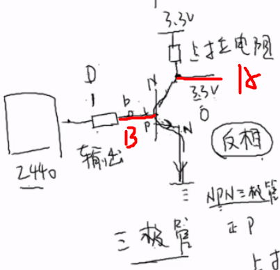

上图展示一个 NPN 三极管，下面是他的工作原理

- 若 2440 提供高电平（1），则三极管导通，在上拉电阻的作用下，输出端 A 获得低电平（0）
- 若 2440 提供低电平（0），三极管截止，故输出端 A 获得高电平（1）

 

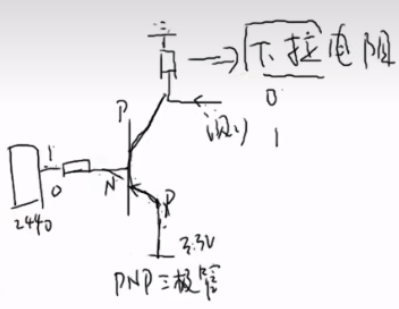

若使用 PNP 三极管，也就是上图的情况，相对对应的就可以采用下拉电阻

- 若 2440 提供低电平（0），三极管导通，下拉电阻旁边的输出端输出高电平（1）
- 若 2440 提供高电平（1），三极管截止，下拉电阻旁边的输出端输出低电平（0）

 

如下图所示的原理图，其中的三个电阻就属于上拉电阻，因为其一段恒定接着正极，另一端有 GPIO 输出决定高低电平

若 GPIO 输出低电平，则导通，此时 LED 会被点亮

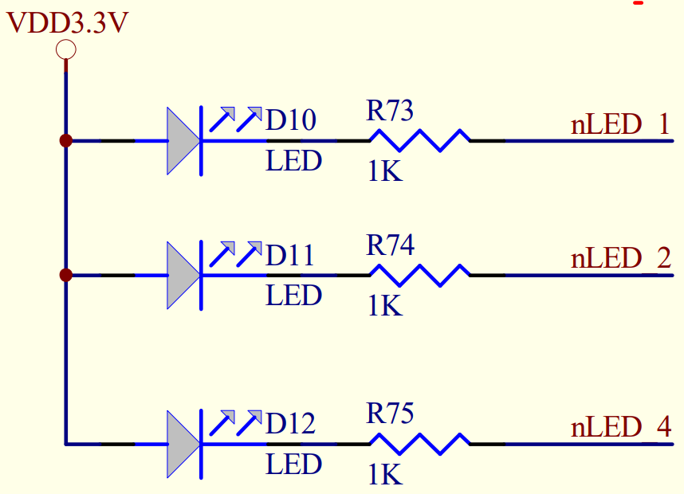

 

### 电源模块

#### LM317 可调稳压电路

芯片 `LM317` 对应的参数如下

1. 输出电压 1.25V-37V
2. 输出电流 5mA-1.5A
3. 最大 IO 电压差：40V(DC)
4. 最小 IO 电压差：3V(DC)

该芯片有三个引脚，作用很明显，IN 和 OUT 分别为输入输出引脚，而 ADJ 则为控制引脚

 

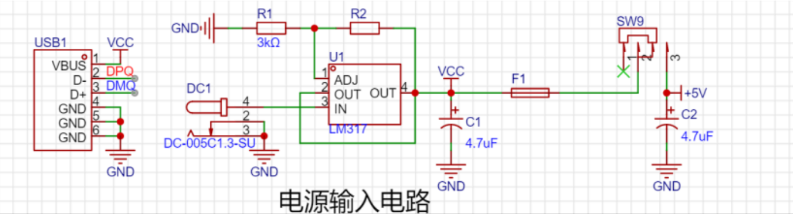

基于 LM317 的稳压电路模块分析  
参考开源项目：https://oshwhub.com/hbu_kejichuangxinxiehui/51-dan-pian-ji-kai-fa-ban

- 最左侧为方头 USB 输入接口仅使用其电源线以及两个数据线（D+、D-）
- 上方 R1/R2 用于给 ADJ 引脚提供参考电压公式为：Vo=1.25x(1+R2/R1)
- IN 引脚接一个 DC(12V 直流)，转换成稳定电压；同时也接一个 5V 直流
- 输入和输出电源端都会配置一个带方向的电容（如图 C1、C2）,用来执行滤波操作

 

### 下载模块

#### PL2303

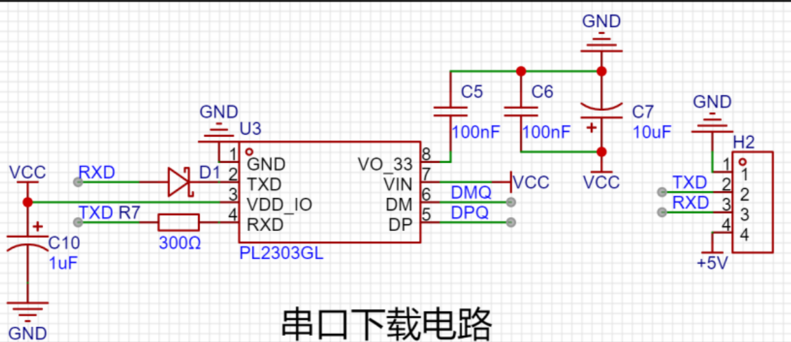

只要连接好对应的 RXD、TXD 引脚即可

只需两根信号线即可实现串口通信

 

#### CH340

 

### 光照检测模块

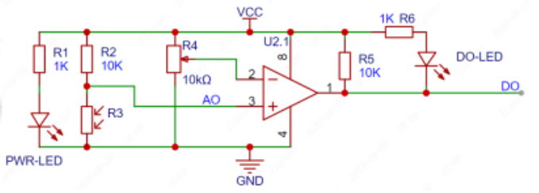

光照强度通过一个光敏电阻进行检测

上方即为光照检测模块的电路图，下面简述其作用：

1. 电路中部为一个运放，当电压 2>3 时，反向放大，引脚 1 输出低电平；当电压 3>2 时，同相放大，引脚 1 输出高电平
2. R3 为光敏电阻  
   光照强烈时，阻值极低，故几乎没有分压，所以使得引脚 3 电压增大，造成 3>2  
   黑暗环境时，阻值较高，分压较大，使得引脚 3 电压很小，造成 2>3
3. 调节 R4 滑动变阻器阻值，即可动态设置灵敏度

 

### 红外接收驱动

#### 红外通讯原理

红外光是以特定的频率脉冲形式发射，接收端收到到信号后，按照约定的协议进行解码；  
对于红外线， `NEC` 协议的频率就是 `38KHZ`

通信方式很简单：发射器发射一定频率的红外光，接收端接收到红外光就输出高电平，接收不到就输出低电平；根据红外光频率约定即可实现数据传输；

 

#### NEC 协议

大多数遥控器使用的都是 NEC 协议，但是对于某些空调比如格力这些，就会使用其特定的协议，但总体的规则大差不差

NEC 协议一次完整的传输包含: 引导码、8 位地址码、8 位地址反码、8 位命令码、8 位命令反码

 

#### 红外接收头硬件设计

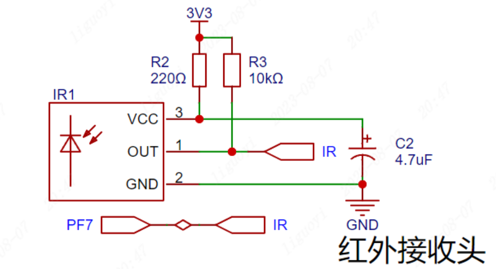

直接使用基本的 GPIO 即可接收红外高低电平信号了

 

### 语音识别模块

 

### 步进电机

#### 步进电机原理

步进电机是将电脉冲信号，转变为角位移或线位移的开环控制电机，又称为脉冲电机。
步进电机有两个重要的结构，即定子和转子

- 定子，就是由电流控制磁场方向，通电时就会产生磁力；
- 转子，被定子环绕在中间受定子磁场变化产生转动（下方示意图中转动的指针）

 

对于二相四线制步进电机，即有两个线圈，每个线圈有两条线（正负极）控制；  
A+与 A-为一相，B+与 B-为一相

步进电机的驱动方式有四拍制与八拍制，四拍值即每次通电一个线圈，使得转子转动  
下图展示四拍制驱动

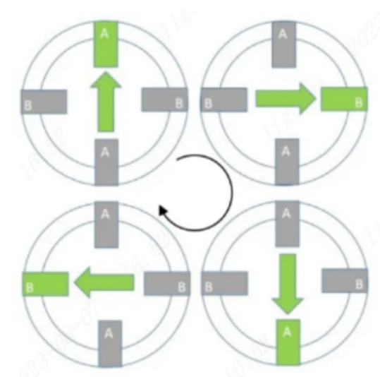

而八拍制即【A+】->【A+B+】->【B+】->【B+A-】->【A-】->【A-B-】->【B-】->【B-A+】

 

#### 模块 L9110S 驱动步进电机

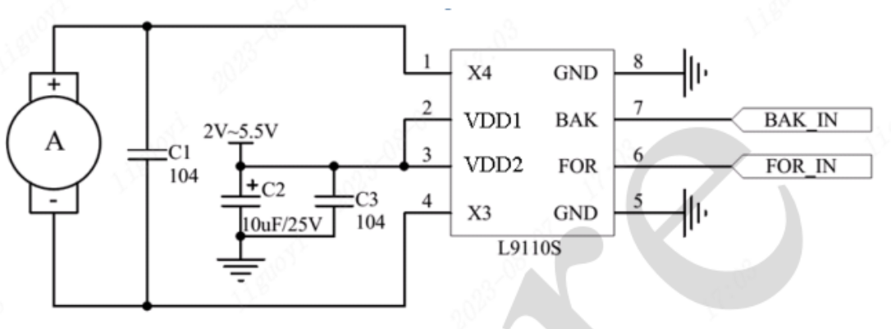

`BAK` 控制 X4 引脚的电平输出； `FOR` 控制 X3 引脚的电平输出

VDD1 和 VDD2 需要设置电容去噪！  
引脚 8、7 外接地

> 一个驱动只能驱动一个线圈，那么对于二相四线制电机，则需要两个驱动模块

 

 

### 零散模块

#### 蜂鸣器模块

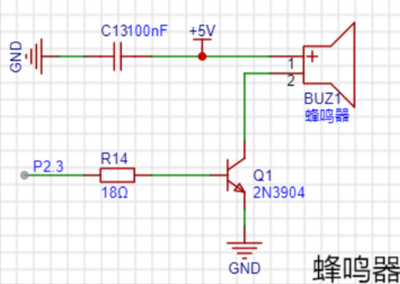

这里的蜂鸣器是`无源蜂鸣器`，即需要人为控制频率才可以发挥自己的声音

触发原理很简单，只需要引脚 P2.3 给予高电平即可使 NPN 三极管导通，此时蜂鸣器鸣叫；给予 P2.3 低电平则三极管截止，蜂鸣器停止鸣叫

仅需按照一定频率给予 P2.3 变换的高低电平输出，即可让蜂鸣器实现不同音调或者乐曲的演奏

 

#### 雨水传感器

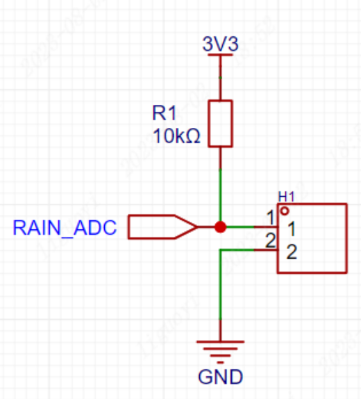

上图所示 H1 即为雨水检测模块，可以将其视为一个开关；  
当有水落在传感器上时，电路短路，等同于开关闭合；当传感器干燥时，电阻很大，等同于开关断开；  
（传感器电阻大小与雨水多少有关系，雨水越多电阻越小）

设置上拉电阻 R1 是为了避免由于雨水过多，传感器电阻过小而直接烧坏电路

当有雨水时，电路导通，RAIN_ADC 接收高电平信号；  
当没有水时，电路断开，RAIN_ADC 接收低电平信号；

 

## 通用电路结构剖析

 

### 基本斩波电路

> 将直流电变为另一固定电压或可调电压的直流电。也称为直流—直流变换器`（DC/DC Converter）`。

主要使用到的斩波电路有 Buck、Boost、Buck-Boost 三大电路，是作为直流开关电源的重要拓补结构

#### Boost

BOOST 电路是一种直流升压开关电路，这里展示使用该电路将直流 5V 升高到 12V

请看下图  
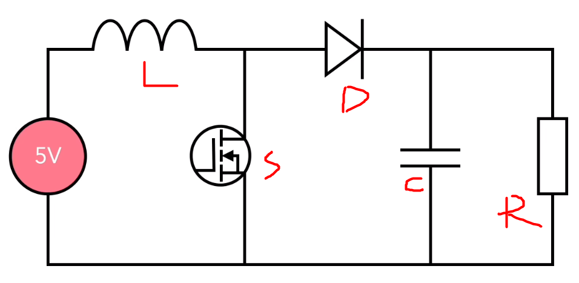

这是它升压作用的完整流程：

1. 晶体管 S 断开，由于电感与电源电流方向相同，故电压相加和平均为 12V。  
   此时通过二极管 D 流向负载 R 的电压就是 12V。  
   此时的电容器 C 进行充电。
2. 晶体管 S 闭合，电感与电源电流方向相反，故电压相互抵消，必定小于 5V。  
   但由于电容器 C 已被充电，可以供给负载 R 电压，故此时总和电压依旧位于 12V 上下。
3. 晶体管 S 再次断开，继续下一次循环

 

按照对应占空比，设置开关通断间隔，即可使得电压升至指定值

请注意，由于电容需要在晶体管 S 闭合时提供负载电压，故其电容必须够大。

 

#### Buck

Buck 电路是一种降压型直流-直流（DC-DC）转换器，用于将高电压转换为较低的稳定电压

下图演示将 12V 电压降到 5V 的流程  
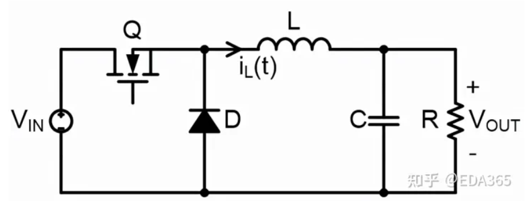

这是降压的步骤：

1. 晶体管 Q 闭合时，由于电感不能立刻突变，故吸收一部分电压，此时流过电感后的电压平均为 5V；
2. 晶体管 Q 断开时，电感放电，此时电流依次流过 `L->R->D->L` ，依然可以保证负载电压为 5V 左右；
3. 晶体管 Q 再次闭合时，电感再次充电，如此循环往复，即可让输出电压稳定在 5V 左右

 

电路中电容的作用

- 平滑输出：电感充放电过程会产生纹波，电容可以环节该纹波使得输出平缓
- 降低开关噪声：由于晶体管 Q 每秒可开合上万次，产生电流电压噪声，可被电容滤波吸收掉
- 提供瞬态响应：当负载变化时，电容可以为 buck 电路提供该瞬态响应，使得过渡平顺

> 开关占空比越小，则输出电压越小

 

#### Buck-Boost

Buck-Boost 电路是一种常见的直流-直流（DC-DC）转换器，可以实现电压的升降转换。它结合了 Buck 和 Boost 两种拓扑结构的特点，能够将输入电压降低或升高到所需的输出电压。

下图为该电路的基本电路图

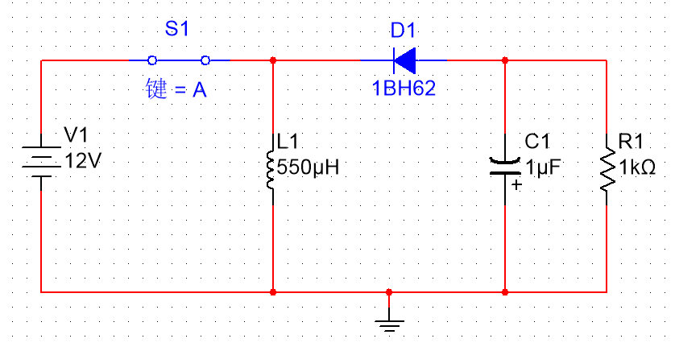

当开关闭合时：电源为电感充电，由于二极管的阻挡，电流无法流过去，所以负载电压只能由电容中存储的电能供应

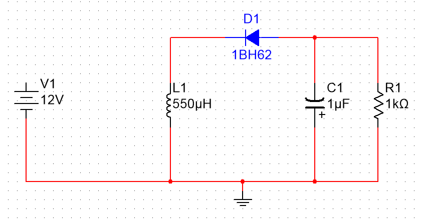

当开关断开时：电感放电，电流流动顺序为 `L1->R1->D1->L1`  
此时电感为负载供电，而电容执行充电过程

 

可以得出以下规律：

1. 当占空比大于 50%时，处于升压状态
2. 当占空比小于 50%时，处于降压状态

 

### 常用电容结构

#### 去耦电容

`去耦电容（Decoupling capacitor）`，也称为旁路电容或绕噪电容，是一种用于消除电路中噪声和波动的电容器。它通常与其他电子元件（如集成电路、传感器、放大器等）一起使用，以提供稳定的电源电压和减少信号干扰

简单的例子：一个电源上连接了 N 多个负载，由于负载电压变化，导致 VCC 提供的 DC 呈现噪声，而我们仅需在每个负载的正负极之间并联一个电容（作为去耦电容），即可吸收这部分噪声而使电压平缓

电容越大，则去耦效果越好

 

用于去耦的电容最常用的是便宜却实用的陶瓷电容，以及成本较高的钽电容

电容除了其基本特性之外，还有两个阻碍电流流动的因素：

- 电阻（ESR）：他一直保持固定的阻抗
- 电感（ESL）：随频率上升阻抗增加

随着电容封装越来越小，ESL 随之也降低；  
若要覆盖更高频率的旁路噪声，那必须尽可能的降低 ESL 的值；

同样容值，贴片（SMD）封装的电容比穿孔的电容效果更好

 

极端情况下，你可能会遇到如下有 6-7 个电容组成的去耦电容组

不同类型、容量的电容，分别赋予了不同的能力，将他们组合在一起可以针对大型设施提供去耦工作

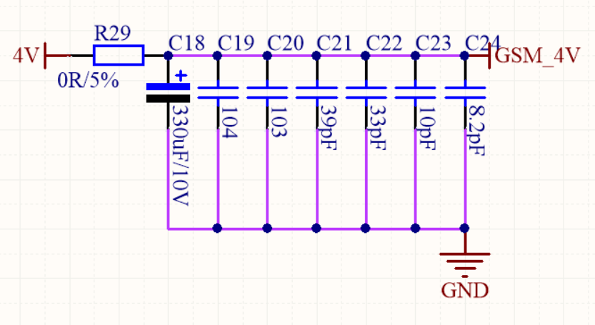

 

#### 旁路电容

旁路电容的作用和去耦电容一致，他的称呼来自于如下两种场景：

1. 用于对输入信号过滤高频噪声，称为旁路电容
2. 用于对输出信号干扰作为过滤对象，称为去耦电容

 

 

#### 滤波电容
