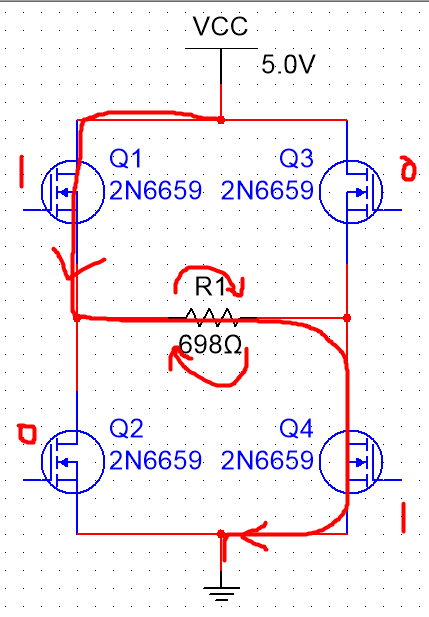
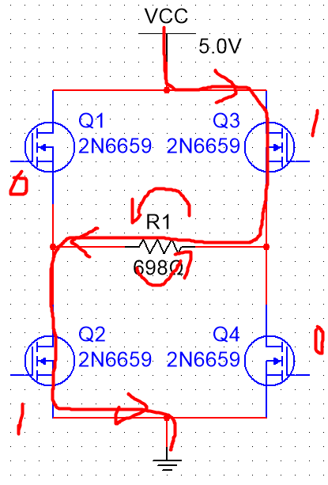
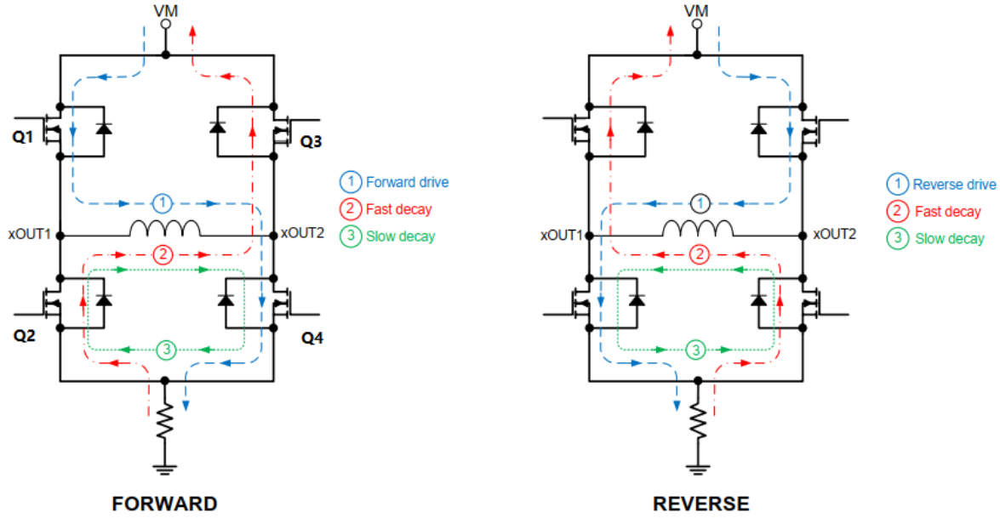
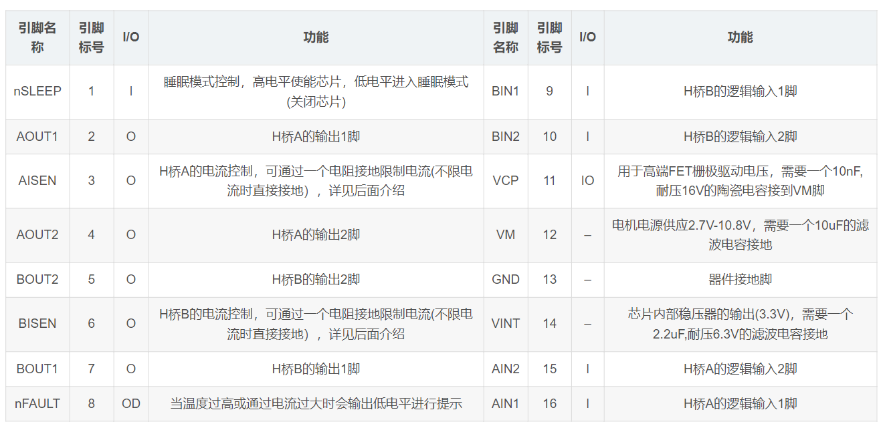
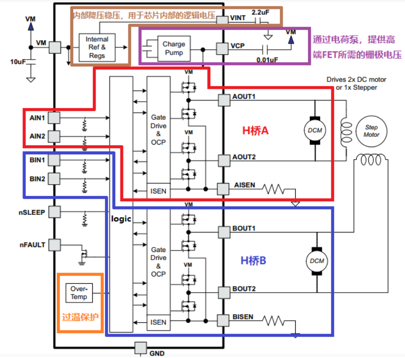
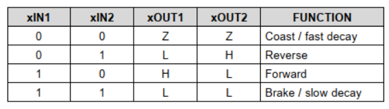
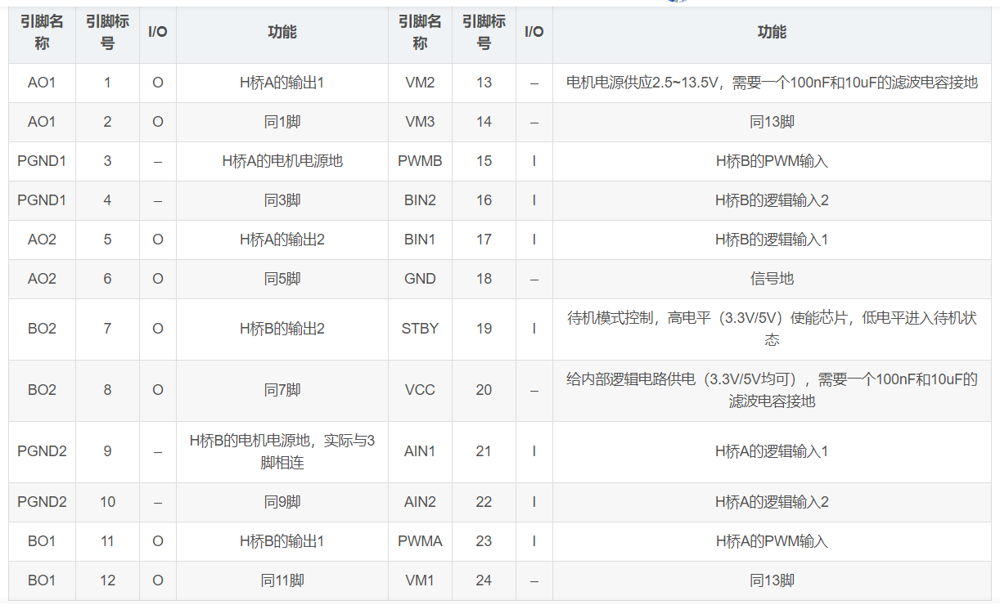
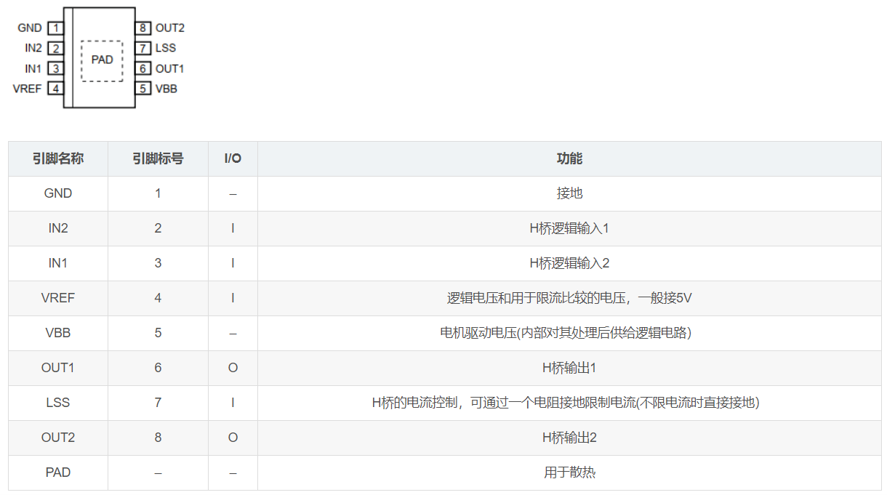
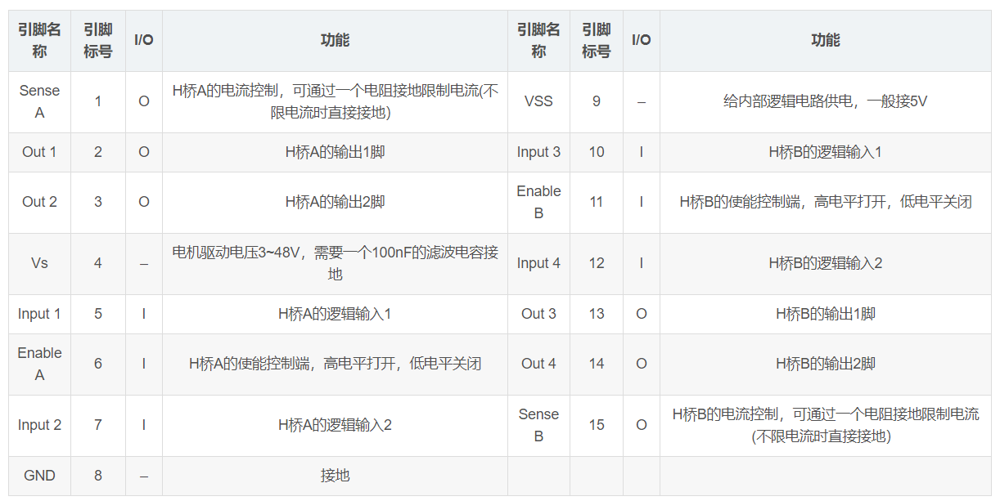
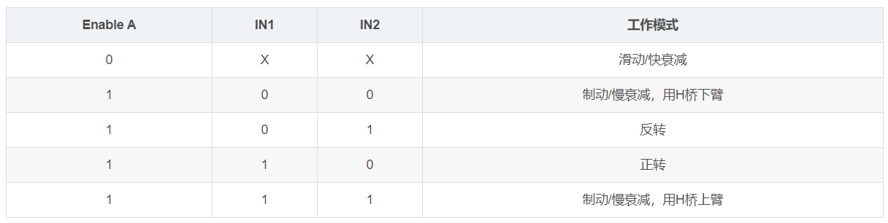

### 显示器

#### SSD1306

一种常见的 OLED 驱动芯片，常用于小尺寸 OLED 显示屏的控制

通过 I2C 或 SPI 接口与单片机进行通信

SSD1306 典型的初始化 OLED 的过程  
`复位->驱动IC初始化代码->开启显示->显存清零->开启显示`

 

#### 8080 并口

8080 并口接口标准的特点是使用了 8 根数据线和一些控制线，其中包括使能信号、读写信号、复位信号等

 

### 存储卡

> 在此介绍所有存储卡的类型以及对应的用处

存储卡按照不同的标准和接口技术可以分为多种类型，常见的存储卡类型包括：

1. SD 卡（Secure Digital Card）：SD 卡是一种由 Toshiba、SanDisk 和 Panasonic 等公司共同推出的一种存储卡标准，具有容量大、速度快、可靠性高等特点，被广泛应用于数码相机、移动电话、平板电脑等设备中。
2. microSD 卡：microSD 卡是一种小型的 SD 卡，通常用于手机、平板电脑等小型设备中，具有小巧、便携等特点。
3. CF 卡（Compact Flash Card）：CF 卡是一种由 SanDisk 公司开发的存储卡标准，具有大容量、高速度、高可靠性等特点，被广泛应用于数码相机、摄像机等设备中。
4. Memory Stick（记忆棒）：Memory Stick 是由索尼公司推出的一种存储卡标准，具有小巧、高速、安全等特点，被广泛应用于索尼品牌的电子设备中。
5. XD 卡：XD 卡是由富士通和东芝公司联合推出的一种存储卡标准，具有小巧、高速、可靠性高等特点，被广泛应用于数码相机等设备中。
6. MMC 卡（MultiMedia Card）：MMC 卡是一种多媒体存储卡，由多家公司共同制定标准，与 SD 卡类似，但接口不同，具有小巧、低功耗、高速度等特点，被广泛应用于移动设备、数码相机、音乐播放器等设备中。
7. SmartMedia 卡：SmartMedia 卡是一种早期的存储卡标准，由东芝公司推出，容量较小，速度较慢，目前已经逐渐被 SD 卡等新一代存储卡所替代。

 

#### SD

> SD 卡（Secure Digital Card）

SD 卡有三种类型，分别对应三种规格  
标准 SD 卡尺寸为 32 x 24 x 2.1 mm  
microSD（即 TF 卡） 卡尺寸为 15 x 11 x 1 mm  
miniSD 卡尺寸为 21.5 x 20 x 1.4 mm

SD 卡读写速度描述

- Class 标识最低读写速度
- UHS Speed Class 标识最高读写速度
- Video Speed Class 针对视频提出的速度等级

 

主要采用两种文件系统：FAT32、exFAT

`SD` 卡的容量为 2GB 以下  
`SDHC` 卡的容量为 2GB 至 32GB  
`SDXC` 卡的容量为 32GB 以上

SD 卡的接口通常为 9 针或 7 针，其中 9 针接口支持 SPI 和 SD 接口两种模式，7 针接口支持 SDIO 接口

 

#### CF

> CF 卡是 CompactFlash（紧凑型闪存卡）

并行数据传输方式，读写速度相对较快，比 SD 卡等存储介质快

采用静态存储技术，不易受到磁场影响

采用内部 ECC（Error Correction Code）纠错技术，能够有效地降低因介质损坏等原因造成的数据丢失率

 

#### Memory Stick

> 翻译过来叫做记忆棒

采用高速串行数据传输方式，读写速度相对较快，比 CF 卡等存储介质快

采用静态存储技术，不易受到磁场影响

支持数据加密

 

#### XD

> 一个富士通研发的存储卡，主要用于数码相机内部

XD 卡的容量相对较小，而且兼容性也较一般，因此在市场上逐渐被 SD 卡等存储介质所替代

XD 卡的尺寸只有约 20mm×25mm×1.7mm，重量不到 3 克，比 SD 卡等存储介质更小巧轻便

 

#### MMC

> MMC 卡（Multimedia Card，多媒体卡）是一种基于闪存技术的存储卡

主要用于数码相机以及 MP3 中的音视频数据存储

采用串行数据传输方式，其最大读写速度可达到 20MB/s

MMC 卡的功耗较低，采用 3.3V 电压

 

### 驱动与接口

#### L7805CV

L7805CV 是一款常用的线性稳压器芯片，用于将输入电压稳定输出为 5V 的直流电压。它是一种三引脚的正向型稳压器，具有固定的输出电压和较高的电压稳定性。

L7805CV 的工作原理是基于稳压器内部的反馈控制电路。当输入电压在规定范围内时，稳压器将自动调节其内部电路，以保持输出电压稳定在 5V。它具有过热保护、过流保护和短路保护等功能，能够有效保护电路和稳定输出电压。

L7805CV 的引脚功能如下：

1. 输入引脚（Vin）：连接到输入电压的正极。
2. 接地引脚（GND）：连接到电源的负极和电路的接地。
3. 输出引脚（Vout）：提供稳定的 5V 输出电压。

使用 L7805CV 时，需要将输入电压接到输入引脚（Vin），接地引脚（GND）连接到电源负极和电路接地，输出引脚（Vout）连接到电路需要 5V 供电的部分。在接线正确的情况下，L7805CV 将会稳定地输出 5V 的直流电压，供给连接在输出引脚的电路使用。

 

#### SL2.1A

一种用于开发 USB2.0 扩展接口的一款便捷封装

 

#### TYPEC-304-BCP16

`TYPEC-304-BCP16` 为卧式 typec 母座元件

通常，Type-C 连接器的引脚定义如下：

1. VBUS：电源供应线，用于提供电源给连接的设备。
2. GND：地线，用于电流回流和电路的共地参考。
3. CC1/CC2：通信线，用于检测连接器的插入和支持不同的通信协议。
4. D+ / D-：数据线，用于传输数据信号。
5. SBU1 / SBU2：侧波线，用于支持附加的功能或模式。
6. Configuration Channel (CC)：用于检测连接器的插入和支持不同的通信协议。
7. 可能还包括其他功能引脚，例如外部供电、地线、时钟线等，这些引脚的具体定义可能因规格和设计而有所不同。

由于无法获取到"TYPEC-304-BCP16"的详细信息，以上列出的引脚定义只是一般的参考，并不适用于特定的型号。如果您需要准确的引脚定义，请参考相关的规格手册、数据表或产品文档来获取详细信息。

 

#### CH340C

CH340C 是一款常用的 USB 转串口芯片，它可以将串行通信信号转换为 USB 接口的数字信号，实现串口设备与计算机之间的数据传输；由 WCH（江苏沁恒微电子有限公司）设计和生产

CH340C 芯片具有以下特点和功能：

1. USB 转串口功能：CH340C 提供了一个全功能的 USB 转串口接口，支持常见的串行通信协议，如 UART、RS232、RS485 等。它使得串口设备可以直接连接到计算机的 USB 接口上，无需额外的串口线缆和串口接口。

2. 高性能和稳定性：CH340C 芯片采用了先进的数字信号处理技术，具有良好的性能和稳定性，能够稳定地进行数据传输和通信。

3. 多种工作模式：CH340C 支持多种工作模式，包括全双工和半双工模式，以适应不同的应用需求。

4. 多种接口：CH340C 提供了多种接口选项，如 USB Type-A、USB Type-C 等，以便于与不同类型的计算机和设备进行连接。

5. 兼容性和易用性：CH340C 芯片具有良好的兼容性，可以与多种操作系统（如 Windows、Mac OS、Linux）和开发环境（如 Arduino）无缝集成，方便开发人员进行软硬件开发和调试。

 

### 传感器

 

### 电机驱动模块

> 参考文献：[电机驱动模块简介](https://blog.csdn.net/qq_44897194/article/details/105524808?ops_request_misc=%257B%2522request%255Fid%2522%253A%2522169262569616800180619709%2522%252C%2522scm%2522%253A%252220140713.130102334..%2522%257D&request_id=169262569616800180619709&biz_id=0&utm_medium=distribute.pc_search_result.none-task-blog-2~all~sobaiduend~default-1-105524808-null-null.142^v93^chatsearchT3_1&utm_term=%E9%A9%B1%E5%8A%A8%E8%8A%AF%E7%89%87&spm=1018.2226.3001.4187)

#### H 桥

> 此部分转载对应文献作为留档，非原创

所谓的 H 桥即由 4 个 NMOS 管加上一个电机组成，通过控制对应 NMOS 管开闭从而形成通路，使得电机正转或者反转

下图表示电机顺时针正转：  
`Q1、Q4` 导通，`Q2、Q3` 截止  

此为电机逆时针倒转：（注意 NMOS 导通截止关系）  

 

**衰减**

由于电机是感性负载，断电时电机存储的反向电动势可能会冲坏 MOS 管；故需形成续流回路缓慢抵消能量

若电机正转（上部左图）：

- 上电时，Q1、Q4 闭合，电流流向（如线 1）
- 若采取 `滑动\快衰减模式`，四个 MOS 关闭，电流通过寄生二极管流过 Q2、Q3（如线 2），电流衰减快，电机由于没有电压故缓慢停下
- 若采取 `制动\慢衰减模式`，Q2、Q4 导通，Q1、Q3 关断，电流绕圈循环（如线 3），电流衰减慢，点击停止

快衰减下，电流迅速下降，电机电感能量释放慢，故停的缓慢  
慢衰减下，电流大且下降缓慢，能量瞬间释放，电机瞬间停止

 

**同侧 MOS 导通问题**

鉴于避免短路问题的出现，H 桥电路目前都会自带控制以阻止同侧 MOS 同时导通（即 Q1、Q2 同时导通的情况）

高端驱动即 MOS 管在负载的高电位一端；  
低端驱动即 MOS 管在负载的低电位一端；

> 驱动电压越大，转速越快；电流越大，扭矩越大  
> `扭矩<负载`时，电机转速会下降，电流上升从而增大扭矩

 

#### DRV8833

> 芯片中共有两个全 H 桥，最多可以同时驱动两个直流电机或一个步进电机

芯片对应引脚及其主要作用图：  

 

两个全 H 桥以及其余引脚的主要接线方式  

> 过温时，温度检测保护模块会使 `nFAULT` 所接的 FET 导通拉到低电平,同时 H 桥转成衰减模式，不再给电机供电

AIN1 与 AIN2 给出四种不同的 01 组合，通过逻辑转换输出四种状态给 AOUT1 和 AOUT2

`AISEN` 如果不接地，则与参考电压比较，若大于参考电压值则令 `nFAULT` 拉低，进入衰减模式

 

以下是输入输出对应的逻辑表  

xIN1 和 xIN2 分别接到单片机 I/O 口，xOUT1 和 xOUT2 接到直流电机两端

 

可以使用 PWM 对 xIN1 与 xIN2 进行转速控制

当 xIN 中有一个恒为低电平，另一个为 PWM 时:采取`正反转与滑动/快衰减`，占空比越大，转速越快。  
当 xIN 中有一个恒为高电平，另一个为 PWM 时:采取`正反转与制动/慢衰减`，占空比越小，转速越快。

 

#### TB6612FNG

主要性能与引脚定义与 DRB8833 几乎一致，但多出来了一个 PWM 控制引脚

下方为对应引脚及其定义  

 

#### A4950

与前两者不同，此为一款单 H 桥控制芯片

芯片简图及其引脚定义  

 

#### L298N

> 一款广泛使用的双 H 桥电机驱动芯片，常用于驱动智能小车等

单桥散热量较大，故需添加散热片，下方为引脚定义  

他使用两根使能引脚分别控制两组 H 桥

其 H 桥中三极管用的是 BJT，故不存在寄生二极管，所以需要人为外接 8 个续流二极管

 

以 H 桥中的 A 作为演示，对应的逻辑表为：

 

### 定时器&锁存器

#### NE555

 

### 通讯

#### HC-05

HC-05 是一种常见的蓝牙模块，用于实现无线通信和数据传输。它基于蓝牙 2.0 规范，具有简单易用、成本低廉的特点，广泛应用于各种电子设备和项目中。

以下是 HC-05 蓝牙模块的一些特点和功能：

1. 蓝牙版本：基于蓝牙 2.0 规范，支持蓝牙经典（Classic）模式。
2. 通信范围：一般的通信范围为 10 米到 30 米，具体取决于环境和天线质量。
3. 工作频率：使用 2.4GHz 的 ISM 频段进行通信。
4. 通信接口：支持 UART（串口）接口，可通过串口与微控制器或其他设备进行通信。
5. 支持的传输速率：可支持多种传输速率，如 9600bps、38400bps 等，具体取决于配置设置。
6. 工作模式：支持主从模式（Master/Slave），可以作为主设备或从设备与其他蓝牙设备进行通信。
7. 配对方式：支持 PIN 码配对和自动配对两种方式，可以根据需要进行配置。
8. 供电电压：一般为 3.3V，但某些模块可能支持 5V 供电。
9. 兼容性：可以与多种蓝牙设备和手机进行配对和通信。

HC-05 蓝牙模块常用于无线串口通信、蓝牙遥控、传感器数据传输、智能家居等应用场景。它提供了简单可靠的无线连接解决方案，使设备之间的数据传输更加便捷。要使用 HC-05 模块，您需要了解其接口和 AT 指令集，以配置和控制模块的功能。

 

### 计数器与译码器

#### CD4017

定义：CD4017 是一种十进制计数器/脉冲分配器，具有 10 个译码输出端，CP、CR、INH 输入端。时钟输入端的斯密特触发器具有脉冲整形功能，对输入时钟脉冲上升和下降时间无限制

主要引脚定义：  
CO：进位脉冲输出  
CP：时钟输入端  
CR：清除端  
INH：禁止端  
Y0~Y9:计数脉冲输出端  
VDD：正电源  
VSS：地

INH 置 1，计数器失效，被禁止；  
CR 置 1，清除当前计数器；

CP 时钟可以用一个 NE555 提供

Y0-Y9 依次触发高电平，实现流水效果  
当计数器到 10 后执行进位操作，此时 CO 置高电平，表示进位脉冲

 

### 开关与按键

#### 拨码开关

拨码开关（DIP Switch）是一种电子开关，通常由一排小型开关组成，每个开关都可以通过拨动来改变其状态。这些开关通常被安装在双列直插式（Dual In-line Package，DIP）封装中

拨码开关的每个开关都有两种状态：开启（ON）或关闭（OFF）

 
