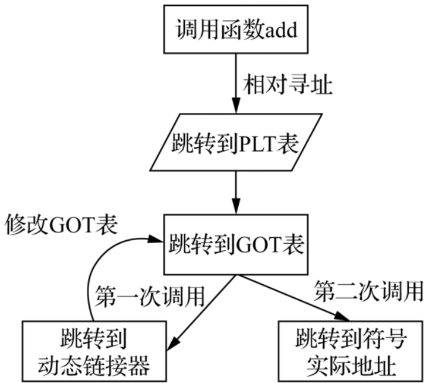

## 嵌入式 C 语言自我修养

<br>

### ARM 体系结构

#### ARM 体系结构

ARM 相对精简指令集 RISC 还有如下区别
● ARM 有桶型移位寄存器，单周期内可以完成数据的各种移位操作。  
● 并不是所有的 ARM 指令都是单周期的。  
● ARM 有 16 位的 Thumb 指令集，是 32 位 ARM 指令集的压缩形式，提高了代码密度  
● 条件执行：通过指令组合，减少了分支指令数目，提高了代码密度。  
● 增加了 DSP、SIMD/NEON 等指令。

<br>

除了用户模式是普通模式，剩下的几种工作模式都属于特权模式

ARM 处理器中的寄存器可分为通用寄存器和专用寄存器两种

寄存器 R0 ～ R12 属于通用寄存器  
`R0 ～ R3` 通常用来传递函数参数  
`R4 ～ R11` 用来保存程序运算的中间结果或函数的局部变量等  
`R12` 常用来作为函数调用过程中的临时寄存器

<br>

`R13` 寄存器又称为堆栈指针寄存器（Stack Pointer，SP），用来维护和管理函数调用过程中的栈帧变化，R13 总是指向当前正在运行的函数的栈帧，一般不能再用作其他用途

`R14` 寄存器又称为链接寄存器（Link Register，LR），在函数调用过程中主要用来保存上一级函数调用者的返回地址

`R15` 又称为程序计数器（Program Counter，PC），CPU 从内存取指令执行，就是默认从 PC 保存的地址中取的

当前处理器状态寄存器`（Current Processor State Register，CPSR）`主要用来表征当前处理器的运行状态

在每种工作模式下，都有一个单独的程序状态保存寄存器`（Saved Processor State Register，SPSR）`

<br>

#### ARM 汇编指令

`ARM` 指令集属于 `RISC` 指令集，CPU 无法对内存里的数据直接操作，只能通过 `Load/Store` 指令来实现

ARM 存储访问指令中，我们经常使用的是 `LDR/STR、LDM/STM` 这两对指令  
`LDR/STR` 指令用来在寄存器和内存之间输送数据

在寄存器之间传送数据，则可以使用 MOV 指令

很多 ARM 指令会使用第二个参数 `operand2`：可以是一个常数，也可以是寄存器+偏移的形式

<br>

几乎所有的 ARM 指令都可以根据 `CPSR` 寄存器中的标志位，通过指令组合实现条件执行

`BEQ` 指令表示两个数比较，结果相等时跳转  
`BNE` 指令则表示结果不相等时跳转

<br>

主要的跳转指令  
`B label` 跳转到标号 label 处  
`BL label` 表示带链接的跳转  
`BX Rm` 表示带状态切换的跳转。Rm 寄存器中保存的是跳转地址，要跳转的目标地址处可能是 ARM 指令，也可能是 Thumb 指令  
`BLX` 是 BL 指令和 BX 指令的综合

<br>

#### ARM 寻址方式

> 此版块内容已在 LinuxC 一站式编程的笔记下记录，如有需要可直接前往指定文章阅览

<br>

#### ARM 伪指令

> ARM 伪指令并不是 ARM 指令集中定义的标准指令，而是为了编程方便，各家编译器厂商自定义的一些辅助指令

`LDR` 伪指令的主要用途是将一个 32 位的内存地址保存到寄存器中  
一般我们会在 LDR 伪指令前加一个等号，用来告诉编译器这是个伪指令

<br>

`ADR` 功能和 LDR 类似，但其为小范围的地址读取伪指令，底层使用相对寻址来实现，因此可以做到代码与位置无关  
ADR 伪指令在编译时则通常会被 ADD 或 SUB 指令代替  
ADR 则使用相对地址

<br>

#### C 与汇编混合编程

混合编程需要遵循这个原则： `ATPCS` （全称是 ARM-Thumb Procedure Call Standard）  
核心内容就是定义了 ARM 子程序调用的基本规则及堆栈的使用约定等

<br>

### 程序编译链接与安装运行

#### 预处理过程

`＃pragma` 预处理命令可以设定编译器的状态，指示编译器完成一些特定的动作  
● `＃pragma pack([n])`：指示结构体和联合成员的对齐方式。  
● `＃pragma message("string")`：在编译信息输出窗口打印自己的文本信息。  
● `＃pragma warning`：有选择地改变编译器的警告信息行为。  
● `＃pragma once`：在头文件中添加这条指令，可以防止头文件多次编译。

<br>

预处理的完整操作

1. 头文件展开，#include 的头文件展开到当前位置
2. 宏展开，删除所有#define
3. 条件编译，根据宏定义的条件选择要参与编译的分支代码
4. 删除注释
5. 添加行号和文件名标识
6. 保留#pragma 命令

<br>

#### 编译过程

编译过程即将高级语言变成低级语言的过程，汇编语言和二进制语言很相似

编译过程可分为六步

1. 词法分析：词法扫描器从左到右逐字符扫描，名将其分解为最小单元 token
2. 语法分析：通过对 token 进行解析，得到一个语法正确的语法树 AST
3. 语义分析：对语法分析输出的各种表达式、语句进行检查
4. 中间代码生成：转换语法树为中间代码，他是一个一维线性序列结构
5. 汇编代码生成：使用汇编器将前一阶段生成的汇编文件翻译成目标文件
6. 目标代码生成

<br>

语法分析工具在对 `token` 序列分析过程中，如果发现不能构建语法上正确的语句或表达式，就会报语法错误：`syntax error`

中间代码与平台无关，可以任意的在后续的流程中转换为 x86 平台或者 ARM 平台

汇编的流程主要包括词法分析、语法分析、指令生成等过程

<br>

符号表  
汇编器会分析汇编语言中各个 section 的信息，收集各种符号，生成符号表，将各个符号在 section 内的偏移地址也填充到符号表内

重定位表：重定向符号关联的地址

<br>

#### 链接过程

链接器将编译器生成的各个可重定位目标文件重新分解组装：  
将各个目标文件的代码段放在一起，作为最终生成的可执行文件的代码段；  
将各个目标文件的数据段放在一起，作为可执行文件的数据段

链接器会在可执行文件中创建一个全局的符号表，收集各个目标文件符号表中的符号，然后将其统一放到全局符号表中

<br>

符号决议：不同模块之间全局变量如命名一致就会造成变量污染，此时链接器会使用特殊的决议方法避免冲突

符号决议解决变量同名冲突的方法

- 引入强弱符号：函数名、初始化的全局变量是强符号，而未初始化的全局变量则是弱符号
- 在一个多文件的工程中，强符号不允许多次定义，否则就会发生重定义错误
- 强符号和弱符号可以在一个项目中共存，当强弱符号共存时，强符号会覆盖掉弱符号

<br>

GUN C 编译器使用 `__attribute__` 关键字来将强符号转换为弱符号

强符号对应强引用，弱符号对应弱引用  
强引用时链接找不到定义，报未定义错误；弱引用时链接找不到定义， 不报错；

<br>

#### 程序安装

> DEBIAN 系（ubuntu、debian）安装包管理系统为 deb；RedHat（kail）系安装包管理系统为 rpm

按照以下步骤制作我们的第一个 deb 安装包

任选一个文件夹，创建源码 demo.c

```c
#include <stdio.h>

int main(void){
  printf("123\n");
  return 0;
}
```

编译得到可执行文件 `gcc -o hw.out demo.c`

在当前文件夹下创建文件夹 hw，并根据以下树形结构创建对应的文件与文件夹  
`control` 文件用来对 deb 包进行参数配置  
`hw` 文件即我们刚刚编译好的可执行文件（这里需要把 hw.out 改名为 hw）

```
 hw
   ├── DEBIAN
   │   └── control
   └── usr
       └── local
           └── bin
               └── hw

```

control 文件进行简单的参数配置（注意 package 不能错！）

```
package:hw
version:1.0
architecture:i386
maintainer:wit
description:deb package demo
```

<br>

回到根目录下（此时和 hw 文件夹同级），打开终端，使用 dpkg 进行打包  
`dpkg -b hw/ hw_1.0_i386.deb`

完毕，此时根目录下生成了打包好的文件 `hw_1.0_i386.deb`

简单的安装一下 `sudo dpkg -i hw_1.0_i386.deb`

此时，可执行文件 hw 就被默认安装到了 `/usr/local/bin` 文件夹下，相当于 ubuntu 的系统路径；  
这意味着我们可以直接在任意路径下使用命令 `hw` 来执行该文件！

<br>

#### apt-get

> apt-get 默认从 ubuntu 提供的主服务器下载包，这些包都经过官方检验后才上架供下载的

`/etc/apt/source.list` 存储着下载源使用的服务器，我们可以修改到当前位置最近的镜像节点

修改完毕镜像节点后需要对 apt 进行更新 `sudo apt-get update`  
更新是为了获取可下载的软件列表，它存储在 `/var/lib/apt/lists`

apt-get 好处是可以处理依赖关系，就像 npm 下载时会把 A 库所依赖的 B 库也下载到 node_modules 文件夹内

<br>

#### 链接静态库

静态库：编译时，链接器将引用的函数代码或者变量连接到可执行文件内部，与其组装在一起

动态库：在编译阶段不参与链接，在程序运行时才加载到内存参与链接

<br>

使用 ar 指令通过 c 源码打包成静态库  
`ar rcs demo.a demo.o`

假设我们仅需要使用静态库中的一个方法，最好将该方法分离为一个单个静态库并对其进行链接，否则将所有方法变量写在一个静态库内会使得他们全部链接，造成冗余

<br>

#### 动态链接

动态链接对静态链接做了一些优化：对一些公用的代码，如库，在链接期间暂不链接，而是推迟到程序运行时再进行链接

windows 下的动态链接库后缀为 dll，而 linux 则为 so

<br>

程序开始加载时，操作系统将控制权转交动态链接器，让他完成动态链接库加载与重定向，最后跳转欲运行的程序  
（事实上，动态链接器也是一个动态链接库）

全局偏移表 GOT：每个应用程序将引用的动态库（绝对地址）符号收集起来，保存到该表中，这个表用来记录各个引用符号的地址

<br>



<br>

#### 共享库

可执行文件依赖的共享库一般要放到库的默认路径下面，如`/lib、/usr/lib` 等

用户可以在 `/etc/ld.so.conf` 文件中添加自己的共享库路径

当然，你可以使用 LD_LIBRARY_PATH 来临时更改共享库路径  
`export LD_LIBRARY_PATH = /home/xxx/xxx`

<br>

#### 插件工作原理

插件的本质即为共享动态库  
Linux 提供了专门的 API，支持显示加载和引用动态链接库

加载动态链接库  
`void *dlopen`

获取动态对象地址  
`void *dlsym`

关闭动态链接库  
`int dlclose(void *Handle)`

动态库错误函数  
`const chat *dlerror(void)`

<br>

#### Linux 内核模块运行机制

`insmod` 命令可以动态加载内核模块

内核模块文件后缀为 ko，它也是一个可重定位的目标文件

内核模块和动态库很相似，但前者是运行在内核态，后者运行于用户态

<br>

#### Linux 内核编译与启动分析

过于低层，不是你们嵌入式应用开发要学的，或者后续感兴趣再学，现在作者也没时间搁着说废话

<br>

### 内存堆栈管理

#### 进程与基础内存管理

Linux 中，每个进程都使用一个 task_struct 结构体表示，各个 task_struct 构成一个链表，由操作系统的调度器管理和维护，每一个进程都会接受操作系统的任务调度，轮流占用 CPU 去运行

用户使用 malloc 申请的内存一般被称为堆内存（heap）  
函数调用过程中使用的内存一般被称为栈内存（stack）

<br>

Linux 内核通过页表和 `MMU 硬件` 来管理内存，完成虚拟地址到物理地址的转换、内存读写权限管理等功能

<br>

#### 栈管理

栈的初始化其实就是栈指针 SP 的初始化

X86 处理器一般使用 ESP（栈顶指针）和 EBP（栈底指针）来管理堆栈，而 ARM 处理器则使用 R13 寄存器（SP）和 R11 寄存器（FP）来管理堆栈

Linux 环境下，栈的起始地址一般就是进程用户空间的最高地址，紧挨着内核空间

<br>

函数的栈空间都被称为栈帧（Frame Pointer，FP）

<br>

**形参与实参在栈上的处理异同点**  
形参只是在函数被调用时才会在栈中分配临时的存储单元，用来保存传递过来的实参值  
变量作为实参传递时，只是将变量值复制给了形参，形参和实参在栈中位于不同的存储单元

形参只有在函数被调用时才会在函数栈帧内分配存储单元，用来接收传进来的实参值

<br>

C 语言具备宽松的溢出校验机制，或者说跟没就没有校验，程序访问越界也不会报错，黑客可以利用这一点，修改地址，使得数组越界跳转到黑客新写的代码里面去

<br>

#### 堆内存管理

> 在使用 malloc 以及 free 时，用的就是堆内存（heap）

堆内存特点

- 匿名，仅能通过指针访问
- 申请与释放均由程序员完成，若用完后不释放就造成内存泄漏

<br>

`uC/OS（微控制器操作系统）` 可以协助我们进行 malloc 以及 free 的操作

在 `uC/OS` 初始化过程中，会调用 `OS_MemInit()`函数，在内存中创建一个节点数为 `OS_MAX_MEM_PART` 的链表

在构建空闲内存块链表时，会占用每个内存块的前 4 字节来存放地址指向下一个内存块

堆内存分配完整流程

1. 用户申请一块内存时，内存分配器就根据申请的内存大小从 `bins` 查找合适的内存块
2. 申请的内存块小于 `M_MXFAST` 时，ptmalloc 分配器会首先到 fast bins 中去看；如果没有找到，则再到 small bins 中查找。如果要申请的内存块大于 512 字节，则直接跳过 small bins
3. 在适当的时机，`fast bins`会将物理相邻的空闲内存块合并，存放到`unsorted bin`中

> TMD 看不下去了，怎么这么复杂

<br>

### GUN C 编译器扩展语法精讲

#### C 语言标准

K&R C 一般也称为传统 C

ANSI C 是 ANSI 在 K&R C 的基础上，统一了各大编译器厂商的不同标准，并对 C 语言的语法和特性做了一些扩展

C99 标准是 ANSI 在 1999 年基于 C89 标准发布的一个新标准

C11 标准是 ANSI 在 2011 年发布的最新 C 语言标准

<br>

#### 指定初始化
