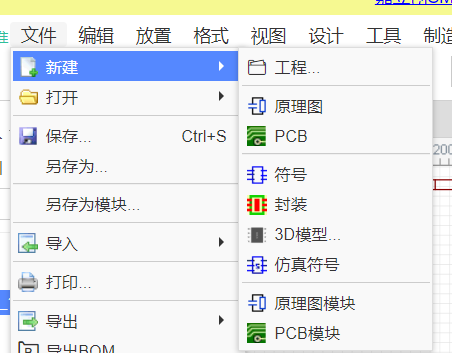
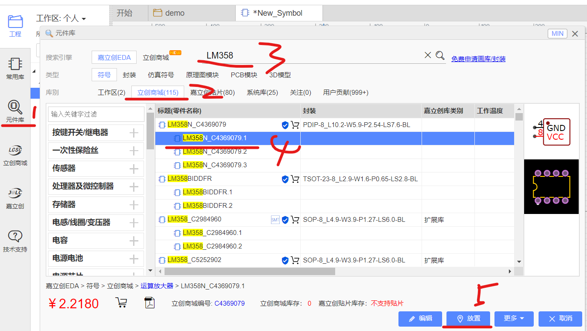
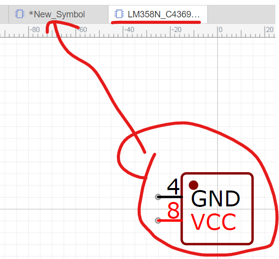
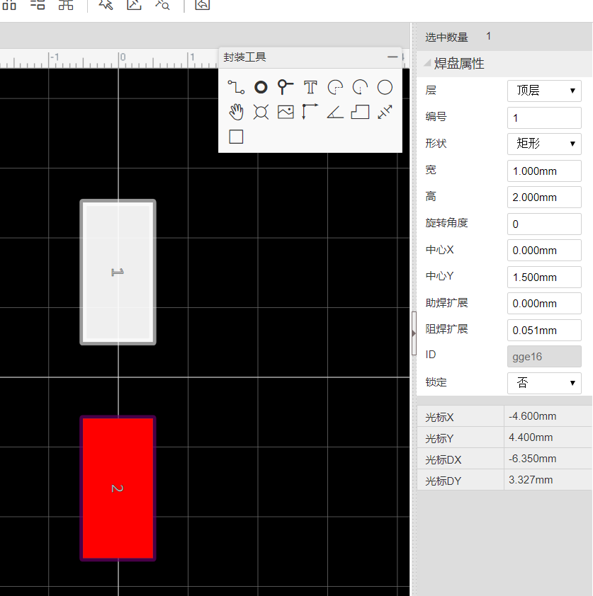
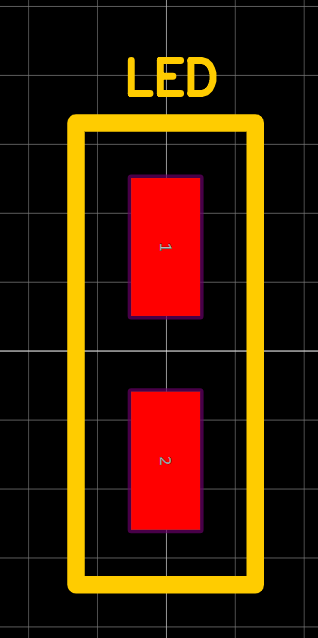
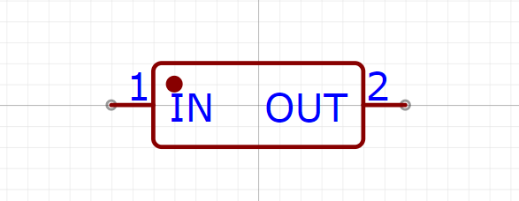
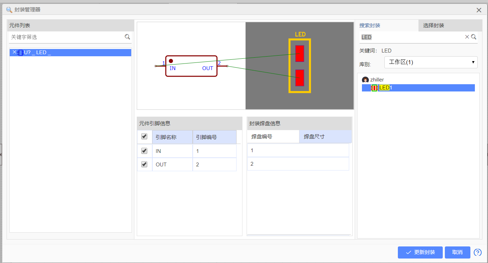
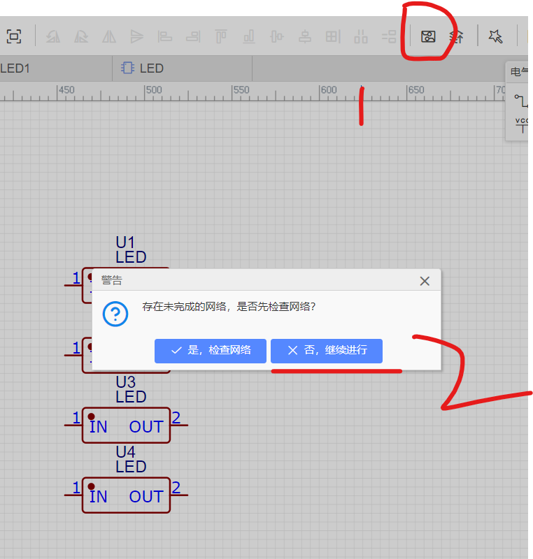
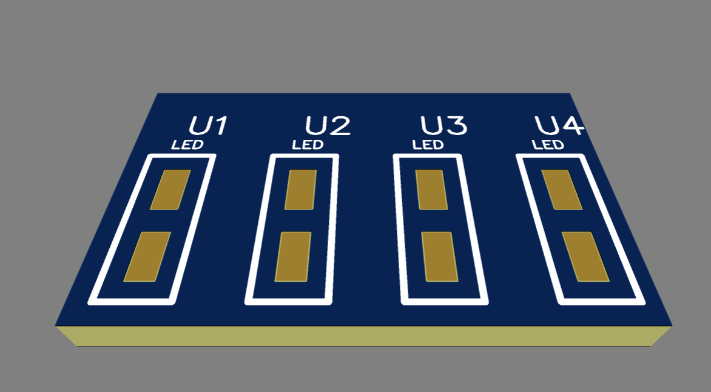

## 立创 EDA 标准版

由于立创 EDA 新版本改了对应术语，这是对于的表格：

原理图库->符号  
PCB 库->封装  
PCB 3D 库->3D 模型

下面的全部讲述将依据旧版称呼，因为更直观，新版称呼模棱两可并且与 AD 的工程架构差别较大

这是最新版本的创建表

 

### 原理图库创建

原理图库分为单库和子库

- 单库只有一个元件
- 子库则可以包含多个元件，通常用来定义一个元件的不同变体

 

点击 `文件->新建->符号`

单击右侧元件库按钮，我们可以在弹出窗口内任意选择嘉立创提供给我们的元件图，一般都可以找到而不需要我们自己再画

按下图操作，选择一个元件并点击放置

此时发现弹出了一个新页面，我么需要在该新页面选择该元件并复制到我们创建的原理库中去

复制粘贴完毕后直接保存，即可得到一个原理库

 

如何创建子库？

再次进入元件库，点击工作区，然后右键点击任意一个我们自定义的元件，点击 `添加子库` 即可

 

### 封装库

点击 `文件->新建->封装`

弹出的窗口直接点击取消，不要创建紫色的板子区域

创建两个焊盘，焊盘使用矩形，位于顶层  
特别注意复制新的焊盘时，编号是不变的，我们必须对其进行修改，否则原理库中的元件没办法和该 PCB 上的封装一一对应，会直接报错！！！

如下图，修改好编号后的结果

使用导线组件，包裹住两个焊盘，并随意添加一个文本组件

确保二者均位于 `顶层丝印层`

ctrl+s 保存封装，封装标题随便取，我这里取 `LED1`

 

点击 文件->新建->符号

使用符号向导快速创建具有两个引脚的元件

点击 工具->封装管理器 （或者直接快捷键 alt+f）

我们要为当前符号指定一个封装，这就是我们之前为什么要着重指出编号问题了，如果编号不对应这一步是出错的！

ctrl+s 保存这个符号

 

回到最开始的原理图文件内，导入我们刚刚创建的新符号

此时点击下图偏右上角的 “原理图转 PCB” 按钮

弹出窗口让我们检查网络，直接不管，点击否

调节紫色框完全包裹住我们的元件，然后进入 3D 预览模式，即可看到成型的板子啦~

 
