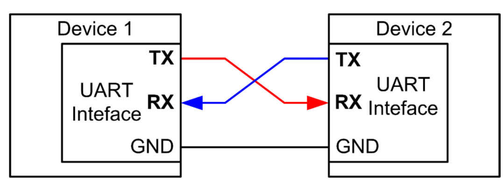
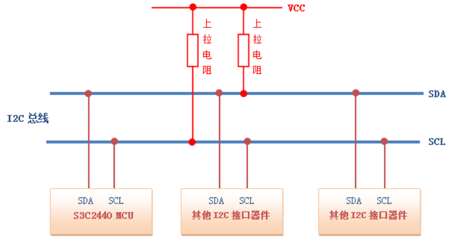
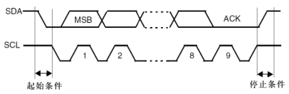
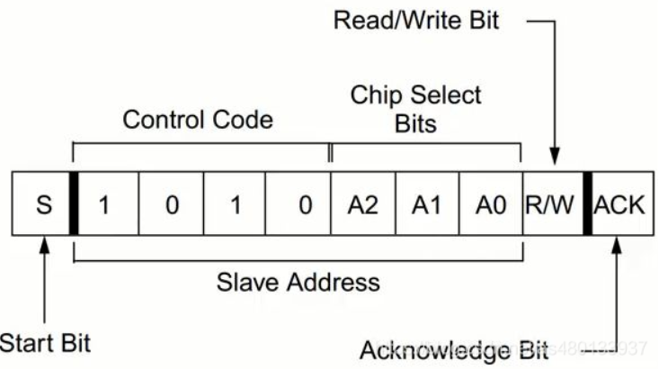
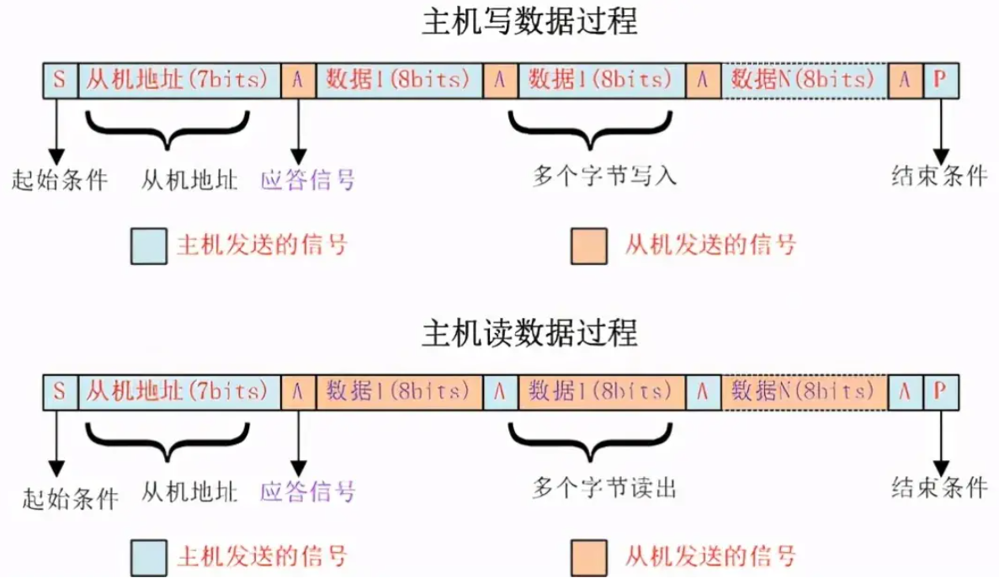
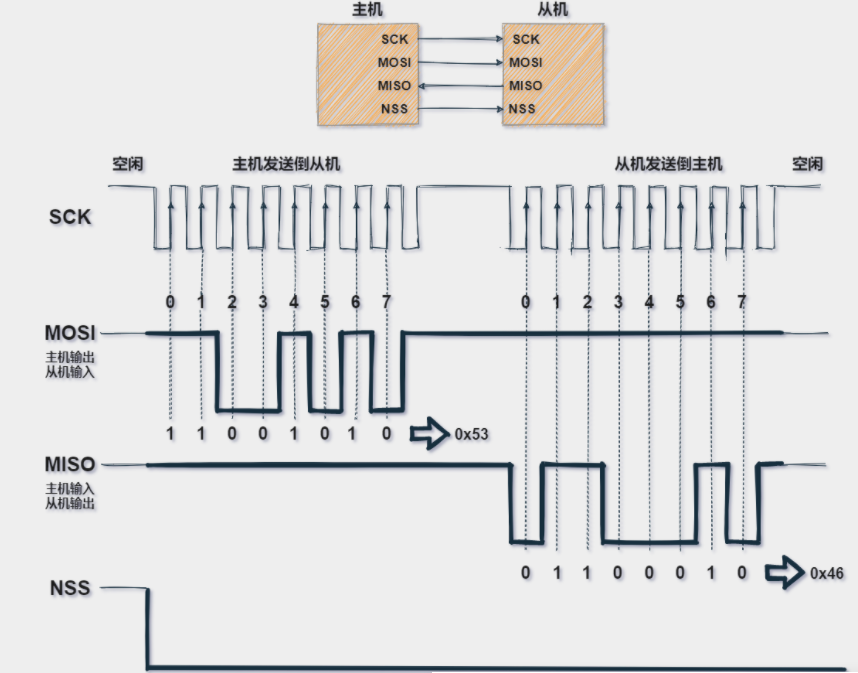

### 串行通信

串行接口简称串口，也称串行通信接口或串行通讯接口

传输方式：传递一个字节时，按照顺序逐个传递

异步通信：不使用时钟信号，每次发送一个数据帧（包括起始位、数据主体、奇偶校验位、终止位），同时双方需约定波特率

同步通信：双方构建一条时钟信号连接，在时钟的协调下按频率发送数据

 

### 并行通信

传递字节时，使用多个并口，所有并口同时进行数据传输

 

### UART 通用异步收发器

#### 定义

> 简要定义：UART 是一款双向、串行、异步的通信总线，可仅用一根数据接收线和一根数据发送线就能实现全双工通信

UART 使用异步收发数据，发送器根据其时钟信号生成的位流取代了时钟信号，接收器使用其内部时钟信号对输入数据进行采样

UART 发送器和接收器必须设置一致的波特率，允许的波特率差异最大值为 10%，超过此值，位的时序就会脱节

 

#### UART 四条接口

- VCC：供电 pin，一般是 3.3V，在实际使用中一般不接，不影响使用；
- GND：接地 pin，板内共地时可以不单独接，板间通信时候必须接上；
- RX：接收数据 pin；
- TX：发送数据 pin； 需要注意 TX RX 的参考系，不要接反了，电平需要兼容；

 

#### UART 传输分析

UART 协议帧：一个传输数据包  
包括结构：起始位、数据段、奇偶校验位、终止位

UART 数据传输流程

1. 总线发送二进制数据给 UART
2. UART 为数据包装，添加起始位、奇偶校验、终止位
3. 数据包以串行的形式发给接收器
4. 接收器校验后拆包，取出二进制数据
5. 二进制串行数据转换回并行数据，发送给总线

 

#### USART

> 一般的，可将 USART 和 UART 视为同种接口，但二者仍然在属性有部分区别

- 需要外部时钟，所以接收方无需直到发送方波特率，只需对接外部时钟即可
- 同步数据以块的形式传输
- USART 更为复杂，他可以模拟 UART 的功能，而反过来就不行！

 

### CAN 控制器局域网络

 

### 电平协议

#### TTL

TTL 是一种数字电平标准，代表“Transistor-Transistor Logic”（晶体管-晶体管逻辑）。  
在 TTL 电路中，晶体管用于放大和切换信号，而逻辑门则用于实现布尔逻辑功能。

TTL 电平的定义  
高电平（通常为 5 伏）被定义为逻辑“1”  
低电平（通常为 0 伏）被定义为逻辑“0”

 

#### RS232

高低电平有效无效范围区间  
信号有效 接通，ON 状态，正电压 `+3V ～+15V`  
信号无效 断开，OFF 状态，负电压 `-3V ～-15V`

RS-232C 并未定义连接器的物理特性，故引脚定义五花八门，

 

#### RS485

定义：它是一种多点、半双工的通信协议，允许多个设备在同一总线上通信，同时只有一个设备发送数据。

RS485 协议使用差分信号传输，即每个数据线上的信号都是相互倒置的。

RS485 总线通常由一个主设备和多个从设备组成，主设备负责控制总线上的通信，而从设备则负责接收和响应主设备发送的数据。  
RS485 总线支持最多 32 个从设备

 

### 握手

#### 软件握手

通常用在实际数据是控制字符的情况  
同样具有三条线，Tx，Rx，地线

发送方高波特率发送数据，接收方 buffer 半满或者快满时，发送 `XOFF` ，告知发送方停止发送  
接收方 buffer 空出后，发送 `XON` ，告知发送方继续传输

 

#### 硬件握手

RTS 线：接收方准备好接收数据时，置高电平  
CTS 线：发送方准备号发送数据时，置高电平

对于 Modem  
DTR 高电平：表示准备好接收 PC 数据  
DSR 高电平：表示 PC 开始发送数据

> 简单记忆：RTS/CTS 表示数据包开始传输，DTR/DSR 表示系统通信就绪

 

#### XModem 握手

xmodern 握手是一种用于在 TLS 连接中协商密码套件的协议。它允许客户端和服务器在一个集合中选择安全性最高的密码套件，从而增加了连接的安全性。下面详细介绍 xmodern 握手的原理和流程。

1. 原理

xmodern 握手是一个相对简单的协议，它使用了一个安全性更高的密码套件，这个密码套件通常是一组独立的加密算法和协议，它们被称为密码套件的组件。在 TLS 连接中，客户端和服务器可以使用 xmodern 握手来协商出一个安全性最高的密码套件。这个密码套件包括一组组件，比如加密算法、密钥交换协议、数字签名算法等，这些组件共同构成了一个密码套件。在 xmodern 握手过程中，客户端和服务器都将发送一个密码套件列表，然后选择列表中共同支持的密码套件中安全性最高的一个。

2. 流程

xmodern 握手过程通常包括以下步骤：

（1）客户端发送一个“客户端 hello”消息，该消息包括以下信息：

- 客户端支持的 TLS 版本号
- 客户端支持的密码套件列表
- 客户端支持的压缩算法列表
- 随机数

（2）服务器回复一个“服务器 hello”消息，该消息包括以下信息：

- 确认的 TLS 版本号
- 选择的密码套件
- 选择的压缩算法
- 随机数

（3）服务器发送一个证书消息，用于验证服务器的身份。该证书通常包括服务器的公钥、证书颁发机构的名称以及数字签名等信息。

（4）如果服务器要求客户端进行身份验证，则服务器发送一个要求客户端提供证书的“服务器 hello done”消息。

（5）客户端向服务器发送一个“客户端 key exchange”消息，该消息包括以下信息：

- 客户端的随机数
- 客户端生成的用于加密会话密钥的公钥信息

（6）客户端发送一个“证书验证”消息，该消息用于验证服务器提供的证书是否有效。

（7）客户端发送一个“客户端 finish”消息，该消息包括一个握手消息哈希和，用于验证握手消息是否被篡改。

（8）服务器回复一个“服务器 finish”消息，该消息也包括一个握手消息哈希和。

在完成以上步骤之后，TLS 连接就建立起来了，客户端和服务器之间可以进行加密通信。

总的来说，xmodern 握手是 TLS 连接中的一个关键步骤，它确保了客户端和服务器

 

### IIC 集成电路总线

> 整体定论：IIC 由恩智浦 NXP 公司研发，适合小数据、短距离、单点传输（只能有一个主机），传输速度较慢

 

#### 层次分析

IIC 总线就两个  
`SDA(Serial Data)` 数据线，双向传递数据  
`SCL(Serial Clock Line)` 时钟线，控制数据发送的时序

总线上会链接 N 个设备，而控制 SCL 总线时钟变化的设备被称为主设备，其余的都成为从设备

IIC 主设备功能：主要产生时钟，产生起始信号和停止信号  
IIC 从设备功能：可编程的 IIC 地址检测，停止位检测

SCL 和 SDA 都需要接上拉电阻以确保数据稳定性，且主从设备均无法控制 SCL 总线变成高电平

IIC 是半双工，而不是全双工 ，同一时间只可以单向通信

 

#### 高阻态

所有设备空闲状态接入 IIC 总线后都会统一被拉到高阻态（SDA 与 SCL 均处于高阻态），即处于断路状态；  
只有正在进行数据交换的设备才可正常通信

高阻态即 SDA 和 SCL 总线均为高电平

IIC 器件地址出厂时即设定好，无法更改

IIC 需要为 SDA 与 SCL 设置上拉电阻，通过官方手册计算得到最佳的阻值为：

- 对于 5V 的电源，每个上拉电阻阻值至少 1.53kΩ
- 对于 3.3V 的电源，每个电阻阻值至少 967Ω
- 或者直接使用经典的 4.7kΩ

 

#### 协议层

IIC 传输时存在三种主要信号

- 开始信号：SCL 高电平，SDA 高电平跳低电平，开始数据传输
- 结束信号：SCL 高电平，SDA 低电平跳高电平，结束传输数据
- 应答信号：接收数据的 IC 收到后反馈一个低电平脉冲，高速主设备数据已收到

开始阶段：SDA 延迟 4.7us 后跳低电平，间隔 4us 后 SCL 跳低电平，高阻态解除，数据开始传输（正因如此，SDA 就必须保持绝对稳定，否则任何的一次错误跳变都会触发开始阶段阻塞总线！！！）

结束阶段：SCL 先行跳高电平，SDA 延迟 4us 跳高电平，双双回到高阻态，结束数据传输

应答阶段：主机 SCL 拉高，读取从机 SDA 的电平，为低电平表示产生应答（应答信号高电平表失败，低电平表成功）

> 在开始阶段和结束阶段 SDA 和 SCL 跳变的过程中，总线独占，IIC 器件无法访问总线

 

#### 数据传输格式

从设备地址格式：八位设备地址=7 位 从机地址+读/写地址  
其中一位表示数据传输方向，0 写 1 读

图中前八位即为数据位，后面的才是

 

#### 完整传输流程

主机发送读取两种不同的状态要分别对应不同的应答

起始、发送、应答、结束，四大阶段已经在上文详细说明

 

#### 总线仲裁

SCL 线上只要有一个节点发送低电平，总线上就表现低电平。当所有的节点都发送高电平时，总线才能表现为高电平。

SDA 仲裁：主机在发送数据后，通过比较总线上的数据来决定是否退出竞争。丢失仲裁的主机立即切换到未被寻址的从机状态

 

### SPI 同步数据总线

> SPI 为同步数据总线，使用一个单独时钟信号确保发送接收端同步

 

#### 数据传输流程

NSS(或 CS/SS) 置低电平，表示开始传输数据

SCK 时钟发出脉冲信号，输入端每接收到一个脉冲就读入一个数据

MOSI 为主机输出端口；  
MISO 为从机输出端口；

主机有且只能有一个，从机可以有任意多个

SPI 接口读写操作均由主设备发起

 

#### 时钟问题

时钟速率：任意设置，但不可超过 SPI 提供的上限值

时钟极性（CKP/CPOL）：用于设置时钟空闲状态下（或默认状态）对应的电平

时钟相位（CKE/CPHA）：声明数据采集时在时钟那个具体相位以及边沿

以上参数组合会出现四种不同的数据采样方式：

1. `Mode0：CKP=0，CKE =0` 当空闲态时，SCK 处于低电平，数据采样是在第 1 个边沿，也就是 SCK 由低电平到高电平的跳变，所以数据采样是在上升沿（准备数据），（发送数据）数据发送是在下降沿。
2. `Mode1：CKP=0，CKE=1` 当空闲态时，SCK 处于低电平，数据发送是在第 2 个边沿，也就是 SCK 由低电平到高电平的跳变，所以数据采样是在下降沿，数据发送是在上升沿。
3. `Mode2：CKP=1，CKE=0` 当空闲态时，SCK 处于高电平，数据采集是在第 1 个边沿，也就是 SCK 由高电平到低电平的跳变，所以数据采集是在下降沿，数据发送是在上升沿。
4. `Mode3：CKP=1，CKE=1` 当空闲态时，SCK 处于高电平，数据发送是在第 2 个边沿，也就是 SCK 由高电平到低电平的跳变，所以数据采集是在上升沿，数据发送是在下降沿。

 

#### 多从机

主机可以使用多个 NSS 口连接到不同的从机，但这会导致竞争问题

另一种方式即采用“菊花链”，即设备信号以串行的方式从一个设备传递到下一个设备中去，以此类推

 

#### SPI 优缺点

数据传输速度快、带宽高、可靠性好。同时，由于每个设备都有一个独立的片选线，因此可以连接多个从设备。

SPI 协议需要使用多个 GPIO 引脚，因此在引脚数量有限的应用场景下，SPI 协议可能不是最佳选择。

 

### 参考文献

[同步异步通讯](https://blog.csdn.net/Rocher_22/article/details/116590629)

[通讯协议大全](https://blog.csdn.net/qq_21104377/article/details/107058919?ops_request_misc=%257B%2522request%255Fid%2522%253A%2522168125876216800180669098%2522%252C%2522scm%2522%253A%252220140713.130102334..%2522%257D&request_id=168125876216800180669098&biz_id=0&utm_medium=distribute.pc_search_result.none-task-blog-2~all~top_positive~default-1-107058919-null-null.142^v82^insert_down1,201^v4^add_ask,239^v2^insert_chatgpt&utm_term=%E9%80%9A%E8%AE%AF%E5%8D%8F%E8%AE%AE)

[UART 总结](https://blog.csdn.net/m0_38106923/article/details/126024970?ops_request_misc=%257B%2522request%255Fid%2522%253A%2522168125949316800184186151%2522%252C%2522scm%2522%253A%252220140713.130102334..%2522%257D&request_id=168125949316800184186151&biz_id=0&utm_medium=distribute.pc_search_result.none-task-blog-2~all~top_positive~default-1-126024970-null-null.142^v82^insert_down1,201^v4^add_ask,239^v2^insert_chatgpt&utm_term=UART)
