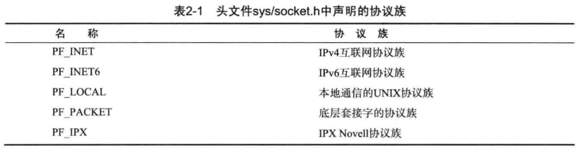
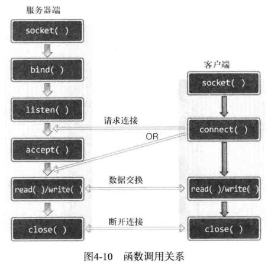

## 网络编程与套接字

<br>

### 理解网络编程与套接字

#### 网络编程中接收连接请求套接字过程

以下为一个服务端构建 socket 套接字需要做到的完整四个步骤

1. 调用 socket 函数创建套接字
2. 调用 bind 函数分配 IP 地址和端口号
3. 调用 listen 函数转换为可接受请求的状态
4. 调用 accept 函数受理连接请求

<br>

#### 客户端套接字处理

对于需要连接上服务端的客户端而言，相对于的代码就简洁了很多

仅需先调用 socket 函数创建套接字，之后再调用 connect 函数向服务器端发送链接请求

<br>

### 基于 linux 的文件操作

#### 文件描述符

文件描述符（file descriptor）是一个整数值，用于表示操作系统中的打开文件或者输入或输出设备。它是对打开文件或设备的引用，通过文件描述符可以进行读取、写入和其他操作。

文件和套接字一般需要经过创建过程才会被分配文件描述符

在 UNIX 系统中对应的输入输出三个文件描述符是：
标准输入（stdin）、标准输出（stdout）和标准错误（stderr）分别有文件描述符 0、1 和 2

<br>

#### 数据操作

由于 Linux 不区分文件以及套接字，可以直接使用对应的文件处理函数来处理套接字  
比如 open、close、write

常见的以 `_t` 结尾的数据类型：

1. `size_t`: 这是一个无符号整数类型，在 `<cstddef>` 头文件中定义。它用于表示对象大小或容器的大小。
2. `ptrdiff_t`: 这是一个有符号整数类型，在 `<cstddef>` 头文件中定义。它用于表示指针之间的差异（偏移量）。
3. `time_t`: 这是一个整数类型，在 `<ctime>` 头文件中定义。它用于表示从特定时间点（通常是 1970 年 1 月 1 日）起经过的秒数。
4. `int32_t, int64_t, uint32_t, uint64_t`: 这些是固定宽度的整数类型，在 `<cstdint>` 头文件中定义。它们分别表示有符号的 32 位整数、有符号的 64 位整数、无符号的 32 位整数和无符号的 64 位整数。

<br>

这是一个简单的，使用文件操作的小案例

```c
#include <iostream>   // 标准输入输出操作
#include <fcntl.h>    // 文件控制选项
#include <unistd.h>   // 文件操作

int main(void) {
    int fd;                              // 文件描述符变量
    char buf[] = "helloworld\n";         // 要写入的数据缓冲区

    fd = open("data.txt", O_CREAT | O_WRONLY | O_TRUNC);  // 打开文件以进行写入操作
    if (fd == -1) {
        // 如果文件打开失败，进行错误处理
        std::cerr << "无法打开文件。" << std::endl;
        return 1;  // 返回非零值表示错误
    }

    std::cout << "文件描述符：" << fd << std::endl;  // 打印文件描述符

    if (write(fd, buf, sizeof(buf)) == -1) {
        // 如果写入操作失败，进行错误处理
        std::cerr << "写入文件失败。" << std::endl;
        close(fd);  // 在返回前关闭文件
        return 1;   // 返回非零值表示错误
    }

    close(fd);   // 关闭文件
    return 0;    // 返回0表示成功执行
}
```

<br>

#### 同时创建文件描述符与套接字

以下代码示例，创建文件和套接字，使用整数返回文件描述符值

```cpp
#include <iostream>   // 标准输入输出操作
#include <sys/types.h>   // socket 函数相关类型
#include <sys/socket.h>  // socket 函数
#include <fcntl.h>    // 文件控制选项
#include <unistd.h>   // 文件操作

int main(void) {
    int fd1, fd2, fd3;
    fd1 = socket(PF_INET, SOCK_STREAM, 0);  // 创建 TCP 套接字
    fd2 = open("test.txt", O_CREAT | O_WRONLY | O_TRUNC);  // 打开文件进行写入操作
    fd3 = socket(PF_INET, SOCK_DGRAM, 0);  // 创建 UDP 套接字

    close(fd1);  // 关闭套接字
    close(fd2);  // 关闭文件
    close(fd3);  // 关闭套接字

    return 0;  // 返回0表示成功执行
}
```

<br>

### 基于 windows 平台的实现

windows 下的句柄相当于 linux 的文件描述符  
但不同的是 windows 还包括了文件句柄和套接字句柄

由于 windows 下的 CPP 开发不切实际，所以这里就不多陈述了，大家可以查阅相关的资料补全这部分内容，如果大家感兴趣的话！

接下来将会把全本的笔记主要集中在 linux 开发上

<br>

## 套接字类型和协议设置

<br>

### 套接字协议及其数据传输特性

如何创建套接字？

```cpp
int socket(int domain, int type, int protocol);       // domain：采取的协议族，一般为 PF_INET；type：数据传输方式，一般为 SOCK_STREAM；protocol：使用的协议，一般设为 0 即可。
                //成功时返回文件描述符，失败时返回 -1
```

创建套接字的函数 socket 的三个参数的含义：

- `domain`：使用的协议族。一般只会用到 PF\*INET，即 IPv4 协议族。
- `type`：套接字类型，即套接字的数据传输方式。主要是两种：SOCK_STREAM（即 TCP）和 SOCK\*（即 UDP）。
- `protocol`：选择的协议。一般情况前两个参数确定后，protocol 也就确定了，所以设为 0 即可。

<br>

#### 协议族



重点关注 IPV4 对应的 `PF_INET` 协议族，绝大部分情况下使用它，即便目前 IPV6 正在推广

<br>

#### 套接字类型

`SOCK_STREAM` 面向链接的套接字，代表 TCP 协议

- 可靠传输，传输的数据不会消失。
- 按序传输。
- 传输的数据没有边界：从面向连接的字节流角度理解。接收方收到数据后放到接收缓存中，用户使用 read 函数像读取字节流一样从中读取数据，因此发送方 write 的次数和接收方 read 的次数可以不一样。

```cpp
int tcp_socket = socket(PF_INET, SOCK_STREAM, 0);
```

<br>

`SOCK_DGRAM` 面向消息的套接字，代表 UDP 协议

- 快速传输。
- 传输的数据可能丢失、损坏。
- 传输的数据有数据边界：这意味着接收数据的次数要和传输次数相同，一方调用了多少次 write（send），另一方就应该调用多少次 read（recv）。
- 限制每次传输的数据大小。

```cpp
int udp_socket = socket(PF_INET, SOCK_DGRAM, 0);
```

<br>

#### 协议最终选择

当同一协议族中存在多个数据传输方式相同的协议时，需要使用第三个参数来明确指定协议信息

`IPV4中面向链接的套接字`这么写

```cpp
int tcp_socket = socket(PF_INET, SOCK_STREAM, IPPROTO_TCP);
```

`IPV4中面向消息的套接字`这么写

```cpp
int tcp_socket = socket(PF_INET, SOCK_STREAM, IPPROTO_UDP);
```

<br>

#### TCP 套接字案例分析

服务端程序 `tcp_server.c`

```cpp
#include <stdio.h>       // 标准输入输出
#include <stdlib.h>      // 标准库函数
#include <string.h>      // 字符串操作
#include <unistd.h>      // UNIX 标准函数
#include <arpa/inet.h>   // 网络地址转换函数
#include <sys/socket.h>  // 套接字函数

void error_handling(char *message);

int main(int argc, char *argv[])
{
    int serv_sock;                 // 服务器套接字
    int clnt_sock;                 // 客户端套接字

    struct sockaddr_in serv_addr;  // 服务器地址结构体，用于持续监听连接请求
    struct sockaddr_in clnt_addr;  // 客户端地址结构体，用于与客户端连接以传输数据
    socklen_t clnt_addr_size;

    char message[] = "Hello World!";

    if (argc != 2) // 需要两个参数：可执行文件名、端口号
    {
        printf("Usage : %s <port>\n", argv[0]);
        exit(1);
    }

    serv_sock = socket(PF_INET, SOCK_STREAM, 0);  // 创建一个 TCP 套接字
    if (serv_sock == -1)
        error_handling("socket() error");

    memset(&serv_addr, 0, sizeof(serv_addr));      // 将 serv_addr 结构体全部置为 0，主要是为了将 serv_addr 的 sin_zero 成员设为 0
    serv_addr.sin_family = AF_INET;                // 选择 IPv4 地址族
    serv_addr.sin_addr.s_addr = htonl(INADDR_ANY); // htonl：将 long 类型数据从主机字节序转换为网络字节序；INADDR_ANY：表示接受任意 IP 地址
    serv_addr.sin_port = htons(atoi(argv[1]));     // 此程序运行时应在可执行文件名后跟一个端口号作为参数，例如：hello_server 3030

    if (bind(serv_sock, (struct sockaddr *)&serv_addr, sizeof(serv_addr)) == -1) // 将套接字与服务器的 IP 地址和端口号绑定
        error_handling("bind() error");

    if (listen(serv_sock, 5) == -1) // 将套接字转换为监听状态，最多允许同时连接 5 个客户端
        error_handling("listen() error");

    clnt_addr_size = sizeof(clnt_addr);
    clnt_sock = accept(serv_sock, (struct sockaddr *)&clnt_addr, &clnt_addr_size); // 接收一个连接请求，并将 clnt_sock 套接字与其连接
    if (clnt_sock == -1)
        error_handling("accept() error");

    write(clnt_sock, message, sizeof(message)); // 向客户端发送信息。注意：clnt_sock 不是客户端的套接字，而是服务器上与客户端连接的套接字
    close(clnt_sock);                           // 关闭与客户连接的套接字，断开该连接
    close(serv_sock);                           // 关闭监听端口的套接字，不再接受任何请求
    return 0;
}

void error_handling(char *message)
{
    fputs(message, stderr);
    fputc('\n', stderr);
    exit(1);
}
```

<br>

客户端 TCP 套接字程序 `tcp_client.c`

```cpp
#include <stdio.h>       // 标准输入输出
#include <stdlib.h>      // 标准库函数
#include <string.h>      // 字符串操作
#include <unistd.h>      // UNIX 标准函数
#include <arpa/inet.h>   // 网络地址转换函数
#include <sys/socket.h>  // 套接字函数

void error_handling(char *message);

int main(int argc, char *argv[])
{
    int sock;                           // 客户端套接字
    struct sockaddr_in serv_addr;       // 服务器地址结构体
    char message[30];                   // 存储接收到的消息
    int str_len;                        // 读取的消息长度

    if (argc != 3)
    {
        printf("Usage : %s <IP> <port>\n", argv[0]);
        exit(1);
    }

    sock = socket(PF_INET, SOCK_STREAM, 0);  // 创建一个 TCP 套接字
    if (sock == -1)
        error_handling("socket() error");

    memset(&serv_addr, 0, sizeof(serv_addr));      // 将 serv_addr 结构体全部置为 0
    serv_addr.sin_family = AF_INET;                // 选择 IPv4 地址族
    serv_addr.sin_addr.s_addr = inet_addr(argv[1]); // 设置服务器 IP 地址
    serv_addr.sin_port = htons(atoi(argv[2]));     // 设置服务器端口号

    if (connect(sock, (struct sockaddr *)&serv_addr, sizeof(serv_addr)) == -1) // 连接到服务器
        error_handling("connect() error");

    str_len = 0;
    int idx = 0, read_len = 0;
    while (read_len = read(sock, &message[idx++], 1)) // 只有当 read 函数读到 EOF (即服务器端调用了 close 函数) 才会中止循环
    {
        if (read_len == -1)
            error_handling("read() error");
        str_len += read_len; // 统计读取的消息长度
    }

    printf("Message from server: %s\n", message);
    printf("Function read call count: %d\n", str_len);
    close(sock); // 关闭套接字
    return 0;
}

void error_handling(char *message)
{
    fputs(message, stderr);
    fputc('\n', stderr);
    exit(1);
}
```

<br>

## 地址族与数据序列

<br>

### 分配给套接字的 IP 与端口

`IPV4` 属 4 字节地址族  
`IPV6` 属 16 字节地址族

A 类地址首字节范围：0-127  
B 类地址首字节范围：128-191  
C 类地址首字节范围：192-223

计算机内部的网络接口卡（NIC）传输数据时，会附带一个端口号，计算机根据此端口号传递到对应套接字里面

端口号特点

- 无法把一个端口号分给不同套接字
- 端口号可分配范围 0-65535
- 0-1023 为知名端口，分给特定应用程序
- TCP 套接字和 UDP 套接字不会共用端口号

<br>

### 地址信息表示

#### sockaddr_in

该结构体定义了套接字地址的格式，用于在套接字编程中指定服务器和客户端的网络地址

```cpp
struct sockaddr_in {
    sa_family_t     sin_family;   // 地址族，通常为 AF_INET（IPv4）;AF_INET6（IPV6）
    uint16_t        sin_port;     // 16 位端口号，使用网络字节序（大端序）
    struct in_addr  sin_addr;     // 表示 32 位 IP 地址的结构体
    char            sin_zero[8];  // 不使用，填充字节，通常为全零
};
```

<br>

#### 通用结构体 sockaddr

该结构体为通用型，不仅仅用于 IPV4

```cpp
struct sockaddr {
    sa_family_t   sin_family;   // 地址族，用于指定地址的类型
    char          sa_data[14];  // 地址信息，具体格式取决于地址族的类型
};
```

<br>

### 网络字节序与地址转换

#### 字节序与网络字节序

CPU 向内存保存数据的方式有两种：

- 大端序：高位字节存放到低位地址。网络字节序为大端序。
- 小端序：高位字节存放到高位地址。目前主流的 Intel 系列 CPU 按小端序方式保存数据。

数据数组首先转换成统一的大端序格式进行网络传输——网络字节序  
小端序系统传输数据时应当转换为大端序格式

接收数据是以小端存储的

<br>

#### 字节序转换

这是几个景点的转换字节序的函数：`htons、ntohs、htonl、ntohl`

现在对 htons 分析：

- h 表示主机 host，字节序
- to 表示转化为
- n 表示网络 network，字节序
- s 表示 short，对应的 l 表示 long

> 仅有向 sockaddr_in 结构体变量填充数据之外，其余情况不需考虑字节序问题

<br>

### 网络地址的初始化与分配

我们需要把我们经常看到的 IP 地址形式（点分十进制）改为 sockaddr_in 所接受的 32 位整型数据

下面有两种函数可以实现此功能

#### inet_addr

转换类型附带网络字节序转换，还可以识别错误的 IP 地址

```cpp
#include <arpa/inet.h>
in_addr_t inet_addr(const char* string);
```

<br>

#### inet_aton

他利用了 `inet_addr` 结构体，效率更高

他接受一个 `inet_addr` 指针，运行完毕后把数据原路保存到该指针

```cpp
#include <arpa/inet.h>
int inet_aton(const char* string, struct in_addr* addr);
```

> 顾名思义，则可以得到 inet_ntoa 就是一个反向转换

<br>

#### 网络地址初始化

```cpp
struct sockaddr_in addr;                             // 声明一个 sockaddr_in 结构体变量 addr
char *serv_ip = "211.217.168.13";                     // 声明 IP 地址字符串
char *serv_port = "9190";                             // 声明端口号字符串
memset(&addr, 0, sizeof(addr));                       // 将 addr 的所有成员初始化为 0，主要是为了将 sockaddr_in 的成员 sin_zero 初始化为 0。
addr.sin_family = AF_INET;                            // 指定地址族为 AF_INET，表示 IPv4 地址族
addr.sin_addr.s_addr = inet_addr(serv_ip);            // 使用 inet_addr 函数将字符串形式的 IP 地址转换为二进制形式，并将结果存储在 sin_addr.s_addr 中
addr.sin_port = htons(atoi(serv_port));               // 使用 atoi 函数将端口号字符串转换为整数，并使用 htons 函数将端口号转换为网络字节序（大端序），然后存储在 sin_port 中
```

<br>

当然，你要是嫌麻烦的话，可以避免每次都输入 IP 地址，改为使用 `INADDR_ANY` 作为替代品

使用此方法，可以自动获取运行服务器端的主机 IP 地址（服务端优先采用此方法）

<br>

## 基于 TCP 服务器端与客户端

<br>

### 理解 TCP/UDP

此部分可以参阅计算机网络对应的总结笔记，或者相应面经，在此处不做具体介绍

<br>

### 实现基于 TCP 的服务器端和客户端

#### TCP 服务器默认函数调用顺序

下面即为对应的默认函数调用顺序

1. socket() 创建套接字
2. bind() 分配套接字地址
3. listen() 等待链接请求状态
4. accept() 允许连接
5. read()/write() 数据交换
6. close() 断开链接

<br>

#### 进入等待链接请求状态

在调用 accept 函数前，请求会处于等待状态

服务器端处于等待连接请求状态指的是：让来自客户端的请求处于等待状态，以等待服务器端受理它们的请求。

链接等待队列：未被受理的连接请求被放置于此处，该连接池的大小取决于 backlog 定义的大小

```cpp
#include <sys/socket.h>

// 返回值：成功时返回 0，失败时返回 -1
// 参数一：传递文件描述符套接字的用途
// 参数二：等待队列的最大长度
int listen(int sockfd, int backlog);
```

<br>

#### 受理客户端链接请求

```cpp
#include <sys/socket.h>

// sockfd：服务器套接字的文件描述符；sockaddr：用于保存发起连接请求的客户端地址信息；addrlen：第二个参数的长度。
// 返回值：成功时返回创建的套接字文件描述符，失败时返回 -1
int accept(int sockfd, struct sockaddr *addr, socklen_t addrlen);
```

服务器套接字只是控制是否允许连接请求进入服务器端

`accept` 函数会受理连接请求等待队列中待处理的客户端连接请求，它从等待队列中取出 1 个连接请求，创建套接字并完成连接请求。如果等待队列为空，accpet 函数会阻塞，直到队列中出现新的连接请求才会返回。

accept 执行完毕后会将它所受理的连接请求对应的客户端地址信息存储到第二个参数 addr 中。

accept 函数调用成功后，其会在内部产生一个新的套接字并返回其文件描述符，该套接字用于与客户端建立连接并进行数据 I/O。

<br>

#### 客户端连接请求

客户端默认函数调用顺序为

1. socket() 创建套接字
2. connect() 请求连接
3. read()/write() 交换数据
4. close() 断开链接

<br>

```cpp
#include <sys/socket.h>

// 参数：sock：客户端套接字的文件描述符；serv_addr：保存目标服务器端地址信息的结构体指针；addrlen：第二个参数的长度（单位是字节）
// 返回值：成功时返回 0，失败时返回 -1
int connect(int sockfd, struct sockaddr *serv_addr, socklen_t addrlen);
```

客户端调用 `connect` 函数后会阻塞，直到发生以下情况之一才会返回：

- 服务器端接收连接请求。
- 发生断网等异常情况而中断连接请求。

> 注意：connect 函数返回后并不立即进行数据交换

<br>

#### 基于 TCP 的服务器端和客户端函数调用关系



客户端只有等到服务器端调用 `listen` 函数后才能调用 `connect` 函数

<br>

### 实现迭代服务器端和客户端

#### 迭代服务器端实现

重复调用 accept 函数即可实现客户端链接请求的持续受理

目前我们仅能实现：受理完一个客户端后在受理下一个，无法同时受理多个客户端（这一技巧将在后续展开介绍）

<br>

#### 迭代 echo 服务器端与客户端

基本运行方式：

1. 服务器端同一时刻只与一个客户端相连接，并提供回声服务。
2. 服务器端依次向 5 个客户端提供服务，然后退出。
3. 客户端接收用户输入的字符串并发送到服务器端。
4. 服务器端将接收到的字符串数据传回客户端，即”回声“。
5. 服务器端与客户端之间的字符串回声一直执行到客户端输入 Q 为止。

<br>

#### echo 客户端完美实现

> 一般的，服务器端不可能提前知道客户端发来的数据有多长，所以只能通过应用层协议确定数据边界以及对应长度大小

应用层协议实际就是在服务器端/客户端的实现过程中逐步定义的规则的集合。

下面依次展示了计数器服务器端和计数器客户端的代码

```cpp
// 客户端代码
#include <stdio.h>
#include <stdlib.h>
#include <string.h>
#include <unistd.h>
#include <arpa/inet.h>
#include <sys/socket.h>

#define BUF_SIZE 50
#define OPSZ 4 // 定义每个操作数在 TCP 报文中占用的字节数

void error_handling(char *message);

int main(int argc, char *argv[])
{
    int sock;
    char opmsg[BUF_SIZE]; // opmsg 用来存储要发送的数据，注意是 char 类型数组
    struct sockaddr_in serv_addr;
    int operand_count, result;

    if (argc != 3)
    {
        printf("Usage : %s <IP> <port>\n", argv[0]);
        exit(1);
    }

    sock = socket(PF_INET, SOCK_STREAM, 0);
    if (sock == -1)
        error_handling("socket() error");

    memset(&serv_addr, 0, sizeof(serv_addr));
    serv_addr.sin_family = AF_INET;
    serv_addr.sin_addr.s_addr = inet_addr(argv[1]);
    serv_addr.sin_port = htons(atoi(argv[2]));

    if (connect(sock, (struct sockaddr *)&serv_addr, sizeof(serv_addr)))
        error_handling("connect() error");
    else
        puts("Connecting..........\n");

    fputs("Operand count: ", stdout);
    scanf("%d", &operand_count);
    opmsg[0] = (char)operand_count; // 数据的第一个字节存储操作数的数量，注意要将变量类型转换为 char。

    for (int i = 0; i < operand_count; i++)
    {
        printf("Operand %d: ", i + 1);
        scanf("%d", (int *)&opmsg[i * OPSZ + 1]); // 从第二个字节开始每四个字节存储一个操作数，向数组存数据时先取地址再转换类型。
    }

    fgetc(stdin);
    fputs("Operator: ", stdout);
    scanf("%c", &opmsg[operand_count * OPSZ + 1]); // 再用一个字节存储运算符

    write(sock, opmsg, operand_count * OPSZ + 2); // 发送数据
    read(sock, &result, OPSZ);                    // 接收运算结果：运算结果是一个 4 字节的操作数

    printf("Operation result: %d\n", result);

    close(sock);
    return 0;
}

void error_handling(char *message)
{
    fputs(message, stderr);
    fputc('\n', stderr);
    exit(1);
}
```

<br>

```cpp
// 服务端代码
#include <stdio.h>
#include <stdlib.h>
#include <string.h>
#include <unistd.h>
#include <arpa/inet.h>
#include <sys/socket.h>

#define BUF_SIZE 50
#define OPSZ 4
void error_handling(char *message);
int calculate(int operand_count, int operands[], char operator);

int main(int argc, char *argv[])
{
    int serv_sock, clnt_sock;
    struct sockaddr_in serv_addr, clnt_addr;
    int clnt_addr_sz;
    char message[BUF_SIZE];

    if (argc != 2)
    {
        printf("Usage : %s <port>", argv[0]);
        exit(1);
    }

    serv_sock = socket(PF_INET, SOCK_STREAM, 0);

    memset(&serv_addr, 0, sizeof(serv_addr));
    serv_addr.sin_family = AF_INET;
    serv_addr.sin_addr.s_addr = htonl(INADDR_ANY);
    serv_addr.sin_port = htons(atoi(argv[1]));

    if (bind(serv_sock, (struct sockaddr *)&serv_addr, sizeof(serv_addr)) == -1)
        error_handling("bind() error");

    if (listen(serv_sock, 5) == -1)
        error_handling("listen() error");

    clnt_addr_sz = sizeof(clnt_addr);
    for (int i = 0; i < 5; i++)
    {
        if ((clnt_sock = accept(serv_sock, (struct sockaddr *)&clnt_addr, &clnt_addr_sz)) == -1)
            error_handling("accept() error");

        int operand_count;
        read(clnt_sock, &operand_count, 1); // 首先读取第 1 个字节，获取操作数的数量

        char operands[BUF_SIZE];
        for (int i = 0; i < operand_count; i++)
        {
            read(clnt_sock, &operands[i * OPSZ], OPSZ); // 根据操作数数量，依次读取操作数
        }

        char operator;
        read(clnt_sock, &operator, 1); // 读取运算符

        int result = calculate(operand_count, (int *)operands, operator);
        write(clnt_sock, (char *)&result, sizeof(result)); // 发送计算结果
        close(clnt_sock);
    }
    close(serv_sock);
    return 0;
}

int calculate(int operand_count, int operands[], char operator)
{
    int result = operands[0];
    switch (operator)
    {
    case '+':
        for (int i = 1; i < operand_count; i++)
            result += operands[i];
        break;
    case '-':
        for (int i = 1; i < operand_count; i++)
            result -= operands[i];
        break;
    case '*':
        for (int i = 1; i < operand_count; i++)
            result *= operands[i];
        break;
    }
    return result;
}

void error_handling(char *message)
{
    fputs(message, stderr);
    fputc('\n', stderr);
    exit(1);
}
```

<br>

### TCP 原理

调用 write 函数，数据先移入到输出缓冲，之后选择合适时间传输到对方输入缓冲内；

调用 read 函数，读取输入缓冲中的内容；

套接字对应的 IO 特性

1. I/O 缓冲在每个套接字中单独存在。
2. I/O 缓冲在创建套接字时自动生成。
3. 即使关闭套接字也会继续传递输出缓冲中遗留的数据。
4. 关闭套接字将丢失输入缓冲中的数据。

<br>

## 基于 UDP 的服务器端和客户端

<br>

### 实现基于 UDP 的服务器端可客户端

UDP 重要特性

1. UDP 无需调用 listen 以及 accept 建立连接
2. UDP 仅有创建套接字过程和数据交换过程
3. 无论服务端还是客户端都只需要 1 个套接字
4. UDP 是无状态的，故每次传输都必须加上目标地址

<br>

### UDP 收发函数

```cpp
#include <sys/socket.h>

// 参数：sock：UDP 套接字文件描述符; buff：用户保存接收的数据; nbytes：可接收的最大字节数;
// flags：可选项参数，没有则为 0; to：包含目标地址信息; addrlen：包含目标地址信息的结构体变量的长度
// 返回值：成功时返回接收的字节数，失败时返回 -1。
ssize_t sendto(int sock, void* buff, size_t nbytes, int flags, struct sockaddr* to, socklen_t addrlen);
```

<br>

```cpp
#include <sys/socket.h>

// 参数：sock：UDP 套接字文件描述符; buff：待传输的数据; nbytes：待传输的数据长度（单位是字节）;
// flags：可选项参数，没有则为 0; from：用来存储发送端的地址信息; addrlen：包含发送端地址信息的结构体变量的长度
// 返回值：成功时返回传输的字节数，失败时返回 -1。
ssize_t recvfrom(int sock, void* buff, size_t nbytes, int flags, struct sockaddr* from, socklen_t *addrlen);
```

> UDP 如果在调用 sendto 函数式发现未分配地址信息，则首次调用 sendto 函数时会自动为套接字分配 IP 和端口

<br>

### UDP 传输特性与 connect 函数

#### 存在数据边界的 UDP 套接字

UDP 是存在数据边界的协议；  
即强调输入函数的调用次数必须等于输出函数的调用次数！

只有这样才可以确保数据完整性

<br>

#### 已连接与未连接套接字

通过 sendto 传输数据过程可分为：

1. 向 UDP 套接字注册 IP 与端口
2. 传输数据
3. 删除 UDP 套接字中注册的目标地址信息

当需要长时间链接时，把 UDP 变成已连接套接字就会节省掉步骤 1、3 所消耗的时间

<br>

#### 创建已经链接的 UDP 套接字

```cpp
// adr为目标地址信息
connect(sock, (struct sockaddr*)&adr, sizeof(adr));
```

<br>

## 优雅的断开套接字链接

### 什么是半关闭状态？

比如两台主机双向通信，A 主机正在传输数据的瞬间立刻执行 close 函数关闭链接，则 B 主机立刻停止接收任何数据，故仍在路上传输的数据就会被丢弃！！！

半关闭指的是：可传输数据但无法接收、不可传输但是可接受，两种主要状态

<br>

### 使用 shutdown 函数断开

```cpp
#include <sys/socket.h>

// shutdown函数只断开其中一个流
// sock：需要断开的套接字，howto：断开的方式
int shutdown(int sock, int howto);
```

第二个参数，断开的方式，可以选择以下三种的一个：

1. `SHUT_RD`：断开输入流，此后套接字无法接收数据；
2. `SHUT_WR`：断开输出流，此后套接字无法发送数据；
3. `SHUT_RDWR`：同时断开 I/O 流。

<br>

### 基于半关闭状态的服务器和客户端代码

首先来看看服务器代码

```cpp
#include <stdio.h>
#include <stdlib.h>
#include <string.h>
#include <unistd.h>
#include <arpa/inet.h>
#include <sys/socket.h>

#define BUF_SIZE 30
void error_handling(char *message);

int main(int argc, char *argv[])
{
    int serv_sd, clnt_sd;
    FILE *fp;
    char buf[BUF_SIZE];
    int read_cnt;

    struct sockaddr_in serv_adr, clnt_adr;
    socklen_t clnt_adr_sz;

    if (argc != 2)
    {
        printf("Usage: %s <port>\n", argv[0]);
        exit(1);
    }

    fp = fopen("file_server.c", "rb");
    serv_sd = socket(PF_INET, SOCK_STREAM, 0);

    memset(&serv_adr, 0, sizeof(serv_adr));
    serv_adr.sin_family = AF_INET;
    serv_adr.sin_addr.s_addr = htonl(INADDR_ANY);
    serv_adr.sin_port = htons(atoi(argv[1]));

    bind(serv_sd, (struct sockaddr *)&serv_adr, sizeof(serv_adr));
    listen(serv_sd, 5);

    clnt_adr_sz = sizeof(clnt_adr);
    clnt_sd = accept(serv_sd, (struct sockaddr *)&clnt_adr, &clnt_adr_sz); // 这里 accept 函数只调用了一次，此程序一次运行期间实际上只能接受一次连接。

    while (1)
    {
        read_cnt = fread((void *)buf, 1, BUF_SIZE, fp);
        if (read_cnt < BUF_SIZE)
        {
            write(clnt_sd, buf, read_cnt);
            break;
        }
        write(clnt_sd, buf, BUF_SIZE);
    }

    shutdown(clnt_sd, SHUT_WR);   // 关闭了输出流
    read(clnt_sd, buf, BUF_SIZE); // 还可以继续接收数据
    printf("Message from client: %s \n", buf);

    fclose(fp);
    close(clnt_sd);
    close(serv_sd);
    return 0;
}

void error_handling(char *message)
{
    fputs(message, stderr);
    fputc('\n', stderr);
    exit(1);
}
```

<br>

再看看客户端的

```cpp
#include <stdio.h>
#include <stdlib.h>
#include <string.h>
#include <unistd.h>
#include <arpa/inet.h>
#include <sys/socket.h>

#define BUF_SIZE 30
void error_handling(char *message);

int main(int argc, char *argv[])
{
    int sd;
    FILE *fp;

    char buf[BUF_SIZE];
    int read_cnt;
    struct sockaddr_in serv_adr;
    if (argc != 3)
    {
        printf("Usage: %s <IP> <port>\n", argv[0]);
        exit(1);
    }

    fp = fopen("receive.dat", "wb");
    sd = socket(PF_INET, SOCK_STREAM, 0);

    memset(&serv_adr, 0, sizeof(serv_adr));
    serv_adr.sin_family = AF_INET;
    serv_adr.sin_addr.s_addr = inet_addr(argv[1]);
    serv_adr.sin_port = htons(atoi(argv[2]));

    connect(sd, (struct sockaddr *)&serv_adr, sizeof(serv_adr));

    while ((read_cnt = read(sd, buf, BUF_SIZE)) != 0)
        fwrite((void *)buf, 1, read_cnt, fp);

    puts("Received file data");
    write(sd, "Thank you", 10);
    fclose(fp);
    close(sd);
    return 0;
}

void error_handling(char *message)
{
    fputs(message, stderr);
    fputc('\n', stderr);
    exit(1);
}
```

<br>

## 域名及网络地址

<br>

### 域名系统

DNS 域名系统，可以将 IP 和域名之间进行相互转换

当前级别 DNS 服务器无法识别当前域名或者 IP 时，会自动请求上一级 DNS 服务器

<br>

### IP 与域名之间转换

#### 利用域名获取 IP

```cpp
#include <netdb.h>

// 返回包含IP地址详细信息的指针
struct hostent* gethostbyname(const char* hostname);
```

<br>

## 套接字的多种可选项

<br>

### 套接字可选项与 IO 缓冲大小

IO 可选项有以下三个主要层次：

1. `IPPROTO_IP`：IP 协议相关事项；
2. `IPPROTO_TCP`：TCP 协议相关事项；
3. `SOL_SOCKET`：套接字相关的通用可选项。

<br>

读取和设置套接字可选项（但有些可选项是只读的，这里要注意！）

```cpp
#include <sys/socket.h>
// sock 套接字
// level 可选项的协议层
// optname 可选项名
// optval 保存查看结果的缓冲地址值
// optlen 向第四个参数传递缓冲大小
int getsockopt(int sock, int level, int optname, void* optval, socklen_t* optlen);

// 对应参数和getsockopt一致
int setsockopt(int sock, int level, int optname, void* optval, socklen_t optlen);
```

<br>

`SO_SNDBUF` 可选项表示输出缓冲大小相关信息  
`SO_RCVBUF` 可选项表示输入缓冲大小相关信息。

缓冲区大小可以被更改，但是仍然会有些许出入

<br>

### SO_REUSEADDR

#### Time-wait 状态

TCP 协议中的一种状态，指的是 TCP 连接关闭后，等待一段时间以确保远程端口收到了 ACK 确认报文段后进入的一种状态

在 TCP 协议中，一旦连接关闭，就会生成一个 FIN 报文段，向远程主机发送关闭请求。此时，如果远程主机发送了 ACK 确认报文段，但是这个 ACK 丢失了，那么本地主机就会一直等待，直到超时时间（超时时间通常是 2 倍的最大报文段生存时间（Maximum Segment Lifetime，MSL），MSL 的典型值为 2 分钟）结束，才会离开 `time-wait` 状态

<br>

#### 地址分配错误（binding error）

服务器端使用 ctrl+c 强行终止程序后，会陷入 time-wait 状态，若此时立即以同一端口号重新运行服务器端，即发生 Binding error  
故只能等待几分钟后再重启服务器

客户端强行终止不会有任何影响

<br>

#### 地址再分配

将 `SO_REUSEADDR` 设置为 1，表示允许重分配 time-wait 状态下的端口号

默认 `SO_REUSEADDR` 值为 0，则为不允许

<br>

### TCP_NODELAY

#### Nagle 算法

> `Nagle` 算法是一种改善 TCP 网络传输性能的算法，它的主要作用是减少网络传输的小分组数目，从而提高网络传输效率

`Nagle` 算法的基本实现思想：当发送端发送一个数据包后，如果当前缓存区中还有数据未被发送，那么就将这个数据包放入缓存区中，等待一段时间再发送。

等待时间是通过 `TCP_NODELAY` 选项来设置的，一般情况下默认为开启状态，即不等待，立即发送。  
当需要启用 Nagle 算法时，需要将 TCP_NODELAY 选项设置为关闭状态。

优点：避免大流量  
缺点：产生 N 多个小体积包，加大网络负载；降低传输速度，因为需要等待 ACK 报文，特别是传输大文件的时候；

<br>

## 多进程服务器端

<br>

### 进程的概念以及运用

#### 如何实现并发服务器

以下为三种实现方式：

- `多进程服务器`：创建多个进程以提供服务（不适用于 Windows，Windows 不支持）。
- `I/O 多路复用服务器`：通过捆绑并统一管理 I/O 对象以提供服务。
- `多线程服务器`：生成与客户端等量的线程以提供服务。

<br>

#### 稍微了解一下进程

1 个 CPU 有多少个运算器就称其由多少个“核心”
如 8 核 CPU 指的就是 CPU 内部有 8 个运算器

进程创建后会自动分配一个进程 ID（`PID`），他是一个值大于 2 的整数（1 保留给操作系统启动后的根进程）

可以使用 fork 函数创建一个新的进程

> 更多涉及到 linux 内核的内容在此处就不过多阐述，不作为本书的重点内容

<br>

### 进程与僵尸进程

当子进程进入僵尸进程状态后，必须由父进程主动获取子进程结束状态值，并结束该状态！

<br>

#### wait 杀死僵尸

通过 wait 函数杀死僵尸进程

wait 函数等待（此过程会造成阻塞）子进程结束并获取其状态的函数  
若子进程一直不被终止，那么就会一直阻塞

```cpp
#include <sys/wait.h>
pid_t wait(int* statloc);
```

<br>

statloc 不易获取，可通过宏的方式简单得到

- `WIFEXITED`：子进程正常终止时返回 true。
- `WEXITSTATUTS`：返回子进程的返回值。

<br>

#### waitpid 杀死僵尸

这个函数相比于 wait 先进一点，可以手动设置是否阻塞

其他的参数和实际功能和 wait 一致

```cpp
#include <sys/wait.h>
pid_t waitpid(pid_t pid, int* statloc, int options);
```

<br>

### 信号处理
