### 前言

参考文献《模拟电路与数字电路自学手册》，微信读书提供对应电子书供阅读

 

### 数字电路基础与门电路

 

#### 数电基础

数字电路中常将 `0 ～ 1V` 范围的电压称为低电平，用“0”表示；而将 `3 ～ 5V` 范围的电压称为高电平，用“1”表示。

正逻辑体制规定：高电平为 1，低电平为 0。  
负逻辑体制规定：低电平为 1，高电平为 0。

 

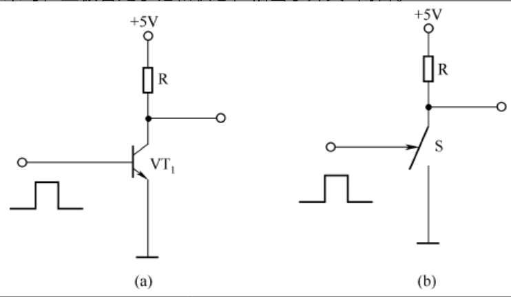

对于一个 NPN 型 BJT 而言，当输入数字信号时会发生如下情况

- 低电平：B 无电流流经，BJT 处于截止区
- 高电平：B 存在高位电流，BJT 处于放大区

而由于数字信号仅需要输入的电压处于一定的范围就可以解释为高低电平，所以一定程度上可以弥补模拟信号因为电压波动而影响元器件性能的问题

 

#### 基本门电路

与门电路

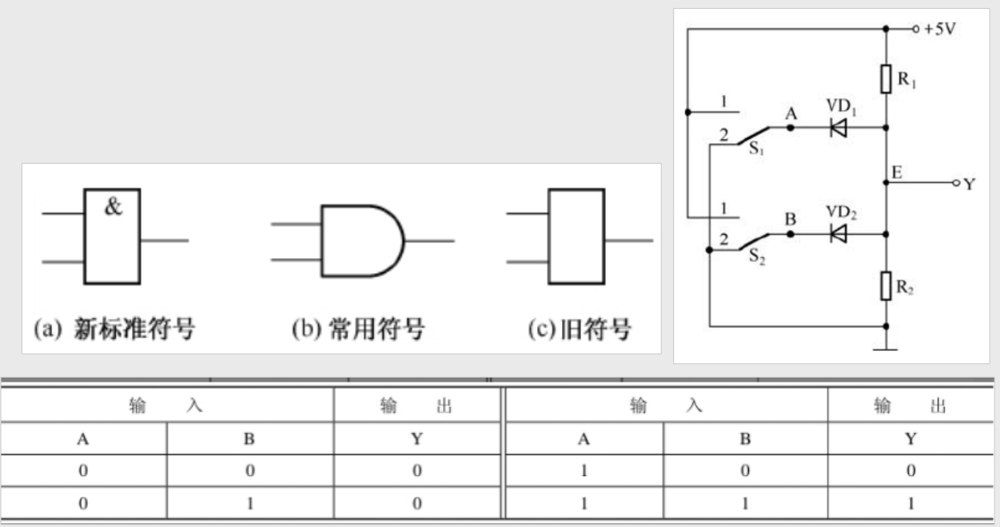

逻辑表达式是：`Y=A·B`

74LS08 是一种较常用的与门芯片

 

或门电路

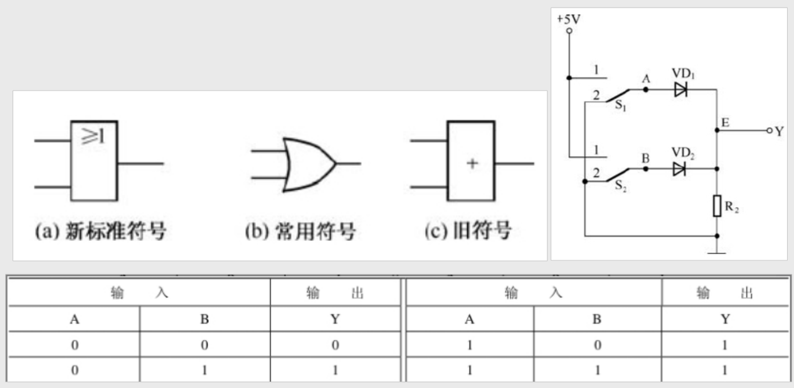

逻辑表达式为：`Y=A+B`

74LS32 是一种较常用的或门芯片

 

非门电路

非门逻辑符号 $$Y=\overline{A}$$

74LS04 是一种常用的非门芯片（又称反相器）

 

#### 复合门电路

与非门

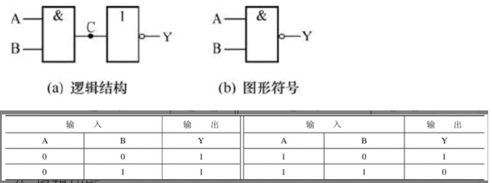

主要功能：只有输入端全为“1”时，输出端才为“0”；只要有一个输入端为“0”，输出端就为“1”

逻辑符号 $$Y=\overline{A\cdot B} $$

`74LS00` 是一种常用的与非门芯片

 

或非门

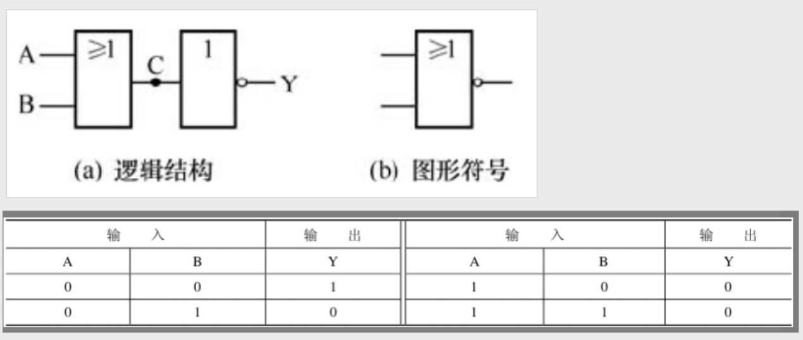

只有输入端全为“0”时，输出端才为“1”；只要输入端有一个“1”，输出端就为“0”

逻辑符号 $$Y=\overline{A+B} $$

`74LS27` 是一种常用的或非门芯片

 

与或非门

逻辑功能是：只要 A、B 端或 C、D 端中有一组全为“1”，输出端就为“0”，否则输出端为“1”

`74LS54` 是一种常用的与或非门芯片

 

异或门

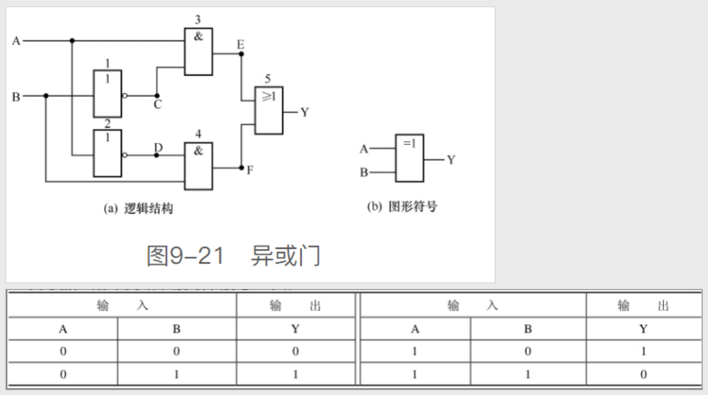

逻辑功能：两输入相同时输出 0，相异时输出 1

逻辑表达式：$$Y=A\oplus  B$$

`74LS86` 是一个 4 组 2 输入异或门芯片

 

同或门

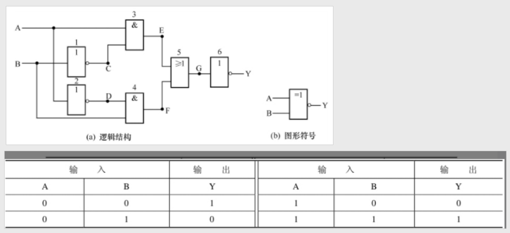

逻辑功能：两输入相同时输出 1，相异时输出 0

逻辑表达式：$$Y=A\odot  B$$

`74LS266` 是一个 4 组 2 输入同或门芯片

 

#### TTL 门电路

> 名称由来：芯片内部主要采用双极型晶体管（即三极管）来构成门电路

74LS 系列和 74 系列芯片属于 TTL 门电路

TTL 门电路是电流控制型器件，其功耗较大，但工作速度快、传输延迟时间短

 

**多发射晶体管**

即拥有两个及以上发射极的 BJT

下面以常见的三个发射极的 NPN-BJT 作为介绍

根据发射极处于高电平个数的不同，可以动态调节基极的电压，从而使得集电极电压发生变动

 

TTL 集电极开路门（OC 门）

此门的输入与输出之间有“与非”的关系

 

**三态输出门（TS 门）**

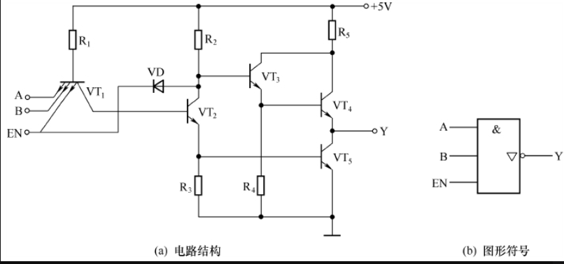

三态输出门即具有三种状态：高电平、低电平、高阻态

`EN=0（0V）` 无论 A、B 端输入“1”还是“0”，VT1 与 EN 相连的发射结和二极管 VD 都处于导通状态，最终 VT4、VT5 都处于截止状态。（此状态称为高阻态）

`EN=1（5V）` 此时使能 EN 作用消失，整个元件变成普通的与非门电路

74LS126 是一种常用的高电平有效型三态门芯片（高电平有效，即使能 EN=1 时才解除高阻态）

三态门可应用于计算机总线设计，譬如一个总线上有 N 个三态门，同一时刻内有且仅有一个三态门 EN=1，可进行信息传递，其余都高阻态

 

**对于 TTL 器件的要求**

输出端禁止直接接电源或接地

输入端高电平有两种获得方式：一是输入端通过串接 1 个 1 ～ 10kΩ 的电阻与电源连接；二是输入端直接与电源连接。输入端直接接地获得低电平

电源电压 VCC 允许范围为`+5V（1±10%）`

 

#### CMOS 门电路

> 芯片内部主要采用 MOS 场效应管(MOSFET)来构成门电路

74HC、74HCT 和 4000 系列芯片属于 CMOS 门电路

CMOS 门电路是电压控制型器件，其工作速度较 TTL 电路慢，但功耗小、抗干抗性强、驱动负载能力强

 

**CMOS 非门**

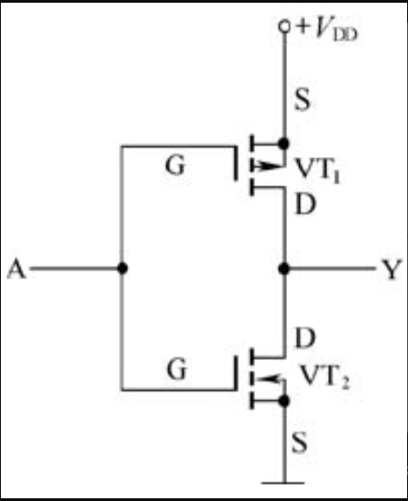

CMOS 由一个增强型 PMOS 和增强型 NMOS 组成

当 A=1 时，上方 PMOS 截止，下方 NMOS 导通，此时 Y 低电平

当 A=0 时，上方 PMOS 导通，下方 NMOS 截止，此时 Y 高电平

 

**CMOS 传输门**

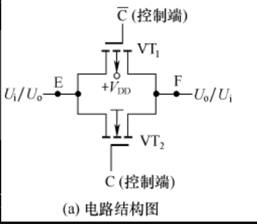

CMOS 传输门，顾名思义即具有双向传递信号的能力

上方为 PMOS，下方为 NMOS

图中上下两个控制端输入的电平总是相反的；

当上方 PMOS 的 C 控制端输入 0，下方的 NMOS 的 C 控制端输入 1 时，两管导通，此时 E 输入的信号就可从 F 输出

当 PMOS 控制端输入 1，NMOS 控制端输入 0，两个门关闭，此时信号无法输出！

为什么说他可双向传递？因为你同样可以吧 F 当做输入端，E 做输出端，最终的效果都是一样的

 

### 数制、编码与逻辑代数

 

#### 数制

本小节主要陈述十进制、二进制、十六进制及其对应的转换法则，网上对应的文章已经有很多，且开发中多用二转十，剩余的场景可以直接使用在线进制转换器解决，就不多费笔墨记录此处笔记

 

#### 编码

> 用二进制数表示各种数字或符号的过程称为编码。编码是由编码电路来完成的

**BCD 码**

`8421BCD` 码是一种有权码，它的 4 位二进制从高到低的位权依次为 23=8、22=4、21=2、20=1

`2421BCD` 码的 4 位二进制从高到低的位权依次为 2、4、2、1  
`5421BCD` 码的 4 位二进制从高到低的位权依次为 5、4、2、1

 

**余 3 码**

由 8421BCD 码加上 3（0011）得来的，它是一种无权码

 

**格雷码**

两个相邻代码之间仅有 1 位数码不同的无权码称为格雷码

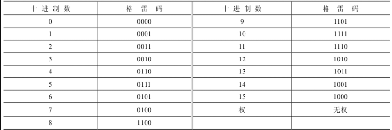

 

#### 逻辑代数

下面为所有逻辑运算的表格

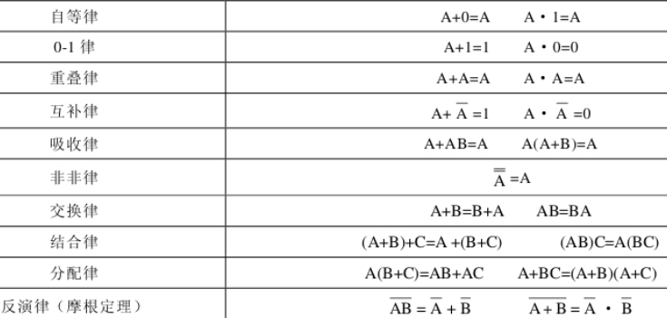

 

### 组合逻辑电路

 

#### 组合逻辑电路分析与设计
