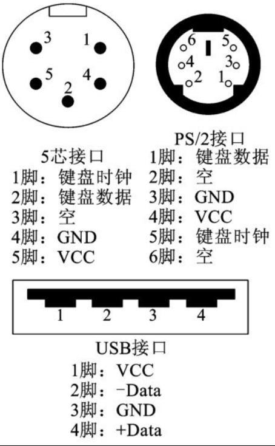

## $\color{deepskyblue} {微机原理及接口技术}$

 

### 微机基础

 

#### 微机组成

下图展示了微型计算机的硬件系统基本结构

中央处理器(CPU): 负责执行计算机程序指令,进行数据运算和逻辑运算。

主存: 用于 storing 程序和数据,包括只读存储器 ROM 和随机存储器 RAM。

输入设备: 外部数据输入的途径,如鼠标、键盘、扫描仪等。

输出设备: 外部显示输出的仪器,如显示器、打印机等。

输入/输出控制器: 负责管理输入输出设备与中央处理器之间的数据通信。

系统总线: 用于相互连接 CPU、内存模块及 I/O 控制器,实现数据和指令的传输。

电源系统: 向整个系统提供工作所需的电源。

 

#### 微机运作原理

微型计算机系统的工作原理可以概括为以下几个方面:

1. 指令执行:CPU 按序号顺序读取指令程序,执行相应的运算或控制功能。它与各个组件通过总线相连,控制数据和地址线的传输。

2. 输入输出:当 CPU 需要访问外部设备(读取或写入)时,它会发出 I/O 请求。I/O 控制器会接受请求,与外设通信,并将结果返回给 CPU。

3. 存储与传输:CPU 读取指令和数据时,首先将地址输出到地址线上。内存会根据此地址,在 RAM 中查找相应的字(word)并通过数据总线返回给 CPU。

4. 时钟控制:一个时钟发生器周期性地产生脉冲信号。CPU 根据这些时钟脉冲来协调和同步它的各个部分的工作,以保证系统的稳定性。

5. 中断响应:当外设需要 CPU 的即时响应时(如鼠标移动),它会发出一个中断请求。CPU 会暂停当前工作,先处理这个中断。执行完中断服务程序后,再回到之前的工作。

6. 总线传输:系统总线将 CPU 、内存和 I/O 控制器相连。数据和地址线通过总线实现组件间的通信。

 

### 8086

> 微处理器内部总体上由 3 个部分组成，即运算器、控制器和寄存器组

 

#### 运算器

运算器由`算术逻辑单元 ALU (arithmeticlogical unit）、通用或专用寄存器组及内部总线` 3 个部分组成

运算器根据总线结构可以分为以下三种

1. 单总线结构运算器：此时所有的部件都通过一条内部总线传递信
2. 双总线结构：内部用两条总线来传送操作数的
3. 三总线结构：速度最快

 

#### 控制器

下图展示了一个控制器的基本运行流程图

控制器必须具备以下功能

- 指令控制：控制器要能根据指令所在的地址按顺序或在遇到转移指令时按照转移地址取出指令，分析指令（指令译码），传送必要的操作数，并在指令执行结束后存放运算结果
- 时序控制：指令的执行是在时钟信号的严格控制下进行的，一条指令的执行时间称为指令周期
- 操作控制

 

控制器的内部主要由以下几个部分组成

- 程序计数器 PC `(programmingcounter）`
- 指令寄存器 IR `(instructionregister）`
- 指令译码器 ID `(instructiondecoder）`
- 时序控制部件
- 微操作控制部件

 

#### 8086 微处理器

> 由于该处理器冗余部分过多，就不一一介绍寄存器的名称和地址了，只介绍重要原理，融会贯通即可

程序执行时，CPU 总是有规律的执行以下操作

1. 从存储器中取出下一条指令；
2. 指令译码（或分析指令）;
3. 如果指令需要，从存储器中读取操作数；
4. 执行指令（包括算术逻辑运算、I/O 操作、数据传送、控制转移等）;
5. 如果需要，将结果写入存储器

 

实模式（8086/8088CPU 只能工作于此模式）

- CPU 只能访问最多 1MB 的内存,并且很少对内存进行保护
- 不使用段机制,CPU 直接访问线性地址
- 需要 Segment 机制,因此实模式下的开销比较低

 

段地址和偏移地址是 x86 微处理器使用的两种寻址模式:

段地址:

- 段地址模式下,内存被划分为多个段(segment)。
- 每个段有一个段基址(base address)和段长度(limit)。
- 指令由一个段寄存器和一个偏移地址组成。段寄存器指定段基地址,偏移地址指定该段内的一个绝对地址。
- 在实模式下,只有一个段,所有段寄存器都指向相同的基地址(0),此时段地址模式实际上相当于线性地址。
- 在保护模式下,不同的段寄存器可指向不同的段,实现内存保护。

偏移地址:

- 在偏移地址模式下,内存被看作是一整块,没有分割为段。
- 指令只包含一个线性地址,指定内存的一个绝对位置。
- 使用偏移地址模式时,x86 处理器会忽略段寄存器,直接使用线性地址。
- 偏移地址模式提供了最简单、最高效的寻址方式。

 

### 8086 指令系统

 

#### 寻址方式

立即寻址：操作数直接包含在指令中，它是一个 8 位或 16 位的常数，也叫立即数，立即数作为指令的一部分，紧跟在操作码之后，存放在代码段内

直接寻址：在此方式下使用指令时，存储单元的有效地址直接由指令给出，在它们的机器码中，有效地址存放在代码段中指令的操作码之后

寄存器寻址：使用 CPU 寄存器存储地址,将使用寄存器的值作为内存地址，在 x86 架构中,支持使用 AX, BX, CX, DX 等通用寄存器进行寄存器寻址

寄存器间接寻址：用寄存器的内容表示操作数的偏移地址的寻址方式，此时寄存器中的内容为操作数的偏移地址而不是其本身！

寄存器相对寻址：操作数在内存中的存放地址（偏移地址）由间址寄存器的内容加上指令中给出的一个 8 位或 16 位的偏移量组成

基址变址寻址（basedindexedaddressing）：该方式的操作数的有效地址是一个基址寄存器（BX 或 BP）和一个变址寄存器（SI 或 DI）的内容之和

相对基址变址寻址（relativebasedindexed addressing）：该方式的操作数的有效地址是一个基址寄存器和一个变址寄存器的内容，再加上指令中指定的 8 位或 16 位偏移量之和

 

### 存储器

 

#### 存储器分类

按照材料分类：半导体存储器、磁性存储器、光盘存储器

只读存储器（readonlymemory, ROM）：存储的内容固定不变，即只能读出不能写入  
随机存取存储器（randomaccessmemory, RAM）：既能读出又能写入的存储器称为随机存取存储器

按作用分类

- 主存储器：在主机内部，用来存放当前正在运行的程序和数据
- 辅助存储器：计算机外部设备
- 高速缓冲存储器 cache：很贵、高速、容量小

 

#### 存储器常用性能指标

1. 吞吐量(throughput):单位时间内处理的数据量,常用 MB/s 或 IOPS(每秒 IO 操作数)表示。
2. 带宽(bandwidth):存储器能支持的最大数据传输速率,使用 bps(比特/秒)计量。
3. 延迟(latency):数据访问的时间间隔,主要指读取或写入的数据要花多长时间。单位通常为毫秒(ms)。低延迟意味着性能更高。
4. I/O Operations Per Second(IOPS):单位时间内执行的输入/输出(读/写)操作次数。
5. 随机读写比例(random read/write ratio):存储器是否支持随机读写,随机读写性能如何。
6. 可用容量(available capacity):存储器中实际可用的容量,需考虑格式化后、RAID 的副本数据等因素。
7. 容量扩展性(scalability):存储器能够扩充到多大的容量。
8. 磁盘存活时间(MTBF):平均故障间隔时间,衡量存储器的可靠性。

 

#### 半导体存储器

上图展示半导体存储器的体系结构

地址译码器：接收 CPU 发出的地址信号，然后产生地址译码信号，以便选中存储矩阵中的某个存储单元

存储矩阵：能够存储二进制信息的基本存储单元的集合

数据输入/输出控制电路：多为三态双向缓冲器结构，以便使系统中各存储器芯片的数据输入/输出端能方便地挂接到系统数据总线上

 

#### 随机存取存储器 RAM

较大容量的存储器中，往往把各个字的同一位组织在一个片中；同一位的这些字通常排成矩阵的形式，如 32× 32=1024 或 64×64=4096。然后，由 X 选择线（行线）和 Y 选择线（列线）的重叠来选择所需要的单元

存储容量较小，也可以把 RAM 芯片的单元阵列直接排成所需要位数的形式

存储器的内部数据通过 I/O 电路以及输入和输出的三态门与数据总线相连

RAM 与 CPU 的连接，主要有以下三个部分

1. 地址线连接
2. 数据线链接
3. 控制线链接

 

#### 动态随机存储器 DRAM

`行地址选通信号(Row Address Strobe,RAS)和列地址选通信号(Column Address Strobe,CAS)` 对应的作用：

- RAS 信号控制行地址的写入,用来选择 DRAM 中的行。
- CAS 信号控制列地址的写入,用来选择 DRAM 中的列。
- 在行地址写入期间,列地址保持不变;在列地址写入期间,行地址保持不变。
- RAS 和 CAS 信号的时序关系严格,确定了 DRAM 的速度和性能。
- 一般情况下,必须先拉低 RAS 信号再拉低 CAS 信号。

据此，可以分析得到 `DRAM` 操作分为以下几个步骤:

1. 向行地址线输入一行地址,拉低 RAS 信号进入行地址写入模式。
2. 等待指定时序后,向列地址线输入一列地址,拉低 CAS 信号进入列地址写入模式。
3. 等待指定时序后,根据读/写控制信号决定进行读操作还是写操作。
4. 操作完成后,将 RAS 和 CAS 信号置高,退出当前操作模式。

 

`地址锁存器(Address Latch)`是计算机系统中一个很重要的组件。用于捕获和保存地址信息,以便后续处理，这是主要功能：

1. 接收并存放地址信息。在地址锁存器中保存的地址可以来自 CPU 或者外围设备。
2. 保持地址稳定。存储器访问通常包括地址阶段和数据阶段,这两个阶段存在间隔。地址锁存器可以在数据阶段保持地址信息不变。
3. 提供后续模块使用。地址锁存器输出保存的地址,以供后续的计算或访问使用。
4. 控制地址锁存时序。通过触发信号控制何时锁存地址,与后续模块协同工作。

通常情况下,地址锁存器用于存储器或外设的地址访问中。主要的工作过程为:

1. 接收一个地址信息输入。
2. 根据触发信号进行地址锁存,保存该地址。
3. 输出锁存的地址,提供给后续模块使用。比如存储器或外围设备进行访问。
4. 保持地址输出直到新的地址输入,实现数据访问的次数。

 

`读周期` 的具体步骤

1. 地址阶段:CPU 输出内存地址
2. 内存延迟:内存芯片检索数据
3. 数据有效期:内存返回数据到数据总线上
4. CPU 读取数据:CPU 从数据总线上获取数据
5. CPU 使用数据:CPU 利用读取到的数据

 

#### 三态缓冲器

`三态缓冲器(Tri-State Buffer)`是一种电路组件,主要用于控制数据总线上的信号。

三态缓冲器有三种可能的输出状态:

- 高电平:输出为逻辑 1。
- 低电平:输出为逻辑 0。
- 高阻态:输出三态(高阻抗),与数据总线脱离。

通过控制一个使能信号,三态缓冲器可以选择其输出状态。

主要特点为:  
当使能信号有效时,三态缓冲器工作在正常工作模式(输出 0/1)。  
当使能信号失效时,三态缓冲器进入高阻态,与数据总线脱离。  
这时数据总线上的其它驱动器可以控制输出信号。

三态缓冲器的主要应用为:  
共享数据总线。  
中断数据流。  
减少总线电流。

 

#### 只读存储器 ROM

主要可将 ROM 分为以下几类

`PROM(可编程只读存储器)`

- 通过物理打洞编程,一次性编程。一旦编程后内容不可修改。
- 存储信息会在其中烧录,然后道具洞来锁定存储位
- 成本低、速度快、存储时间长

`EPROM(光可擦可编只读存储器)`

- 可以使用电子方法多次编程和擦除。
- 使用紫外光来擦除電路,然后使用编程器进行再编程
- 一次只能擦除整个 EPROM 芯片内容

`EEPROM(电可擦可编只读存储器)`

- 可以电子方式多次编程和擦除,不需要紫外光。
- 每个存储单元(字节)都可以单独编程和擦除。
- 成本高、速度较慢

`FLASH ROM`

- 类似于 EEPROM,但通过整个块来编程和擦除,速度比 EEPROM 快。
- 通过释放电子而擦除
- 每次最少可以擦除 64KB 的数据,最大可以整个芯片
- 成本介于 EPROM 和 EEPROM 之间

 

#### 存储器与 CPU 链接

`片选`  
通过高低电平选择对应芯片，一般存在一下两种电平选择方式：
高电平片选：当片选引脚拉高电平时,对应芯片被激活,可以工作。拉低电平则被禁止工作  
低电平片选：反过来

片选的利用场景

- CPU 访问内存时通过地址译码器产生相应内存芯片的片选。
- 芯片组访问 PCI 设备时,需要为不同设备产生不同的片选信号。
- 组成多个内存通道时,为不同通道的内存产生不同的片选。

 

`地址译码器`  
由于 cpu 发出的地址通常采用二进制编码,而存储器芯片内部通常采用一种独特的接线方式来标识地址。此时就需要该译码器来实现地址的转换

一般的，地址译码器有以下几种：门电路译码器、N 中取 1 译码器和 PLD （programmablelogicdevice，可编程逻辑器件）译码器

> 74LS138 是常用的 8 中取 1 译码器，输入 3 位二进制码，便在 8 个输出端产生一个低电平片选信号，因此也称为 3-8 译码器

 

#### 存储空间扩展方式

位扩展、字扩展和字位扩展是计算机体系结构中的三种数据扩展方法。

位扩展是指通过在数据中添加额外的 0 位来扩展数据宽度。例如:

- 4 位数据`0011` 通过位扩展为 8 位为 `00110000`
- 数据宽度从`n`位扩展为`n+m`位,用`m`位 0 扩展。

字扩展是指通过使用相同的数据来组成多个相同的字来扩展字长。例如:

- 4 位`0011`通过 2 倍字扩展为 8 位为`00111100`
- 数据宽度从`n`位扩展为 `2*n` 位,重复相同的数据。

字位扩展是先进行字扩展,然后将高位与低位组合。例如:

- 4 位`0011` 先进行 2 倍字扩展得到`00111100`,然后将高低位组合为`0011111100`
- 数据宽度从`n` 扩展为 `2*n + n` 位。

这三种扩展方法的特点:

- 位扩展:添加 0,最简单但效率低。

- 字扩展:重复数据,常用于扩展少量数据。

- 字位扩展:充分利用数据,扩展效率高。

 

#### 内存寻址方法（片选方式）

这是关于内存寻址方法常见的有三种:

线选法(Line Select):

- 通过激活相应的选线,实现对相应内存线的访问。
- 比如 8 条内存线,需要 3 条地址线 AAA,000~111 分别选择 0~7 号线。
- 简单实用但可寻址数量有限,只能访问 2^n 条线。

全译码法(Full Decode):

- 将地址完全译码,驱动相应的内存片选线。
- 比如 10 位地址需要 10 条片选线,可以访问 2^10=1024 个存储单元。
- 可寻址数量多但成本高,占用线路多。

部分译码法(Partial Decode):

- 将高地址 bit 部分译码,低地址 bit 采用线选法。
- 比如高 6 位译码驱动 64 条片选线,低 4 位通过线选选通其中一个。
- 可寻址 2^10 个单元,但只需 64 条片选线。
- 在可寻址数量和 complexity 之间找到平衡。

三种方法的比较:

- 线选法成本低但可寻址数量有限。
- 全译码法可寻址数量多但成本高,占用线路多。
- 部分译码法在可寻址数量和 complexity 之间取得平衡。

 

#### 存储器小节思考题

**为什么动态 RAM 需要定时刷新？**

动态 RAM(DRAM)需要定期刷新是因为其存储单元采用一个电容器来保持电荷信息。

存储单元由一个闸管和一个电容器组成,电荷的有无表示存储的 0 和 1。但电容器会随时间慢慢泄漏电荷,信息将丢失。

为了防止电荷消失,DRAM 需要定期重新 charges 电容器,这个过程称为“刷新”或“刷新”。

 

**CPU 寻址内存的能力最基本的因素取决于什么**

地址总线、数据总线 位宽、总线(Front side bus)频率、指令集支持

 

### I/O 接口技术

 

#### IO 接口概述

顾名思义，可得接口主要功能如下

（1）数据缓冲：实现高速 CPU 与慢速外部设备的速度匹配。  
（2）信号转换：实现数字量与模拟量的转换、串行与并行格式的转换和电平转换  
（3）中断控制：实现 CPU 与外部设备并行工作和故障自动处理等。  
（4）定时计数：实现系统定时和外部事件计数及控制。  
（5）DAM 传送：实现存储器与 I/O 设备之间直接交换信息。

这是一个典型的 IO 接口电路结构图

 

`数据寄存器`是可读写的，用来存放 CPU 与 I/O 设备交换的信息。  
`控制寄存器`用来存放 CPU 向外部设备发送的控制命令和工作方式设置等。  
`状态寄存器`用来存放外部设备当前的工作状态信息，供 CPU 查询。  
`数据缓冲器`是 CPU 与 I/O 设备信息传送的通道，它与 CPU 的数据总线 DB 连接，I/O 设备与 CPU 交换的信息都是通过数据缓冲器进行的。

 

#### IO 端口编址寻址

> CPU 与外设通信时需要传输许多不同信息，将这些寄存器和它们的控制逻辑统称为 I/O 端口（port）

`数据端口`  
存放外设送往 CPU 的数据以及 CPU 要输出到外设去的数据。这些数据是主机和外设之间交换的最基本的信息

`状态端口`  
主要用来指示外设的当前状态。除了状态端口中的内容外，接口电路中往往还会有若干状态线，它们用电平的高低来指示外设当前的状态

`命令端口（控制端口）`  
存放 CPU 向接口发出的各种命令和控制字，以便控制接口或设备的动作（常见的命令信息位有启动位、停止位、允许中断位）

 

> I/O 端口的编址方式有两种，分别称为存储器映象寻址方式和 I/O 单独编址方式

`存储器映象寻址方式`  
若把系统中的每一个 I/O 端口都看作一个存储单元，并与存储单元一样统一编址，这样访问存储器的所有指令均可用来访问 I/O 端口，不用设置专门的 I/O 指令

`I/O单独编址方式`  
对系统中的 I/O 端口地址单独编址，构成一个 I/O 空间，它们不占用存储空间，而是用专门的 IN 指令和 OUT 指令来访问这种具有独立地址空间的端口

 

#### 输入输出控制方式

这 4 种是程序设计与系统结构中常见的 I/O 控制方式:

程序控制方式(Program controlled I/O):

- 分为无条件传送和有条件传送两种方式
- 无条件传送：当外设已准备就绪，那就不必查询外设的状态而进行信息传输
- 有条件传送：CPU 通过执行程序不断读取并测试外部设备状态，如果输入外部设备处于已准备好状态或输出外部设备为空闲状态时，则 CPU 执行信息指令

中断控制方式(Interrupt controlled I/O):

- 当 I/O 完成时触发中断,跳转到中断服务程序。
- 使 CPU 在 I/O 就绪时进行处理,效率较高。
- 中断在程序间插入,需要保存超频信息等。有一定开销。

直接存取方式(Direct Memory Access,DMA):  
当某一外部设备需要输入/输出一批数据时，向 DMA 控制器发出请求，DMA 控制器接收到这一请求后，向 CPU 发出总线请求。若 CPU 响应 DMA 的请求把总线使用权赋给 DMA 控制器，数据不通过 CPU，可直接由 DMA 控制器进行处理。当这批数据传送完毕后，DMA 控制器再向 CPU 发出“结束中断请求”，CPU 响应这一中断请求，即可收回总线使用权。

输入/输出处理机控制方式:

- 使用专用的 I/O 处理器负责与外围设备的交互。
- I/O 处理器独立于 CPU,专注于 I/O 操作。
- CPU 只需与 I/O 处理器通信,间接实现与外设的交互。
- I/O 处理器效率高,能有效减轻 CPU 压力。

四者效率：
程序控制方式 < 中断控制方式 < DMA < I/O 处理机

 

#### 并行通道与并行接口

这是一个 8255A 结构的简单图

8255A 是一个可以提供 3 个 8 位通道的并行输入/输出接口芯片  
通过编程其内部寄存器可配置每个端口为输入或输出模式。  
主要通过控制字寄存器配置端口模式和方向,然后通过输入状态寄存器读取输入端口,或通过输出控制寄存器控制输出端口

 

#### 串行通信与串行接口

调制解调器的作用是，进行数据的编码以及解码，使其更适合大数据的高速传输作用

信号的调制有以下三种

1. 调频，使用频移键控法 FSK（frequencyshiftkeying）
2. 调幅，使用幅移键控法 ASK （amplitude shiftkeying）
3. 调相，使用相移键控法 PSK （phaseshiftkeying）

 

#### 同步通信与异步通信

`同步通信`  
指在约定的通信速率下，发送端和接收端的时钟信号频率和相位始终保持一致（同步）

- 发送端和接收端使用同一个时钟,基于该时钟进行同步工作，故传送数据的同时还要传送时钟信号
- 传输线路上始终保持连续的字符位流。若计算机没有数据传输，则线路上要用专用的“空闲”字符或同步字符填充。
- 发送端只会在时钟上升沿或下降沿发送数据,接收端也只在时钟相应沿接收数据
- 发送和接收之间没有手握信号,完全依赖时间,基于时钟周期来协调

以下为几种常见的同步形式对应的数据段格式

 

`异步通信`  
通信中两个字符之间的时间间隔是不固定的，而在一个字符内各位的时间间隔是固定的

- 规定字符由起始位（startbit）、数据位（databits）、奇偶校验位（parity）和停止位（stopbits）组成
- 传送一个字符时，由一位低电平的起始位开始，接着传送数据位；最后传送的是高电平的停止位；从停止位结束到下一个字符的起始位之间的空闲位要由高电平“1”来填充
- 发送端通过一个手动信号(如握手线)告知接收端数据有效,接收端基于该信号捕获数据
- 发送数据和接收数据间隔可以是任意时钟,完全不依赖时钟

 

### 中断技术

 

#### 中断概述

中断的流程是？

- CPU 正在执行进程 A
- 此时外部或者内部中断请求发生，CPU 响应中断
- 进程 A 暂时中断执行，转而运行中断服务程序 B
- 中断服务程序 B 运行结束，返回原来进程 A 中断的位置
- 继续执行进程 A

 

`中断源`  
一种是外部中断或硬件中断，它们从 CPU 的不可屏蔽中断引脚 NMI 和可屏蔽中断引脚 INTR 引入；  
另一种为内部中断或软件中断，是为解决 CPU 运行过程中出现的一些意外事件或便于程序调试而设置的

 

**外部中断**

NMI 引脚引入的中断称为不可屏蔽中断，处理紧急事件，不受中断标志 IF 影响

INTR 引脚引入的中断请求称为可屏蔽中断，只有当 CPU 的标志寄存器 FLAGS 的 IF=1 时，才允许响应此脚引入的中断请求

 

**内部中断**

内部中断不需要硬件支持，不受 IF 标志控制，不执行中断总线周期  
除单步中断可通过 TF 标志允许或禁止外，其余都是不可屏蔽的中断

内部中断分类

1. 除法错中断：除数为 0 时的中断
2. 单步中断：TF=1 时，每执行完一条指令，就自动产生一个单步中断
3. 溢出中断：溢出标志 OF=1 时，可由溢出中断指令 INTO 产生中断类型号为 4 的溢出中断
4. 软件中断指令 INTn
5. 断点中断：专为调试设计

 

**中断向量表**

每次中断，都会把断点和标志寄存器推入堆栈保护，之后找到中断服务程序入口地址并执行；  
中断服务程序结束后，执行返回值 IRET，从堆栈恢复当前 CPU 状态与断点

中断服务程序的入口地址通常被称为中断向量（interruptvector）或中断矢量

中断向量表存放中断服务程序入口地址的段地址（CS）和地址的偏移量（IP）

 

**中断嵌套**

CPU 响应中断时，会根据优先级先响应优先级高的中断请求，后响应优先级低的中断请求

中断嵌套发生于优先级更高的中断请求打断当前中断请求，使得低优先级中断请求进入嵌套栈中的过程

机器进入中断服务程序之后，硬件会自动关闭中断，禁止别的中断进入

 

#### 中断处理过程

> 主要由五个过程：中断请求、中断源识别（中断判优）、中断响应、中断处理和中断返回

 

**中断请求**

中断请求信号分为以下两种

1. 边沿触发：CPU 根据中断请求端的电平跳变判断信号有效与否
2. 电平触发：CPU 根据中断请求有无稳定电平信号判断信号有效与否

 

**中断源识别**

由于同一时间内可能有两个及以上中断源发出中断请求，CPU 必须对其进行识别并取其中一个进行中断

判优手段分为两种：软件判优、硬件判优

 

**中断响应**

要响应中断请求，需具备以下四个条件

1. 一条指令执行结束
2. CPU 处于开中断状态
3. 当前没有发生复位（RESET）、保持（HOLD）、内部中断和非屏蔽中断请求（NMI）
4. 若当前执行的指令是开中断指令（STI）和中断返回指令（IRET），则它们执行完后再执行一条指令，CPU 才能响应 INTR 请求

 

**中断处理**

中断处理由中断服务子程序完成

中断服务子程序执行以下五个步骤

1. 保护软件现场
2. 开中断
3. 执行中断处理程序
4. 关中断
5. 恢复现场

 

**中断返回**

中断返回需执行中断返回指令 IRET

 

### 可编程定时器与计数器

 

软件定时法：设计一个延时子程序，子程序中全部指令执行时间的总和就是该子程序的延时时间

硬件定时法：利用专用的硬件定时器/计数器，在简单软件控制下产生准确的延时时间

 

**定时器/计数器在计数方式**

- 加法计数器:每有一个计数脉冲就加 1，当加到预先设定的计数值时产生一个定时信号输出
- 减法计数器:送入计数初值后，每来一个计数脉冲就减 1，减到零时产生一个定时信号输出

 

### DMA 控制器

> 接下来以 DMA 控制器 8237A 作为后续内容的介绍

 

8237A + 8 位锁存器 = 完整的 4 通道 DMA 控制器

各个通道可以完成的动作

- DMA 读操作：读存储器送外设
- DMA 写操作：读外设写存储器
- DMA 校验操作：通道不进行数据传送操作，只是完成校验功能

 

#### 8237A 结构

8237A 有两种不同的工作状态

1. 丛态方式：DMA 控制器未取得总线控制权时必须由 CPU 对 DMA 控制器进行编程，这时，CPU 处于主控状态
2. 主态方式：当 DMA 控制器取得总线控制权后，系统就完全在它的控制下

 

HRQ（总线请求信号）：该信号送到 CPU 的 HOLD 端，是向 CPU 申请获得总线控制权的 DMA 请求信号  
 HLDA（总线响应信号）：响应总线请求信号

 

#### 工作方式

主控设备执行 DMA 传送时有以下 4 种数据传送方式

1. 字节传送：每次 DMA 传送请求只传送一个字节的数据，数据传送后当前字节计数器自动减 1，撤销 HRQ 信号，释放系统总线控制权，并退还给 CPU
2. 块传送：一旦 8237A 获得总线控制权，连续地传送一个数据块，直到当前字节计数器减为 0 或由外部产生信号时终止 DMA 传送
3. 请求传送：他可以保存 DMA 现场，并且可以快速恢复
4. 级联模块：当一片 8237A 通道不够使用时，可通过多片级联的方式增加 DMA 通道

 

#### 工作时序

8237A 有两个主要的工作周期，即空闲周期（idlecycle）和有效周期（activecycle）

 

空闲周期：系统复位后或无 DMA 请求时处于空闲周期，这时 DMA 处于从态方式

有效周期：当 8237A 在 SI 状态采样到外部有效的 DMA 请求信号 DREQ 后，就向 CPU 发 DMA 请求信号 HRQ，并进入有效周期 SO 状态

 

### 模数数模转换器

 

#### 控制系统中的模拟接口

`A/D 转换器` 把模拟信号转成数字信号，供微处理器使用；  
`D/A 转换器` 输出模拟信号，供外部控制装置使用；

 

#### D/A 原理

D/A 转换器的主要部件是电阻开关网络  
通常是由输入的二进制数的各位控制一些开关，通过电阻网络，在运算放大器的输入端产生与二进制数各位的权成比例的电流，经过运算放大器相加和转换而成为与二进制数成比例的模拟电压

`电压型D/A` 可看做电压源，需接较大负载电阻；  
`电流型D/A` 可看最电流源，不可接过大负载电阻（常用）；

 

#### D/A 技术指标

分辨率：是 D/A 对于微小输入量变化的敏感程度描述；  
对一个分辨率为 n 位的转换器，能够分辨满量程的 2-n 输入信号

精度：包括绝对精度和相对精度

建立时间也称稳定时间：指在 D/A 的数字输入端加上满量程的变化（如从全“0”变为全“1”）以后，其模拟输出稳定到最终值时所需的时间

输出电平：  
电压型的 D/A 转换器，其输出电压为 0 ～ 5V 或 0 ～ 10V；  
而电流型的 D/A 转换器，其输出电流为几毫安至几安

 

常用 D/A 芯片：DAC0832

- 一款 8 位 D/A 芯片
- 可处于三种不同工作方式：直通方式、单缓冲方式、双缓冲方式

另一个常见的高性能芯片：DAC1210

 

#### A/D 原理

最常用的 A/D 转换器：逐次逼近型的 A/D 转换器

逐次逼近型 A/D 组成：逐次逼近寄存器（SAR）、D/A 转换器、比较器、时序和控制逻辑等部分

转换原理：逐次把设定的 SAR 中的数字量经 D/A 转换后得到电压 VC，与待转换的模拟电压 VX 进行比较

 

分辨率：举个栗子：当输入电压的满量程为 VFS=10 V 时，则 10 位 A/D 转换器的分辨率为 10V/1024≈0.01V

 

### 总线概述

 

#### 总线概念

微机一般有以下三个总线

- 内部总线：是微型计算机内部各外部芯片与处理器之间的总线
- 系统总线：是微型计算机中各插件板与系统板之间的总线
- 外部总线：是微型计算机和外部设备之间的总线

 

单总线结构

- 当 I/O 设备与主存交换信息时，原则上不影响 CPU 的工作
- 因为只有一组总线，当某一时刻各部件都要占用时会出现争夺总线使用权的现象

 

双总线结构

- 其为存储总线与 I/O 总线分开的结构

 

多总线结构

- 采用 DMA 控制器可形成三总线结构  
  主存总线用于 CPU 与主存之间的信息传输  
  I/O 总线供 CPU 与各类 I/O 设备之间的信息传递  
  DMA 总线用于高速外设（如磁盘等）与主存之间直接交换信息
- 四总线结构实现了处理器链接 Cache

 

#### 总线指标

总线宽度：指可同时传送的二进制数据的位数  
数据传输率：又称总线带宽，是指在单位时间内总线上可传送的数据总量  
总线频率：总线通常都有一个基本时钟，总线上其他信号都以这个时钟为基准  
总线复用通常地址总线与数据总线在物理上是分开的两种总线

总线传输四个阶段：总线请求和仲裁、寻址、数据传输、结束

总线传输有同步和异步两个方式

 

#### PCI 总线

PCI 总线链接图

 

### 人机交换接口

 

#### 键盘接口

目前微机主要用到的两类键盘：

- PC/XT 机采用的 83 个键的标准键盘和 AT 机使用的 84 个键的键盘
- 增强型的 10l/103/104/105/108/109 个键的扩展键盘

键盘通过电缆与主机链接，每次按下或者放开键盘都会发出对应的扫描码  
PC/XT 扫描码发射格式起始位为高电平；而 PC/AT 起始位则为低电平；

 

PC 键盘对应的三种接口  

 

#### 鼠标接口

鼠标有机械鼠标、光电鼠标和光电机械鼠标三类

- 机械鼠标通过轨迹球运动带动齿轮产生信号
- 光电鼠标通过红外光收发装置检测信号

 

#### 显示器接口

视频显示标准

1. MDA 标准：单色字符显示接口
2. CGA 标准：彩色显示适配器
3. EGA 标准：增强型显示适配器
4. VGA 标准：阵列彩色显示接口，颜色 256 色
5. SVGA 标准：超级 VGA，分辨率大幅度提高
6. TVGA 标准：全功能视频图形阵列显示接口，它兼容 VGA 全部显示标准，并扩展了若干字符显示和图形显示的新标准

 

CRT 显示器

- 老式的电视和计算机显示器，它使用阴极射线管技术产生图像
- 通过控制电子枪的位置和强度，可以在荧光屏幕上生成各种颜色和形状的图像
- CRT 可以实现高刷和优质的饱和度，但是容易烧屏且体积过大

 

LCD 显示器

- 只有有源阵列 LCD 可在 30 ～ 50ms 范围内，无源阵列 LCD 无法满足实时视频的要求
- LCD 采用背光点亮
- 由于背光特性，故其显示视角远小于 CRT 显示

 

### MCS-51

 

#### CPU

由两个部分组成：运算器和控制器

运算器：算术逻辑单元（ALU）、位处理器、累加器 ACC 等组成；  
控制器：主要有内部晶振和一些定时、控制逻辑组成

 

#### 存储器

拥有三个存储器地址空间

1. 程序存储器地址空间
2. 内部数据存储器地址空间
3. 外部数据存储器地址空间

 

`累加器 ACC`：一个最常用的专用寄存器，大部分单操作数指令的操作数取自累加器，指令系统中采用 A 作为累加器的助记符

`程序状态字 PSW`：一个 8 位寄存器，它包含了程序状态信息

`栈指针 SP`：它指示出栈顶在内部 RAM 块中的位置；SP 的初值越小，堆栈深度就可以越深

`数据指针 DPTR`：一个 16 位专用寄存器，当对 64KB 外部数据存储空间寻址时，可作为间址寄存器使用

`IO 专用寄存器`：统一使用 MOV 指令操作

`串行数据缓存器SBUF`：用于存放欲发送或已接受的数据，由两个独立的寄存器组成，一个是发送缓冲器，另一个是接受缓冲器

`定时器与计数器`

 

#### 时序系统

> XTAL1 作为芯片内部振荡电路的输入端，XTAL2 为其输出端

标准内部时钟  
在 XTAL1 和 XTAL2 上面接定时原件，内部振荡电路实现自激振荡

 

外部时钟方式？  
下图展示了 HMOS 型芯片的外部时钟连接方式

q
 

#### 单片机复位

计算机启动，系统默认进入复位状态；  
复位状态下 CPU 和其余转筒寄存器均设置默认值；

 

在单片机的 RESET 引脚上出现 24 个时钟振荡脉冲（两个机器周期）以上的高电平，单片机就能实现复位

下图表示内部复位的典型格式，RESET 接外部复位电路，而施密特触发器可以用来进行整形操作

 

简单复位电路有上电复位和手动复位两种  
不管是哪一种复位电路都要保证在 RESET 引脚上提供 10ms 以上稳定的高电平

 

#### 低功耗

目前存在两种低功耗模式

1. 空闲方式
2. 掉电保护方式

空闲方式中，仅 CPU 停止工作，但振荡器仍然运行，中断控制器等仍然在时钟控制下进行。

掉电保护方式中，片内振荡器停止工作，片内所有功能全部停止工作，而 RAM 等寄存器内容可维持不变

 

低功耗工作方式是通过 `电源控制寄存器PCON` 来确定的

PCON.0=1 进入空闲方式  
可以使用中断、硬件复位两种方式退出空闲方式

PCON.1=1 进入掉电保护方式  
只能使用硬件复位的方式退出掉电保护方式  
不建议通过降低 VCC 电压使得其“不自然的”进入掉电保护状态！

 

#### 定时器计数器原理

重点关注以下图形，C51 和 STM32 的定时器和计数器对应寄存器名称和布局都差不多，学会了就直接融会贯通即可

 

T0 由 TH0 和 TL0 构成，T1 由 TH1 和 TL1 构成  
`TMOD`用于控制和确定各个定时器/计数器的功能和工作模式  
`TCON`用于控制定时器/计数器 T0、T1 的启动和停止计数，同时包含定时器/计数器的状态

 

下图为定时器与计数器的工作原理图

- 计数脉冲有两个源：一个是片内振荡器输出经 12 分频得到；一个是外部脉冲 TX
- C/T 用于设置使用内部振荡（0）还是外部振荡（1）
- 控制信号有效时（闭合），开始计数
- 计数开始，每获得一个脉冲则让加 1 计数器给计数器加 1
- 当计数器全 1 时，发生溢出，计数器归零，置位 TCON 表示定时时间到或者计数值满

 

控制寄存器 TCON 可以设置以下几个主要的位

- TF1：定时器 1 溢出标志位，当定时器/计数器 1 计满溢出时，由硬件置 1
- TR1：定时器 1 运行控制位，置位时，启动定时器/计数器工作；清零时，停止工作
- TF0：定时器 0 溢出标志位
- TR0：定时器 0 运行控制位

 

#### 定时器与计数器工作模式

定时器/计数器的初始化流程

1. 确定定时器的工作模式，设置 TMOD
2. 写入定时初值到 TH0、TL0 或 TH1、TL1 中；
3. 设置 IE，开放定时器中断；
4. 将 TR0 或 TR1 置位，启动定时器/计数器工作。

 

#### 串行通讯

串行口基本结构

- 收发缓冲器 SBUF 可同时收发数据
- 发送缓冲器只能写入不能读出，接收缓冲器只能读出不能写入
- SBUF 的作用是设置针对接收缓存区操作还是发送缓冲器操作

 

`串行口控制寄存器 SCON` 设置串行通信接口的工作方式及收发方式  
`电源控制寄存器 PCON`

 

波特率解释

- 波特率指串行口每秒发送（或接收）的位数
- 工作方式 0 中，波特率为时钟频率的 1/12，即 fosc/12
- 工作方式 2 中，波特率取决于 PCON 中的 SMOD 值

 

#### 中断系统

下图展示了中断系统的程序框图  
下面介绍当设置对应寄存器的值后对应含义

- `IT0=1` 设置 INT0 为脉冲触发，下降沿有效
- `IT0=0` 设置 INT0 为电平触发，低电平有效
- `IE0` INT0 请求标志位
- `TF0` T0 定时计数溢出标志位
- `EA=1` CPU 开放所有中断
- `EX0=0` 禁止 INT0 中断
- `ET0=0` 禁止 T0 中断
- `PX0` 外部中断 0 优先级设定位
- `PT0` 定时器 T0 中断优先级设定位
- `PX1` 外部中断 1 优先级设定位
- `PT1` 定时器 T1 中断优先级设定位
- `PS` 串行口中断优先级设定位。

 

外部中断 0：对应引脚 INT0  
外部中断 1：对应引脚 INT1

外部中断有两种触发方式

1. 低电平有效：即 CPU 时刻监测 INT 输入电平，若为低电平则触发中断
2. 边沿触发：连续监测 INT 两次输入电平，若前一次为高电平，后一次为低电平，则触发中断

> 低电平或高电平的宽度至少要保持一个机器周期，即 12 个振荡周期以上

 

PX PT PS 可以设置中断的优先级，设置为 0 为低优先级，设置为 1 为高优先级

中断规则

- 低优先级中断请求不能打断高优先级的中断服务
- 高优先级中断请求可以打断低优先级的中断服务
- 一个中断一旦得到响应，与它同级的中断请求不能中断它
- 如果同级的多个中断请求同时出现，则按 CPU 查询次序确定哪个中断请求被响应

 

#### 单片机的中断处理流程

> 分为 3 个阶段，即中断响应、中断处理和中断返回

中断响应

- 中断响应条件满足，且不存在中断阻断的情况，开始触发中断响应
- 中断系统通过硬件生成长调用指令（LCALL），其把断点地址压入堆栈保护起来
- 将对应的中断入口地址装入程序计数器 PC，使程序转向该中断入口地址，执行中断服务程序

 

中断处理

- 从入口地址开始执行，直至遇到指令 "RETI" 为止
- 过程包括：一是保护现场；二是处理中断源的请求

 

中断返回

- 由专门的中断返回指令 RETI 来实现的
- RETI 把断点地址取出，送回到程序计数器 PC 中去
- 通知中断系统已完成中断处理，将清除优先级状态触发器

 

PS:中断请求撤销（对于某些中断，如果不及时清除就会触发下一次中断）

1. 定时器溢出中断 TF0 或 TF1 是自动清除的，不用管
2. 边沿触发 IE0 或 IE1 也是自动清除
3. 串行口中断需要手动清除

 

### MCS-51 单片机系统扩展

 

#### 外存逻辑结构

8051 基本上使用 EPROM 进行掉电存储，下面是对应的逻辑示意图

 

若片内有一定容量的程序存储器，则 EA 外接高电平 VCC，处于无效状态；  
若片内无存储，需要外接存储器，则 EA 外接低电平 GND，处于有效状态；

 

#### 外部 EPROM

紫外线可擦写存储器，已经过时，且擦除数据必须要使用专用的紫外线光照射 15min 才可以完全擦除，效率极低，可利用性弱

故在此不做介绍

 

#### 电可擦除可编程存储器 EEPROM

5v 电源即可擦写 EEPROM，在写入前会自动执行擦除过程，无需人为干预

EEPROM 大多采用并行总线执行信息传输

 
