## 介绍

<br>

### 三种主流 Cortex 款式

款式 A：设计用于高性能的“开放应用平台”  
款式 R：用于高端的嵌入式系统，尤其是那些带有实时要求的  
款式 M：用于深度嵌入的，单片机风格的系统中

<br>

### 指令集发展

ARM 处理器一直支持两种形式上相对独立的指令集，它
们分别是

- 32 位的 ARM 指令集。对应处理器状态：ARM 状态
- 16 位的 Thumb 指令集。对应处理器状态：Thumb 状态

Thumb 指令集在功能上是 ARM 指令集的一个子集，但它能带来
更高的代码密度

<br>

## Cortex-M3 概览

<br>

### 寄存器组

Cortex-M3 处理器拥有 `R0-R15` 的寄存器组。其中 R13 作为`堆栈指针 SP`

SP 有两个，但在同
一时刻只能有一个可以看到，这也就是所谓的“banked”寄存器

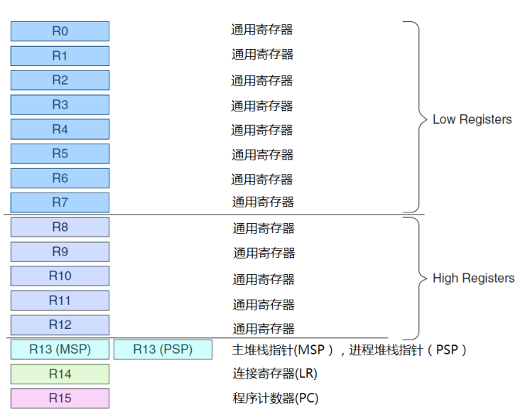

<br>

#### 寄存器分析

`R0-R12`：通用寄存器

`Banked R13`: 两个堆栈指针，含有主堆栈指针（MSP）以及进程堆栈指针（PSP）；  
前者操作系统内核，后者处理用户应用代码

`R14`：连接寄存器，当呼叫一个子程序时，由 R14 存储返回地址

<br>

#### 特殊功能寄存器

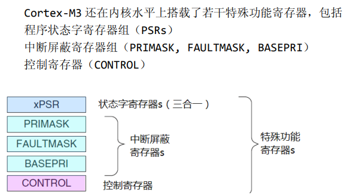

<br>

### 操作模式与特权

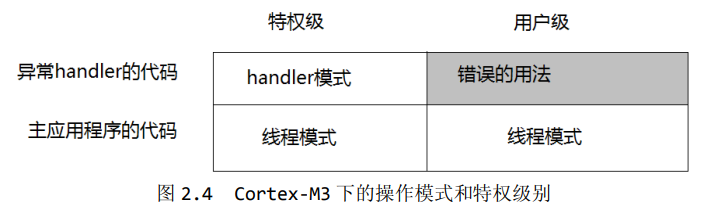

两种操作模式

1. 处理者模式（handler mode）
2. 线程模式（thread mode）

两种特权操作

1. 特权级
2. 用户级

<br>

用户切换到特权级需要经过此步骤：执行系统调用指令 SVC，触发 SVC 异常，通过异常服务例程接管后修改 CONTROL 寄存器，才可以进入特权级

<br>

### 内建嵌套向量中断控制器

嵌套向量中断控制器 NVIC(Nested Vectored Interrupt Controller)

其提供的功能：

1. 涵盖了所有外部中断和绝大多数异常，可赋予异常优先级，若硬件发现高优先级进来就会立刻抢占当前异常位
2. 开始响应一个中断后，CM3 会自动定位一张向量表，并且根据中断号从表中找出 ISR 的入口地址，然后跳转过去执行
3. 软件可以在运行时期更改中断的优先级
4. 既可以屏蔽优先级低于某个阈值的中断/异常，也可以全体封杀

<br>

### 存储器映射

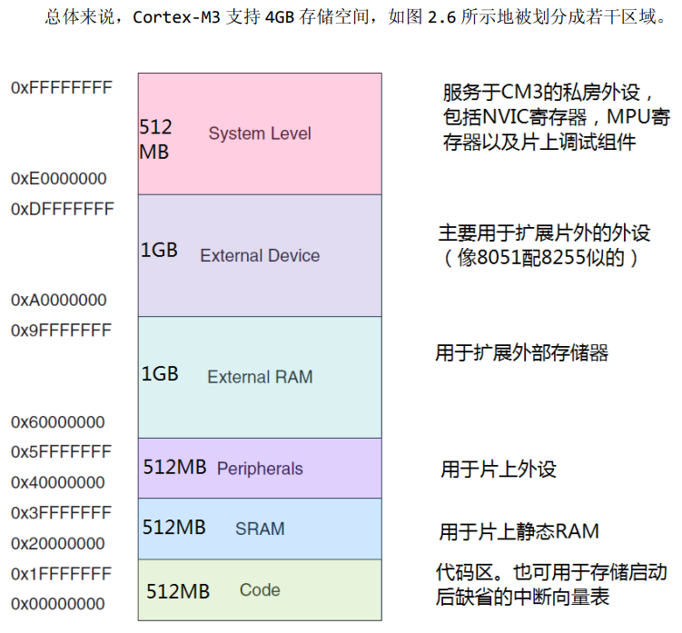

`system level` 系统寄存区，这里的设备均使用固定地址

<br>

### 总线接口

Cortex-M3 拥有以下三大总线接口：

1. 指令存储区总线：I-Code 总线（用于取指）和 D-Code 总线（用于查表）
2. 系统总线：用于访问内存和外设
3. 私有外设总线：负责一部分私有外设的访问，主要就是访问调试组件

<br>

### 存储器保护单元（MPU）

该部件为可选的，开启它以对特权访问以及用户访问进行不同限制

MPU 最常见的就是保护特权级代码不被其他低级用户随意篡改，通过吧内存区设置为只读来进行保护

<br>

### 指令集

`Cortex-M3` 只使用 `Thumb-2` 指令集，它允许同时处理 32 位指令和 16 位指令

再过去的 cortex 架构，在 32 位和 16 位状态下，分别处于 ARM 状态和 Thumb 状态，需要执行状态切换，存在开销

<br>

### 中断及异常

`ARMv7-M` 开创了一个全新的异常模型，他支持 11 种系统异常，240 个外部终端输入，并取消了 `FIQ` 概念

CM3 的所有中断机制都由 `NVIC` 实现

<br>

## Cortex-M3 基础

<br>

### 寄存器组

`通用目的寄存器 R0-R7`  
R0-R7 也被称为低组寄存器。所有指令都能访问它们。它们的字长全是 32 位，复位后的初始值是不可预料的

`通用目的寄存器 R8-R12`  
R8-R12 也被称为高组寄存器。这是因为只有很少的 16 位 Thumb 指令能访问它们，32 位的  
thumb-2 指令则不受限制

<br>

#### 堆栈指针 R13

主堆栈指针（MSP）：由 OS 内核、异常服务例程等特权访问程序使用

进程堆栈指针（PSP）：常规应用程序代码

`cortex-m3` 给予了两根指令 PUSH 和 POP 处理堆栈指针的操作

<br>

#### 链接寄存器 R14（LR）

LR 寄存器用于存储函数调用的返回地址。

当一个函数被调用时，当前函数的返回地址会被保存到 LR 寄存器中，以便在函数执行完毕后返回到正确的位置。

<br>

#### 程序计数器 R15（PC）

`R15 寄存器` 在 ARM 架构中用于存储下一条将要执行的指令的地址。它指示了程序执行的当前位置，并在指令执行期间自动递增，以便跳转到下一条指令的地址。

<br>

### 特殊功能寄存器组

#### 程序状态寄存器 PSR

PSR 包括三个子状态寄存器

- 应用程序 PSR（APSR）
- 中断号 PSR（IPSR）
- 执行 PSR（EPSR）

使用 MSR 和 MRS 指令

<br>

屏蔽寄存器组
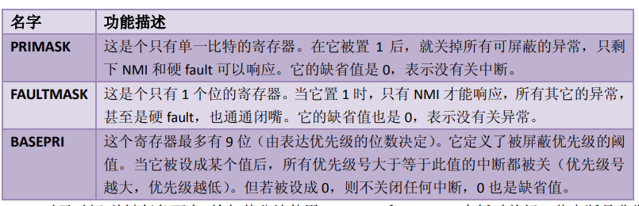

<br>

#### 控制寄存器 CONTROL

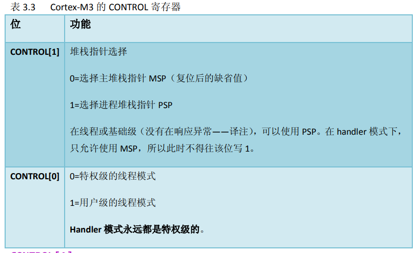

控制寄存器有两种作用：定义特权级别、选择当前使用的堆栈指针

Cortex-M3 的 handler 模式中，`CONTROL[1]`总是 0。在线程模式中则可以为 0 或 1

这两个 CONTROL 都必须位于特权级下才可以进行写操作

<br>

### 操作模式

线程模式+用户级下，无法访问系统控制空间（SCS）

越权访问一律产生 fault，单少部分情况下会被忽略掉而不产生 fault

<br>

特权级下置位 `CONTROL[0]` 进入用户级，再通过异常返回先前的用户级  
如下图所示，特权级和用户级之间的转换

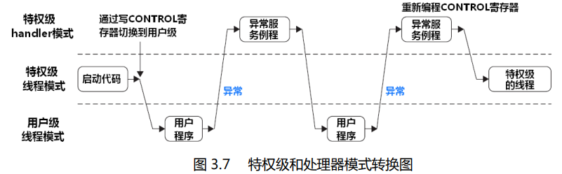

<br>

### 栈内存操作

我们所谓的堆栈操作实际上就是对内存的读写，访问地址通过 SP 给予

一般的，PUSH 和 POP 必须要成对使用，对应寄存器先后顺序必须一致  
使用这两条指令时对应 SP 指针也会自增和自减

PUSH 指令等效于与使用 R13 作为地址指针的 `STMDB` 指令，而 POP 指令则等效于使用
R13 作为地址指针的 `LDMIA` 指令

<br>

### Cortex-M3 堆栈实现

Cortex-M3 使用的是“向下生长的满栈”模型，即栈空间从高地址向低地址生长的一种栈结构。

Cortex-M3 具有两个堆栈，分别是：主堆栈和进程堆栈  
双堆栈的作用是可以在主堆栈处理异常的错误而不会影响到进程堆栈中的应用程序执行

<br>

### 复位序列

在 CM3 中，在 0 地址处提供 MSP 的初始值，然后紧跟着就是向量表（向量表在以后还可以被移至其它位置——译注）。  
向量表中的数值是 32 位的地址，而不是跳转指令。向量表的第一个条目指向复位后应执行的第一条指令。

<br>

## 指令集

<br>

### 汇编语言基础

一条简单的汇编指令格式（注释使用一个分号）：  
`操作码 操作数 1, 操作数 2, … ;注释`

下面表示寄存器移位存储方法，对于立即数必须要以#开头

```s
MOV R0, #0x12 ; R0 -> 0x12
MOV R1, #’A’ ; R1 -> 字母 A 的 ASCII 码
```

EQU 指示字来定义常数  
DCI 编译器指示字，用来表示某些汇编器无法识别的特殊指令助记符  
DCB 来定义一串字节常数  
DCD 来定义一串 32 位整数

```s
DCI 0xBE00 ; 用于指代断点BKPT

DCD 0x123 ; 定义整数

DCB "heloworld",0 ; 定义字符串
```

<br>

#### UAL

统一汇编语言（UAL），是一个语法规则，用于支持 Thumb-2

你依然可以使用传统的 thumb 语法，这里不做介绍

```s
ADD R0, R0, R1  ;等效R0=RO+R1

ANDS R0, R0, R1

ADDS.N R0, #1 ;指定使用 16 位指令（N＝Narrow）
ADDS.W R0, #1 ;指定使用 32 位指令（W=Wide）
```

<br>

### 近距离检视指令

#### 数据传输

CM3 中的数据传送类型有如下几个

- 在两个寄存器间传送数据
- 在寄存器与存储器间传送数据
- 在寄存器与特殊功能寄存器间传送数据
- 把一个立即数加载到寄存器

<br>

常用存储器访问指令  
(LDR 加载指令，STR 存储指令)

`LDRB Rd, [Rn, #offset]` 从地址 Rn+offset 处读取一个字节送到 Rd

`LDRD Rd1, Rd2, [Rn, #offset]` 从地址 Rn+offset 处读取一个双字(64 位整数)送到 Rd1（低 32 位）和 Rd2（高 32 位）中

`STR Rd, [Rn, #offset]` 把 Rd 中的低字存储到地址 Rn+offset 处

<br>

常用的多重存储器访问方式  
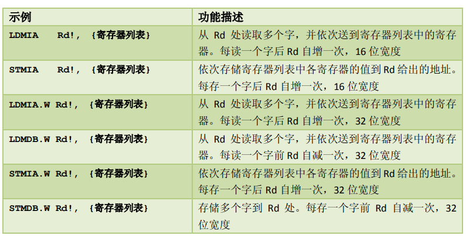

感叹号的作用是：

````asm
STMIA.W R8!, {r0-R3} ; R8 值变为 0x8010，每存一次增一次，先存储后自增
)。增/减单位：字（4 字节）。例如，记R8=0x8000，则下面两
条指令：
STMDB.W R8, {R0-R3} ; R8 值的“一个内部复本”先自减后再存储数据，但 R8 的值不变```
````

<br>

带预索引的 LDR 和 STR

`LDR.W R0, [R1, #20]!` 该指令先把地址 R1+offset 处的值加载到 R0，然后，R1 <- R1+ 20

<br>

后索引：在后索引中，基址寄存器是无条件被更新，省略感叹号

`STR.W R0 [R1], #-12` 该指令是把 R0 的值存储到地址 R1 处的。在存储完毕后， R1 <- R1+(-12)

> 注：利用 LDR 和 STR 时，可以使用寄存器作为偏移值，而不用背立即数  
> 但如果拿寄存器作偏移值就绝对不可以使用预索引和后索引了

<br>

LDR 伪指令和 ADR 伪指令

`LDR r0, =address1`：将地址 address1 的立即数加载到寄存器 r0 中。

`ADR r0, address1`：将标签 address1 的地址加载到寄存器 r0 中

<br>

#### 数据处理

ADD 指令有如下几个用法

- `ADD R0, R1` ; R0 += R1
- `ADD R0, #0x12` ; R0 += 12
- `ADD.W R0, R1, R2` ; R0 = R1+R2

<br>

除了 ADD 指令之外，CM3 中还包含 `SUB, MUL, UDIV/SDIV` 等用于算术四则运算

`SUB Rd, Rm` 常规减法，Rd -= Rn  
`SBC Rd, Rm` 带错位的减法，Rd -= Rm+C  
`RSB.W Rd, Rn, #imm12` 反向减法，Rd = imm12-Rn  
`MUL Rd, Rm` 常规乘法，`Rd *= Rm`

<br>

常规逻辑操作  
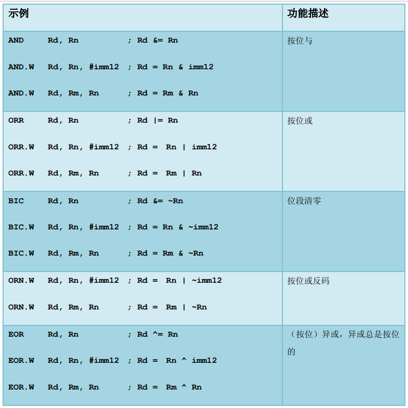

<br>

移位以及循环指令

`LSL Rd, Rn, #imm5 ; Rd = Rn<<imm5` 逻辑左移  
`LSR Rd, Rn, #imm5 ; Rd = Rn>>imm5` 逻辑右移  
`ASR Rd, Rn, #imm5 ; Rd = Rn>>imm5` 算数右移

> 其余指令出现频率很低，面试不会细分考察，我们仅需掌握重点简单的内容就好了，别为难自己

<br>

#### 子程呼叫与无条件跳转指令

最基础的两个无条件跳转指令：

- `B Label` 跳转到 Label 处对应的地址
- `BX reg` 跳转到由寄存器 reg 给出的地址
- `BL Label` 跳转到 Label 对应的地址，并且把跳转前的下条指令地址保存到 LR
- `BLX reg` 跳转到由寄存器 reg 给出的地址，并根据 REG 的 LSB 切换处理器状态，还要把转移前的下条指令地址保存到 LR

> 在执行 BLX 时，必须置位 LSB=1，否则触发 fault

<br>

#### 标志位与条件转移

应用程序状态寄存器(APSR)中存在 5 个标志位  
标志位用于表示程序执行过程中的状态信息和操作结果的特性

以下为 APSR 中的四个可被条件转移指令参考的标志位

1. N（Negative）：表示最近的算术或逻辑操作结果为负数。它用于判断操作结果的符号。
2. Z（Zero）：表示最近的算术或逻辑操作结果为零。它用于检测操作结果是否为零。
3. C（Carry）：表示最近的无符号算术操作产生了进位或借位。它用于处理多字节算术运算中的进位或借位。
4. V（Overflow）：表示最近的有符号算术操作产生了溢出。它用于检测有符号数运算的溢出情况。

<br>

下表展示了各种可供我们使用的跳转条件，当对应标志位置位后进入跳转流程

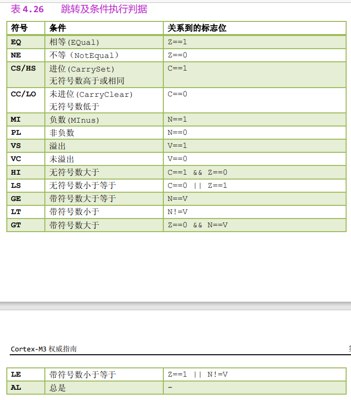

以上条件组合常配合无条件转移指令（B）使用，使之变成各式条件转移指令  
`BEQ label` 表示当 z 被置位为 1 时跳转到位置 label  
`MOVGT R2, R1`

<br>

条件跳转例子：

- `CMP` 表示为两个数作差，并根据差的结果设置标志位
- 根据上方四个标志位，可知当算数运算结果等于 0 时，触发 `z=1`
- 故当 `R0==R1==0` 时，触发 `z=1`，此时 BEQ 检测到标志位置位，即进入跳转流程，跳转到 label 标注的位置

```s
CMP R0, R1
BEQ label
```

<br>

#### 指令隔离指令

指令隔离（Instruction Barrier）指令是一种用于确保指令执行顺序和内存访问顺序的特殊指令，一般用于多核处理器和多线程环境

如果 CM3 缺少对应的隔离措施，就会发生所谓的“紊乱现象”

下面为 CM3 中的 3 条隔离指令

1. ISB（Instruction Synchronization Barrier）：执行 ISB 指令会导致处理器暂停执行，直到之前的所有指令都已完成执行，同时将所有未决的中断和异常处理完毕。这可以确保在 ISB 指令之前的所有指令都已经完成执行，防止指令重排序。
2. DSB（Data Synchronization Barrier）：执行 DSB 指令会导致处理器暂停执行，直到之前的所有数据访问指令都已经完成。这可以确保在 DSB 指令之前的所有数据访问指令都已经完成，防止数据访问重排序。DSB 指令还可以用于确保处理器与外部设备之间的数据同步。
3. DMB（Data Memory Barrier）：执行 DMB 指令会导致处理器暂停执行，直到之前的所有数据访问指令和内存访问指令都已经完成。这可以确保在 DMB 指令之前的所有数据和内存访问都已经完成，防止数据和内存访问重排序。DMB 指令还可以用于确保处理器与外部设备之间的数据同步。

<br>

#### 饱和运算

饱和运算类似于模电中的削顶失真，即通过使用 SSAT 指令，将大数据（32 位）截断为小数据（16 位）

`SSAT.W Rd, #imm5, Rn, {,shift}`

- `Rd`：目标寄存器，用于存储截断后的结果。
- `#imm5`：一个立即数，表示要截断的位数，取值范围为 1 到 32。
- `Rn`：源寄存器，包含要进行截断操作的原始数据。
- `{,shift}`：可选参数，用于指定可选的移位操作，可以是 LSL（逻辑左移）、LSR（逻辑右移）、ASR（算术右移）或 ROR（循环右移）。

<br>

### CM3 中新引入指令

> 这些指令从 ARMv6,ARMv7 才开始支持

#### MRS\MSR

这两条指令仅可以在以下两种情况下使用：

1. 特权级
2. APSR 下的用户级

<br>

命令语法  
`MRS <Rn>, <SReg>` 加载特殊功能寄存器的值到 Rn  
`MSR <Sreg>,<Rn> ` 存储 Rn 的值到特殊功能寄存器

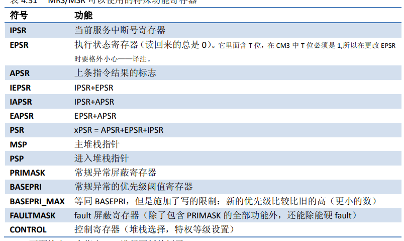

<br>

#### IF-THEN

`IF-THEN(IT)`指令围起一个块，里面最多有 4 条指令

其中 T 代表条件成立时执行的语句，E 代表条件不成立时执行的语句  
E 对应指令必须和 T 对应指令相反！

下面展示了对应伪代码和使用方式

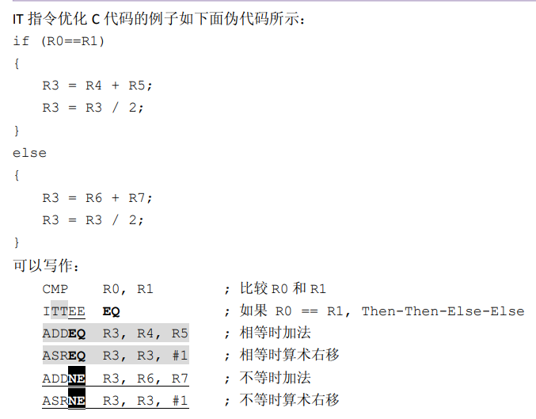

<br>

#### CBZ/CBNZ

CBZ（Compare and Branch if Zero）：CBZ 指令用于比较一个寄存器的值是否为零，如果为零，则执行跳转操作到指定的目标地址。

CBNZ 含义与 CBZ 相反

格式：

```s
CBZ <寄存器>, <目标地址>    ; 如果寄存器的值为零，则跳转到目标地址
CBNZ <寄存器>, <目标地址>   ; 如果寄存器的值不为零，则跳转到目标地址
```

<br>

#### SDIV/UDIV

32 位硬件除法指令

```s
SDIV.W Rd, Rn, Rm
UDIV.W Rd, Rn, Rm
```

<br>

#### REV RBIT

REV 反转 32 位整数中的字节序，REVH 则以半字为单位反转，且只反转低半字

```s
REV Rd, Rm
REVH Rd, Rm
REV16 Rd, Rm
REVSH Rd, Rm
```

RBIT 比前面的 REV 之流更精细，它是按位反转的，相当于把 32 位整数的二进制表示法水平旋
转 180 度

```s
RBIT.W Rd, Rn
```

<br>

#### SXTB

用于将数据宽度转换成带符号位 32 位整数长度

带 U 字头的表示高位清零

```s
SXTB Rd, Rn
SXTH Rd, Rn
UXTB Rd, Rn
UXTH Rd, Rn
```

<br>

#### TBB,TBH

`TBB（Table Branch Byte）`：TBB 指令用于通过查找表的方式进行跳转。它将一个字节大小的偏移量添加到基地址寄存器中，并跳转到所得到的目标地址。

```s
TBB [<基地址寄存器> + <偏移量寄存器>]
```

`TBH（Table Branch Halfword）`：相对应处理的就是半字数据

```s
TBH [<基地址寄存器> + <偏移量寄存器> * 2]
```

<br>

## 存储系统

<br>

### 存储器映射

CM3 预定义存储器映射简图（CM3 的地址空间是 4GB ）

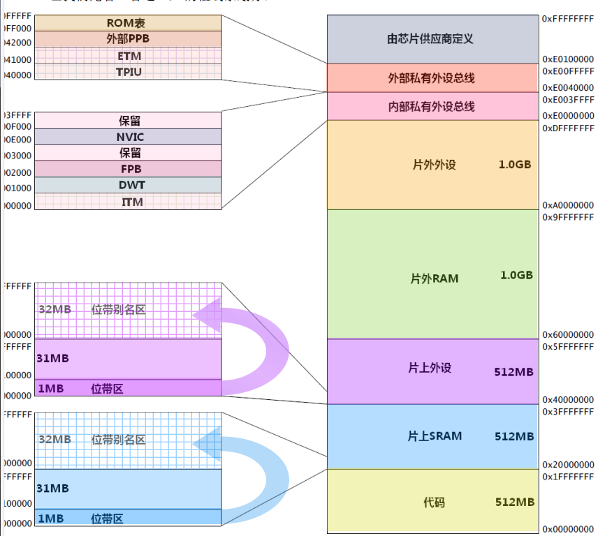

<br>

片上 SRAM：大小 512MB，拥有 1MB 位带区，32MB 位带别名区；而位带别名区里面的每个字对应位带区的一个比特

片上外设：定义个片上 SRAM 几乎一致，但不可以执行命令

片外外设、片外 RAM：各占 1GB 用于连接外部，但片外外设区同样不可执行命令

> 总结：外设区不可以执行命令，而 RAM 区均可执行命令

<br>

最后的 512MB 分配给 CM3 的系统级组件，内部私有外设总线 s，外部私有外设总线 s，以及由提供者定义的系统外设

私有外设总线有两条

- AHB 私有外设总线，只用于 CM3 内部的 AHB 外设，它们是：NVIC, FPB, DWT 和 ITM
- APB 私有外设总线，既用于 CM3 内部的 APB 设备，也用于外部设备

NVIC 所处的区域叫做“系统控制空间（SCS）”

<br>

### 存储器各种访问属性

CM3 为存储器的访问设置了 4 个属性

- 可否缓冲(Bufferable)
- 可否缓存(Cacheable)
- 可否执行(Executable)
- 可否共享(Sharable)

CM3 片上默认无配备缓存，而可以使用外设缓存，此时就需要引入缓存设置来进行管理

<br>

### 存储器的缺省访问许可

CM3 在未开启 MPU(存储保护单元)时，缺省访问许可才能生效

如果启用了 MPU，则会在地址空间划分多个区，为不同区设置不同访问权限

<br>

### 位带操作

> 位带操作（Bit Banding）是一种在嵌入式系统中进行位级操作的技术。它通过将特定的位与内存地址进行映射，以实现对单个位的原子操作。

那片上 SRAM 作为介绍，它拥有一个 1MB 位带区，以及一个 32MB 位带别名区，下面时对应位带操作流程：

1. 位带别名区将单个比特膨胀为 32 位的字
2. 通过访问这些字，从而达到访问原始比特的目的

<br>

一般而言，位带操作包含：读、改、写三步，而这三步之间夹杂着两个极短的切换空挡，若多个进程并发执行位带操作，可能会导致紊乱现象（即冲突）

而 CM3 位带操作改进了这一缺点，使三步变成了一个原子操作，完美解决了

<br>

C 编译器不支持位带操作，故需要使用 define 定义

使用 define 定义一个位带别名区地址：`#define DEVICE_REG0 ((volatile unsigned long *) (0x40000000))`

<br>

### 非对齐数据传输

最低有效位（LSB）：即二进制数中最右边的一位数字；  
最高有效位（MSB）：即二进制数中最左边的一位数字；

在 CM3 构架下，非对齐的数据传送只发生在常规的数据传送指令中，如 `LDR/LDRH/LDRSH`

<br>

### 互斥访问

CM3 使用互斥访问技术取代了传统 ARM 中的 SWP 指令

在互斥访问操作下，允许互斥体所在的地址被其它总线 master 访问，也允许被其它运行在本机上的任务访问，而 CM3 能够“驳回”有可能导致竞态条件的互斥写操作

互斥访问的读写操作对应的指令为

```s
LDREX/STREX, LDREXH/STREXH,
LDREXB/STREXB
```

<br>

在使用互斥访问时，`LDREX/STREX` 必须成对使用

严格的驳回规定（目前大多数情况下选择）：

- 当执行一条 LDREX 指令后，下一条立马跟着就是 STREX，那么他将会被执行
- 如果第一条 LDREX 指令后又跟着其他的 STR 指令或者某些中断，那么接在这些代码之后的 STREX 就会被驳回！

<br>

`LDREX/STREX` 的工作原理：

1. 执行 LDREX 后，在处理器内部标注一段地址，地址一般从 R0 开始
2. 紧接着执行 STREX，若其存储区地址落在标注地址内，那么就清除该标记

<br>

### 端模式

CM3 虽然同时支持小端模式和大端模式，但是推荐直接使用小端  
CM3 使用的是“字节不变大端”

CM3 中，均在复位时确定使用哪种端模式，且运行时不得更改

<br>

## 实现 CM3

<br>

### 流水线

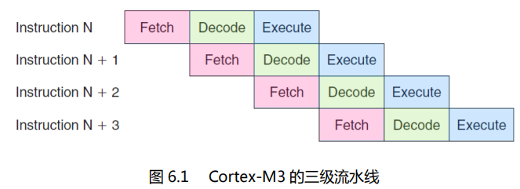

CM3 处理器使用 3 级流水线，分别是：取指，解码和执行

CM3 有时候会一次取出两个 16 位指令（合计 32 位指令），先处理一个然后等一个周期后再处理下一个

处于对 Thumb 兼容性考虑，取 PC 时，会返回当前指令地址+4 值

处理器内核预取单元有一个`指令缓冲区`，让后续执行的指令在这里排队

<br>

### CM3 详细框图

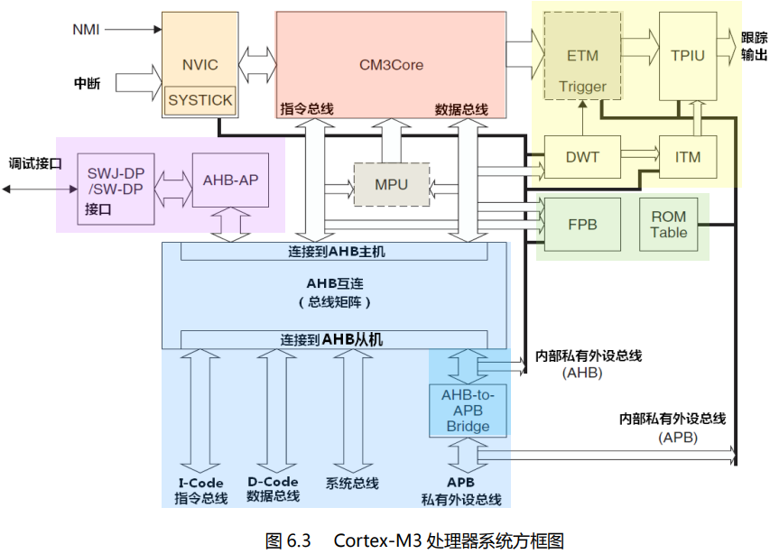

| 缩写          | 含义                                                                                                                           |
| ------------- | ------------------------------------------------------------------------------------------------------------------------------ |
| NVIC          | 嵌套向量中断控制器                                                                                                             |
| SYSTICK Timer | 一个简易的周期定时器，用于提供时基，亦被操作系统所使用                                                                         |
| MPU           | 存储器保护单元（可选）                                                                                                         |
| CM3BusMatrix  | 内部的 AHB 互连                                                                                                                |
| AHB to APB    | 把 AHB 转换为 APB 的总线桥                                                                                                     |
| SW-DP/SWJ-DP  | 串行线调试端口/串行线 JTAG 调试端口。通过串行线调试协议或者是传统的 JTAG 协议（专用于 SWJ-DP），都可以用于实现与调试接口的连接 |
| AHB-AP AHB    | 访问端口，它把串行线/SWJ 接口的命令转换成 AHB 数据传送                                                                         |
| ETM           | 嵌入式跟踪宏单元（可选组件），调试用。 用于处理指令跟踪                                                                        |
| DWT           | 数据观察点及跟踪单元，调试用。这是一个处理数据观察点功能的模块                                                                 |
| ITM           | 仪器化跟踪宏单元                                                                                                               |
| TPIU          | 跟踪单元的接口单元。所有跟踪单元发出的调试信息都要先送给它，它再转发给外部跟踪捕获硬件的                                       |
| FPB Flash     | 地址重载及断点单元                                                                                                             |
| ROM 表        | 一个小的查找表，其中存储了配置信息                                                                                             |

<br>

CM3 处理器中各个重要模块介绍：

1. CM3Core：CPU
2. NVIC：支持中断嵌套，向量中断机制可以在中断发生时，自动取出对应服务例程的入口地址
3. SysTick 定时器：在 NVIC 内部实现，可以每隔一定时间产生中断，即便系统睡眠也可以工作
4. 存储器保护单元：把存储器划分为多个区进行保护
5. BusMatrix：CM3 总线核心，通过他让数据在不同总线间传输
6. AHB to APB Bridge：总线桥，把多个 APB 设备连接到私有外设总线
7. SW-DP/SWJ-DP：串行调试
8. AHB-AP：无
9. ETM 嵌入式跟踪宏单元：实时指令跟踪，
10. DWT 数据观察点及跟踪单元：通过其设置数据观察点
11. ITM 仪器化追踪宏单元：无
12. FPB：提供 flash 地址重载与断点功能

<br>

### CM3 总线接口

`I-Code 总线` 一条 32 位总线，进行取指操作

`D-Code 总线` 一条 32 位总线，进行数据访问操作，连接到该总线的设备不需要支持非对齐访问

`系统总线` 负责数据传送，他们都是对齐的

`外部私有外设总线` 基于 APB 协议的 32 为总线，负责私有外设访问

`调试访问端口总线` 专用于挂接调试接口

<br>

### 总线连接模板

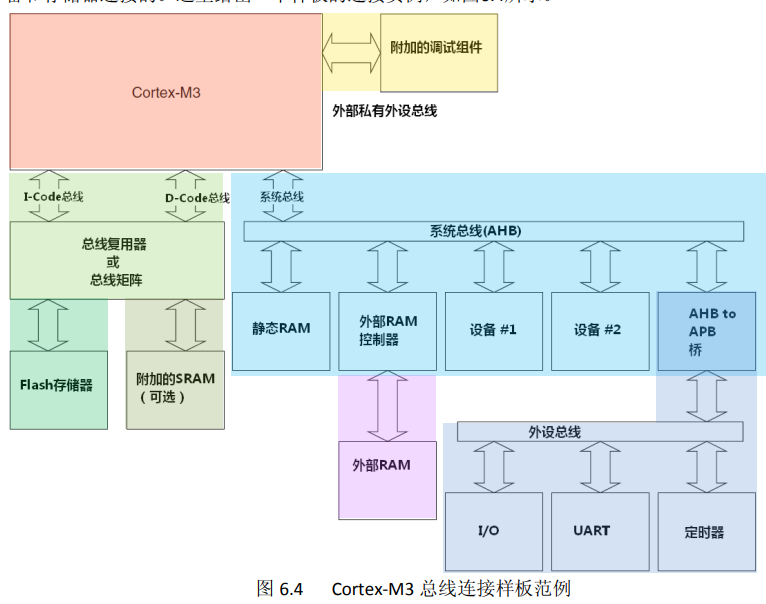

<br>

## 异常

<br>

### 异常类型

编号为 1－15 的对应系统异常，大于等于 16 的则全是外部中断

中断不等于异常

15 个可用的系统异常表  
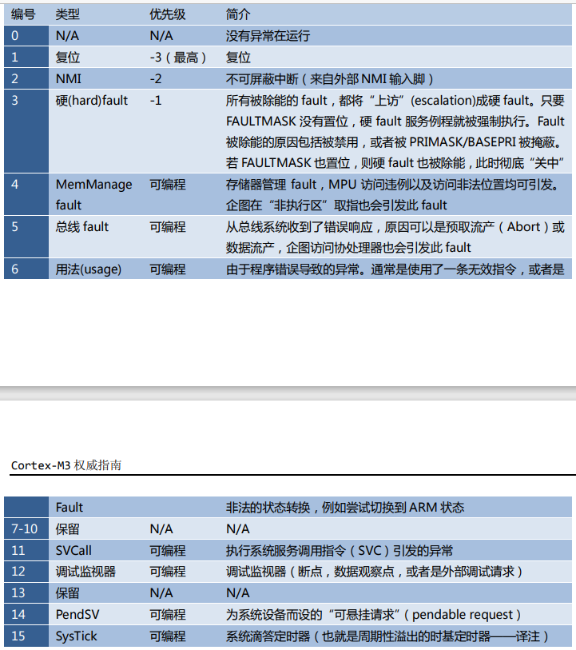

<br>

### 优先级定义

优先级的数值越小，则优先级越高。  
CM3 支持中断嵌套，使得高优先级异常会抢占(preempt)低优先级异常

三个特殊的系统异常：`复位，NMI 以及硬 fault`，它们有固定的优先级，并且它们的优先级号是负数，从而高于所有其它异常

<br>

CM3 还把 256 级优先级按位分成高低两段，分别称为`抢占优先级和子优先级`

NVIC 中有一个寄存器保存优先级组，他把优先级分为两段：  
MSB 所在的位段对应抢占优先级； LSB 所在的位段对应子优先级

<br>

#### 优先级组

CM3 支持 8 个不同的中断优先级，通常被分成 4 个优先级组

CM3 中断优先级组分配的四种主流方式：

`Preemptive Priority Grouping (0 位抢占优先级组)`：  
这种模式下，优先级分组被禁用，所有中断的优先级都是唯一的。优先级值高的中断总是可以打断正在执行的优先级值低的中断。这是最简单的中断优先级模式，但在复杂的应用中可能不够灵活。

`No Preemptive Priority Grouping (4 位抢占优先级组)`：  
这种模式下，中断被分为 4 个优先级组，每组内有 2 个优先级。每个组的中断不会互相打断，但是一个组内的高优先级中断可以打断低优先级中断。这提供了一定程度的分层和优先级控制。

`Priority Grouping (3 位抢占优先级组)`：  
这种模式下，中断被分为 8 个优先级组，每组内有 1 个优先级。这意味着每个中断都有唯一的优先级，没有中断会被其他中断完全屏蔽。这提供了更精细的优先级控制，但在复杂应用中可能需要更多的配置。

`Priority Grouping (2 位抢占优先级组)`：  
这种模式下，中断被分为 16 个优先级组，每组内有 1 个优先级。与上述模式相比，这种模式提供了更大的灵活性，但配置会更加复杂。

<br>

### 向量表

`Cortex-M3` 处理器使用中断向量表来管理不同中断的入口地址。  
中断向量表是一个存储了中断处理程序地址的数组，每个元素对应一个特定的中断号。  
当中断发生时，处理器会根据中断号从向量表中读取对应的地址，然后跳转到相应的中断处理程序。

中断向量表通常位于内存的起始地址处。向量表中的每个元素都是一个 4 字节（32 位）的地址，指向对应中断的处理程序

可以在 SRAM 中开出一块空间用于存储向量表

<br>

### 中断输入于挂起

#### NMI

NMI（Non-Maskable Interrupt，非屏蔽中断）是一种特殊类型的中断，在嵌入式系统中常用于处理一些紧急和重要的事件。与普通的可屏蔽中断不同，NMI 是无法被屏蔽或阻止的中断，即使处理器处于屏蔽中断状态（例如，全局中断被禁用），NMI 仍然可以触发。

当 NMI 发生时，处理器会跳转到 NMI 处理程序的入口地址执行相应的操作

<br>

#### 中断挂起

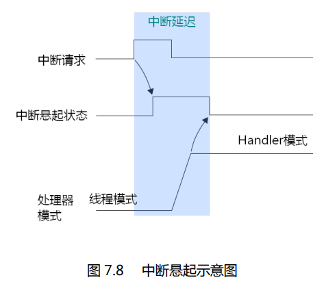

中断输入脚置位有效后，他就被挂起，此时无法撤销中断请求  
若在中断得到响应前消除挂起状态，则中断被取消

中断服务例程开始执行时，其挂起状态会被硬件自动清除

中断源一直维持中断请求信号，则该中断再完成一轮服务历程后又会被立刻赋予挂起状态进行下一轮  
中断源以脉冲的形式发送 N 多个中断请求信号，最终只会接受一个

<br>

### Fault 类异常

#### 总线 faults

该 fault 可能产生的情况：

1. 当 AHB 接口上正在传送数据时，回复了一个错误信号
2. 在处理器启动中断服务序列(sequence)后读取向量时
3. 中断处理起始阶段的堆栈 PUSH 动作
4. 中断处理收尾阶段的堆栈 POP 动作

总线 fault 一旦检测到更高优先级异常，就会先执行后者，自己就挂起

总线 fault 是被某同级或更高优先级异常的服务例程引发的，则会变成硬 fault，使得最后执行的是硬 fault 的服务例程

欲使能总线 fault 服务例程前，总线 fault 服务例程的入口地址必须已经在向量表中配置好

<br>

`总线 fault 状态寄存器(BFSR)` 位于 NVIC 内部，可以找出产生 fault 的原因

<br>

#### 存储器管理 faults

触发该 faults 的原因有如下四点：

- 访问了所有 MPU regions 覆盖范围之外的地址
- 访问了没有存储器与之对应的空地址
- 往只读 region 写数据
- 用户级下访问了只允许在特权级下访问的地址

<br>

MemManage fault 被除能，则会上访成硬 faults  
若该硬 faults 执行时又导致了 MemManage fault，则内核被锁定

MemManage fault 必须被使能才能正常响应

<br>

#### 用法 faults

用法 faults 一个重要的功能是：  
执行了协处理器指令。Cortex-M3 本身并不支持协处理器，但是通过 fault 异常机制，可以建立一套“软件模拟”的机制，来执行一段程序模拟协处理器的功能

其余功能以及使能除能啥的情况和存储器 faults 基本一致，在这里不做过多介绍

导致用法 faults 最常见的原因是：视图切入 ARM 状态

<br>

### SVC 与 PendSV

OS 不允许用户直接操作硬件，故出现了对应的桥梁 SVC（系统服务调用）

SVC 可以这样定义：  
操作系统提供系统服务函数，用户通过 SVC 对这些函数发出请求，并以此来间接控制硬件

<br>

SVC 异常可以通过执行 SVC 指令来产生；  
SVC 指令需要一个立即数，充当系统调用代号

<br>

PendSV 和 SVC 作用一致，只不过他可以被挂起

PendSV 异常处理程序通常会保存当前任务的上下文，并加载下一个任务的上下文，从而实现任务切换

PendSV 的任务优先级较低，故可以被许多高优先级例程打断

<br>

## NVIC 与中断控制

<br>

### 中断使能与除能

中断的使能与除能分别使用各自的寄存器来控制

CM3 中可以有 240 对使能位／除能位`(SETENA 位/CLRENA 位)`  
要使能或者除能一个中断，仅需写 1 到对应的位中去即可

<br>

### 中断的悬起与解悬

中断挂起可以使用这两个寄存器处理  
“中断设置悬起寄存器(SETPEND)”  
“中断悬起清除寄存器(CLRPEND)”

他们也可以有 8 对

<br>

每个外部中断都有一个对应的优先级寄存器，每个寄存器占用 8 位

每个外部中断都有一个活动状态位。在处理器执行了其 ISR 的第一条指令后，它的活动位就被置 1，并且直到 ISR 返回时才硬件清零

两个特殊功能寄存器：

1. `PRIMASK` 用于除能在 NMI 和硬 fault 之外的所有异常，它有效地把当前优先级改为 0
2. `FAULTMASK` ，它把当前优先级改为-1

<br>

### 中断系统设置的全过程

建立一个外部中断的流程

1. 当系统启动后，先设置优先级组寄存器。缺省情况下使用组 0（7 位抢占优先级，1 位亚优先级）。
2. 如果需要重定位向量表，先把硬 fault 和 NMI 服务例程的入口地址写到新表项所在的地址中。
3. 配置向量表偏移量寄存器，使之指向新的向量表（如果有重定位的话）
4. 为该中断建立中断向量。因为向量表可能已经重定位了，保险起见需要先读取向量表偏移量寄存器的值，再根据该中断在表中的位置，计算出对应的表项，再把服务例程的入口地址填写进去。如果一直使用 ROM 中的向量表，则无需此步骤。
5. 为该中断设置优先级。
6. 使能该中断

<br>

### SysTick 定时器

SysTick 定时器被捆绑在 NVIC 中，用于产生 SysTick 异常（异常号：15）

CM3 内部存在一个简单的定时器，可以借助内部时钟（FCLK）和外部时钟（STCLK）控制它

所有 CM3 产品间，SysTick 的处理方式都是相同的

为了让不同 CM3 产品都可以运行一致的 SysTick 中断频率，可以这样子做：直接把 TENMS 的值写入重装载寄存器，这样一来，只要没突破系统的“弹性极限”，就能做到每 10ms 来一次 SysTick 异常

<br>

## 中断的具体行为

<br>
