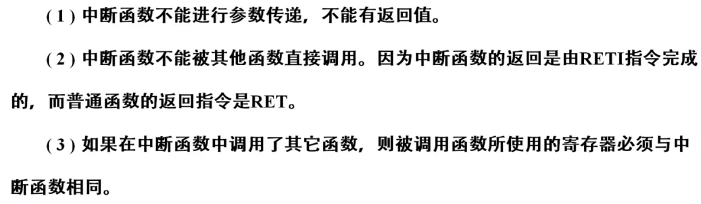

### 计算机的数值表示

#### 源码

正数：首位 0，其余七位表示实际数值  
负数：首位 1，其余七位表示实际数值

缺点是部分运算会出错，需要额外的算法对其进行处理，十分麻烦

<br>

#### 反码

正数：首位 0，其余七位表示实际数值  
负数：首位 1，其余七位为正数七位的逐位取反结果

例如：正数 01011100，则负数 10100011

缺点是正负运算或者负负运算都会少一个 1

<br>

#### 补码

> 完美的编码方式，不会产生致命性错误，几乎所有计算机都使用该编码系统

正数：首位 0，其余七位表示实际数值  
负数：首位 1，其余七位为正数七位的逐位取反后加一

例如：正数 01111000，负数 10000111

最后加一的作用就是为了抵消反码中出现的“误差 1”现象

<br>

### MCS51 单片机

#### 型号与构成

MCS-51 单片机型号对应参数解析图


基本内部结构图


<br>

常用器件介绍

- ACC 累加器：ALU 进行运算时，数据绝大部分来自累加器 A
- PSW 标志寄存器：一个 8 位寄存器，保存指令执行结果状态

<br>

常见控制部件

- 定时和控制电路
- 指令寄存器
- 指令译码器
- 程序计数器 PC
- 堆栈指针 SP
- 数据指针 DPTR

<br>

#### 存储结构

**程序存储器 ROM**

- 存放单片机工作时的程序，没有 ROM 就无法工作
- MCS51 内置程序计数器 PC，他可指示 CPU 下一步所处理的程序在 ROM 中的地址
- ROM 有片内存储器和片外存储器（通过总线访问）两种

为便于快速访问片内和片外 ROM，单片机自带控制线 EA，来决定使用内还是外 ROM  
`EA=1`，高电平，当 PC 大于某值时访问片外 ROM，其余时刻访问片内 ROM  
`EA=0`，低电平，片内 ROM 被忽略

ROM 存在七个特殊的地址  


<br>

**数据存储器 RAM**

- 具备快速存取功能，掉电后数据立刻丢失
- 同样具有片内和片外两个类型

内部寄存器分为以下几个主要区域

1. 工作寄存器：也称通用寄存器，每次存储 8 个信息，共 4 组，每组用 R0-R7 表示
2. 位寻址区
3. 一般 RAM 区：也称用户 RAM 区，80 字节
4. 堆栈区与堆栈指针，安装 LIFO 原则
5. 特殊功能寄存器：类似于一个自定义变量池，用户可以自定义，但是不可以挪作他用

<br>

#### 外部引脚与总线接口


P0 口（P0.0-P0.7）  
不接片外存储器与扩展 IO 口时，作为双向 IO 口使用；  
反之，分时复用为低八位地址总线与双向数据总线；

P1 口（P1.0-P1.7） 可做双向 IO 口

P2 口（P2.0-P2.7）一般做双向 IO 口，扩展外存后可做高八位地址总线

P3 口（P3.0-P3.7）除做双向 IO 口外，还可做特殊用途  


<br>

控制线  


<br>

MCS51 单片机通过不同信号对内外存储器进行读写操作；  
片外数据存储器通过 RD\WR 指令读写；  
片外程序存储器读通过 PSEN 指令实现；

<br>

#### 并行 IO 口工作原理

> 主要有四大 IO 口，他们具有特殊锁存作用，分别是 P0 P1 P2 P3

**P1**


写入时：  
D=1，此时锁存器右下角 Q 为对 D 取反，得到 0，此时场效应管 V1=0，不导通，VCC=5v 直接通过上拉电阻输出信号 1  
D=0，Q 取反得 1，此时 V1=1，场效应管导通，故与 VCC=5v 相互抵消，输出信号 0

读入时：
D=0，场效应管不导通，外界信号直接流入通过下方绕过

<br>

**P3**


读写流程和 P1 口几乎一致，只不过要注意第二功能区的与非门，即 1 和 1 取 0,1 和 0 取 1，以此类推

<br>

**P2**


MUX 数据选择器，可视为一单刀双掷开关，当控制=0 时，链接锁存器；当控制=1 时，链接地址总线；

<br>

#### 工作周期

**晶振**

XTAL1 以及 XTAL2 口为外接晶振口；  
内部晶振由一个反相放大器构成

<br>

**复位方式**

外部电路使 RST 端出现连续两周期的高电平，此时执行复位；

<br>

**机器周期**

- 机器周期包含 S1-S6 六个
- 一个状态包含两拍 P1\P2
- 一个拍称为一个时钟周期


<br>

**指令周期**

定义：机器取一个指令并将其完整执行完毕的周期过程；

一个指令周期一般由 1-2 个机器周期组成；  
仅乘除运算需 4 机器周期完成；

<br>

### 开发环境

#### 中断函数

中断函数的特点



<br>

#### 计数器与 TMOD

当定时/计数器工作在计数模式时，对引脚 P0-P3.4 范围脉冲进行计数

<br>

**定时/计数器方式寄存器 TMOD**


选择定时计数器的类型

CT=1 表示计数方式；CT=0 表示定时模式

<br>

**定时/计数器控制寄存器 TCON**


方式二和方式一为主要的定时/计数器方式

方式一可视为手动方式，每次溢出都必须手动置位；  
方式二可视为自动方式，系统自动置位开启下一次定时/计数；

TL0/TL1 计数；  
TH0/TH1 保存初值；

方式二执行下：  
TL0/TL1 计满后溢出，使得 TF0/TF1 置位；  
溢出后触发开关，将 TH0/TH1 初值灌入 TL0/TL1；  
如此循环往复，达成自动；

<br>

> 方式三使用场景较少，这里不做详细介绍

<br>

#### 定时器控制接口

8 位自动定时器测试小案例；

不使用真机，此处仅做出模拟；

```c
#include <REGX52.H>

// 设置P1_0口
sbit P1_0=P1^0;

void main(){
	char i;

    // TMOD置位，转二进制为0000 0010
    // 对应定时器0的M1=1,M0=0 故此时选用8为自动定时器
	TMOD=0x02;

    // 设置初始值TH0=0x06
	TH0=0x06;
    // 设置计数器初始值TL0=0x06
	TL0=0x06;

    // 开启定时器
	TR0=1;

    // 无限死循环
	for(;;){
        // 如果TL0溢出，此时TF0=1，此处if判断通过，重置TF0=0，继续循环执行
		if(TF0){
			TF0=0;
			P1_0=!P1_0;
		}
	}
}
```

<br>

中断函数进阶

```c
#include <REGX52.H>

// 总计数器
char count;

// 延迟1000ms
void Delay()		//@11.0592MHz
{
	unsigned char i, j, k;

	i = 8;
	j = 1;
	k = 243;
	do
	{
		do
		{
			while (--k);
		} while (--j);
	} while (--i);
}

void main(){

	TMOD=0x02;
	TH0=0x06;
	TL0=0x06;
	count=0;

    // EA与ET0触发对应的中断函数
	EA=1;ET0=1;
	TR0=1;
	while(1);
}

// 类型1的中断函数
void Timer0_Routine(void) interrupt 1 {
    // 中断后，重设初值与计数器
	TH0=0x06;
	TL0=0x06;
    // 总计数器+1
	count++;
    // 延迟1000ms
	Delay();

    // 判断总计数器数值是否为5，从而执行灯光切换
	if(count==5){
		count=0;
		P2=0xaa;
	}else{
		P2=0x01;
	}
}
```

<br>

#### 串行通讯

MCS51 单片机使用 TTL 电平模式，即+5v 高电平，0v 低电平，传输距离 15m 左右；

RS232 电平模式：-15v 至-3v 低电平；3v 至 15v 高电平；

<br>

**串行口控制寄存器 SCON**


REN=1 表示允许接收；  
TB8：发送的第九位数据；  
RB8：接收的第九位数据；  
T1：发送中断控制  
T2：接收中断控制

<br>

**电源控制寄存器 PCON**

<br>

#### 中断控制系统

**外部中断 INT0/INT1**

使用外部引脚 P3.2/P3.3 分别触发；由 TCON 进行管理

IT0/IT1=0 设置外部中断方式为电平触发  
IT0/IT1=1 设置外部中断方式为跳变触发

IE0/IE1 外部中断的中断请求控制位

<br>

### 单片机外设

#### 总线扩展 IO 口

绝对地址头文件导入  
`#include <absacc.h>`

我们可以通过预定义的宏 XBYTE 以及 XWORD 分别获取 char 类型和 int 类型的绝对地址  
获取格式为：`宏[地址]`

```c
#include <reg51.h>
#include <absacc.h> // 绝对地址头文件引入

void main(){
	unsigned char var1;
	unsigned int var2;

	var1 = XBYTE[0x0005]; // 访问片外RAM的0005字节单元
	var2 = XWORD[0x0002]; // 访问片外RAM的0002字单元
}
```

<br>

### ADC 转换器

#### A/D 转换器

AD 器件：将模拟量转换成数字量  
DA 器件：将数字量转换成模拟量

<br>

逐次比较型 A/D：从低位到高位逐次增加电压权值，如此循环往复，直到恰好撞到正确的电压值为止
