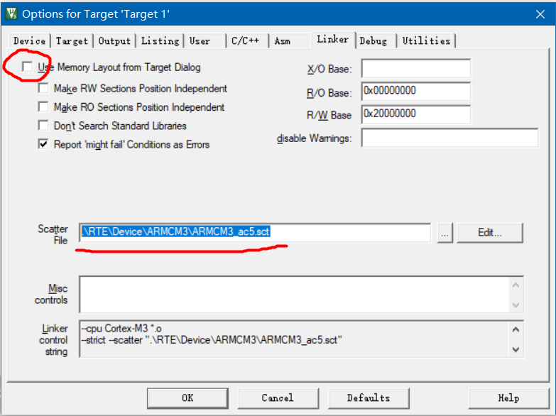

## FreeRTOS 内核分析

<br>

### 新建 FreeRTOS 工程

#### axf 报错

keli 默认使用 object 下的 axf 文件，他默认会报错，我们需要切换为以下路径的对应文件  
`.\RTE\Device\ARMCM3\ARMCM3_ac5.sct`

如下图，点击 keli 菜单上的魔法棒图标，进入 linker 选项卡，取消勾选 `use memory layout from target dialog`，之后在当前项目文件夹下找到下图所示的 axf 文件，然后点击确认

之后直接 rebuild 重新编译，即可消除该错误！！！



<br>

### 裸机系统与多任务系统

此部分和 uCOS 完全一致，不再过多废话

<br>

### 列表与列表项

<br>

这里的列表，实际上就相当于 C 中的链表结构

freertos 中最常用的实际上是双向链表

<br>

```c
// 定义链表节点
struct xLIST_ITEM
{
	TickType_t xItemValue;             // 辅助值
	struct xLIST_ITEM *  pxNext;       // 指向下一个节点
	struct xLIST_ITEM *  pxPrevious;   // 指向上一个节点
	void * pvOwner;					   // 指向该节点内核对象，通常为TCB
	void *  pvContainer;		       // 指向节点所在链表
};
typedef struct xLIST_ITEM ListItem_t;  // 节点数据类型重定义
```

<br>

### 任务定义与任务切换

<br>

#### 创建任务

多任务系统内所有任务均独立且互不干扰，故下方为创建任务的主要步骤

1. 定义一个全局数组作为任务栈
2. 定义任务函数，函数主体无限循环且不能返回
3. 定义存储各个任务基本信息的任务控制块（TCB）
4. 实现任务创建函数，任务创建有静态和动态两种方式

<br>

#### 就绪列表

> 任务创建好之后，我们需要把任务添加到就绪列表中，表示任务已经就绪，系统随时可以调度

实现就绪列表步骤

1. 定义一个 List_t 类型的数组作为就绪列表，数组的下标对应任务的优先级，同一优先级的任务统一插入就绪列表的同一条链表中
2. prvInitialiseTaskLists()函数内初始化就绪列表

TCB 中的 `xStateListItem` 成员可视为挂载到就绪列表的一个接口，将任务插入就绪列表中，就是通过将任务控制块的 xStateListItem 节点插入就绪列表中

<br>

#### 调度器

> 调度器是操作系统的核心，其主要功能就是实现任务的切换，即找到最高优先级任务然后执行它

`vTaskStartScheduler()` 函数完成调度器的启动

SVC 中断要想被成功响应，其函数名必须与向量表注册的名称一致

任务切换就是在就绪列表中寻找优先级最高的就绪任务，然后执行该任务

任务切换的流程（基于 PendSV 中断服务函数）

1. 定义全局指针 pxCurrentTCB 指向当前正运行或即将运行的任务的 TCB
2. 将 psp 的值存储到 r0 寄存器
3. 加载 pxCurrentTCB 的地址到 r3，再将其加载到 r2
4. 以 r0 作为基址，将 r0 的值存储到 r2 指向的内容
5. 将 r3 和 r14 临时压入栈，提供栈保护

<br>

#### 中断优先级

`BASEPRI寄存器` 该寄存器用于调配基准中断优先级（说人话就是，超过该寄存器设置的优先级值的中断才可被响应，否则一律过滤掉不响应！）

<br>

`PSP(Process Stack Pointer)`:进程堆栈指针,用于普通任务的栈。  
`MSP(Main Stack Pointer)`:主堆栈指针,用于中断服务例程的栈。

- PSP 指向任务栈的栈顶,用于任务的函数调用、变量局部化等。每个任务都有自己的 PSP。
- MSP 指向中断服务例程栈的栈顶。所有中断和异常都使用同一个 MSP。
- 开启中断后,CPU 会自动从 MSP 中保存上下文并恢复,因此中断服务例程使用 MSP。
- 任务切换时,任务上下文是从 PSP 中保存和恢复的。
- 在 FreeRTOS 初始化时,会初始化这两个寄存器:
- PSP 指向任务控制块中 taskTOP_OF_STACK 成员,对应任务栈的顶部。MSP 指向中断栈的顶部。
- 在中断服务例程中,不能修改 PSP,必须使用 MSP。
- 在任务中,不能修改 MSP,必须使用 PSP。

<br>

### 临界段保护

<br>

什么是临界段？  
即一段在执行时不能被中断的代码段

FreeRTOS 中，对中断的开和关是通过操作 BASEPRI 寄存器来实现

- 大于等于 BASEPRI 的值的中断会被屏蔽
- 小于 BASEPRI 的值的中断不会被屏蔽，不受 FreeRTOS 管理

开中断和关中断的区别？

- 开中断(Interrupts Enabled):中断使能状态,该状态下 CPU 可以响应中断请求。
- 关中断(Interrupts Disabled):中断禁止状态,CPU 不响应任何中断请求。

<br>

#### 关中断

分为两种

- 无返回值的关中断函数：不可嵌套、不可用于中断、没有存储参数的功能
- 带返回值的关中断函数：即向 BASEPRI 写入新值时，先将 BASEPRI 的值保存起来，在更新完 BASEPRI 的值时，将之前保存好的 BASEPRI 的值返回，返回的值作为形参传入开中断函数

<br>

#### 开中断

开中断也分为两个版本

- 不带中断保护：直接设置 BASEPRI=0
- 带中断保护：将上一次关中断时保存的 BASEPRI 的值作为形参

<br>

#### 临界段出入

```c
/* 在中断场合，临界段可以嵌套 */
{
    uint32_t ulReturn;
    /* 进入临界段，临界段可以嵌套 */
    ulReturn = taskENTER_CRITICAL_FROM_ISR();
    /* 临界段代码 */
    /* 退出临界段 */
    taskEXIT_CRITICAL_FROM_ISR( ulReturn );
}


/* 在非中断场合，临界段不能嵌套 */
{
    /* 进入临界段 */
    taskENTER_CRITICAL();
    /* 临界段代码 */
    /* 退出临界段*/
    taskEXIT_CRITICAL();
}
```

<br>

### 空闲任务与阻塞延迟

<br>

#### 空闲任务

RTOS 的特性即让 CPU 持续保持工作状态

当 CPU 无任务可执行时，会进入空闲状态，此时就需要执行一个空闲任务

下面是空闲任务创建的对应步骤

1. 定义空闲任务的栈空间
2. 定义空闲任务的 TCB
3. 在调度器启动函数 vTaskStartScheduler()中创建空闲任务
4. 空闲任务作为最低优先级而插入就绪列表排头

<br>

#### 阻塞延时

> 阻塞延时的阻塞是指任务调用该延时函数后，任务会被剥夺 CPU 使用权，然后进入阻塞状态，直到延时结束，任务重新获取 CPU 使用权才可以继续运行

当所有任务都处于延时状态时，CPU 自动调取空闲任务执行

阻塞延时基本实现函数 `vTaskDelay`

```c
void vTaskDelay( const TickType_t xTicksToDelay )
{
    TCB_t *pxTCB = NULL;
    /* 获取当前任务的TCB */
    pxTCB = pxCurrentTCB;(1)
    /* 设置延时时间 */
    pxTCB->xTicksToDelay = xTicksToDelay;(2)
    /* 任务切换 */
    taskYIELD();(3)
}
```

<br>

调用 tashYIELD()会产生 `PendSV` 中断，在 PendSV 中断服务函数中会调用上下文切换函数 `vTaskSwitchContext()`，该函数的作用是寻找最高优先级的就绪任务，然后更新 `pxCurrentTCB`

<br>

xTicksToDelay 表示延时时间，时间按照周期递减，此递减周期时由 SysTick 提供的

操作系统中最小的时间单位就是 `SysTick` 的中断周期，我们称之为一个 tick

<br>

### 多优先级

> 在 FreeRTOS 中，数字优先级越小，逻辑优先级也越小，这与 RT-Thread 和 μC/OS 刚好相反。

<br>

就绪列表 pxReadyTasksLists 是一个数组，它存储着就绪任务的 TCB  
数组下标即为优先级

空闲任务的优先级最低，其数组下标永远为 0

如果想让任务支持优先级，直接让 pxCurrentTCB（全局 TCB 指针）指向优先级最高的那个任务即可！

查找最高优先级任务有两种方法：通用方法、处理器优化后方法

<br>

#### 通用方法

1. 定义 uxTopReadyPriority，存储创建任务的优先级，默认为 0
2. 将 uxTopReadyPriority 的值暂存到局部变量 uxTopPriority
3. 从某一最高优先级开始，查找任一就绪列表，如果找到符合优先级的任务，停止 while 循环，更新 pxCurrentTCB
4. 如果找不到符合条件的任务，就切换到低一级优先级，继续执行就绪列表查找，直到找到为止
5. 执行完毕，更新 uxTopPriority 的值到 uxTopReadyPriority

<br>

#### 优化后方法

根据前导零计算

例如，有如下 `uxTopReadyPriority` 的值（000011）；  
0 表示对应任务不参与优先级计算，1 表示参与运算；  
优先级依然按照从小到大优先级依次增大的原则；

可见 uxTopReadyPriority 有四个前导零，后面的两位才参与优先级计算，且最后一位的优先级达到最高  
空闲任务优先级为 0，但是不出现在 uxTopReadyPriority 里面，所以首位 0 并不代表空闲任务！

<br>

任务切换函数 `vTaskSwitchContext()`  
他可以寻找到优先级最高的就绪任务 TCB 并将其更新到 pxCurrentTCB

<br>

### 任务延时列表

#### xTicksToDelay

这是于 TCB 中内置的延时变量

最简单的 `xTicksToDelay` 任务挂起到唤醒全流程  
此方法由于需要每次时基中断都必须全部扫描一次，很费时，后续使用延时列表进行改进

1. 初始化 xTicksToDelay 并设置需要延时时间
2. 挂起任务
3. 清空任务的优先级位图表中的对应位
4. 每次时基中断就扫描一次 xTicksToDelay，若大于 0 则递减，若等于 0 表示任务就绪，开始切换任务

<br>

#### 任务延迟列表工作原理

- 当任务需要延时时，挂起任务，并将任务从就绪列表删除，并插入到任务延时列表；
- 更新下一个任务的解锁时刻变量 xNextTaskUnblockTime 的值；
- 当系统时基计数器 xTickCount 的值与 xNextTaskUnblockTime 相等时，就表示有任务延时到期了，需要将该任务就绪；

<br>

### 时间片

> FreeRTOS 与 RT-Thread 和 μC/OS 一样，都支持时间片功能。所谓时间片，就是同一个优先级下可以有多个任务，每个任务轮流享有相同的 CPU 时间，享有 CPU 的时间叫作时间片

<br>

#### 实验校验

编写以下三个任务函数：
任务 1：优先度 2，主体为无限循环的任务，非阻塞  
任务 2：优先度 2，主体为无限循环的任务，非阻塞  
任务 3：优先度 3，主体是一个 tick，阻塞

由于该函数的作用：taskSELECT_HIGHEST_PRIORITY_TASK()  
所以系统任务切换时总会调用该方法，以从循环列表里面查找优先级最高的任务（如任务 3），所以会每次都进入 1tick 的阻塞中，然后 1s 退出阻塞状态！

<br>

#### taskSELECT_HIGHEST_PRIORITY_TASK()

函数实现流程

1. 根据优先级位图表 uxTopReadyPriority 找到就绪任务的最高优先级，然后将优先级暂存在 uxTopPriority 中
2. 获取优先级最高的就绪任务的 TCB，然后更新到 pxCurrentTCB
3. listGET_OWNER_OF_NEXT_ENTRY()函数选择执行任务 1 还是任务 2

<br>

#### taskRESET_READY_PRIORITY()

功能：当清除优先级位图表 `uxTopReady-Priority` 中相应的位时，会先判断当前优先级链表下是否还有其他任务，如果有则不清零

<br>

## FreeRTOS 内核应用开发

> 此步骤需要野火 STM32 开发板，当然如果你没有的话看看笔记背一背应付面试也不是不行！

<br>

### 移植 FreeRTOS 到 STM32
