### 点灯

> 这里将会以一个最简单的一个点灯实验来展示如何使用 STM32CubeMX 快速生成 STM32 工程并上手开发，包括对项目工程建立的详细内容分析解释

> 接下来使用正点原子探索者开发板 `STM32F407ZGT6`

<br>

#### 选择 MCU

下载并安装 STM32CubeMX，具体流程大家可以去网上找找，非常简单

按照下图所示，点击 `ACCESS TO MCU SELECTOR` 选择适合的 MCU

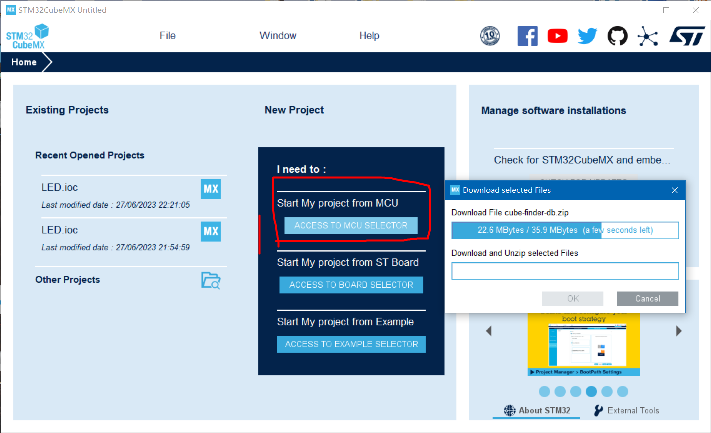

找到探索者开发板对应的 STM32 板子型号，使用左上角的搜索按钮找到  
然后在右侧面板下方选择型号  
最后点击右上角的 start project 开启工程

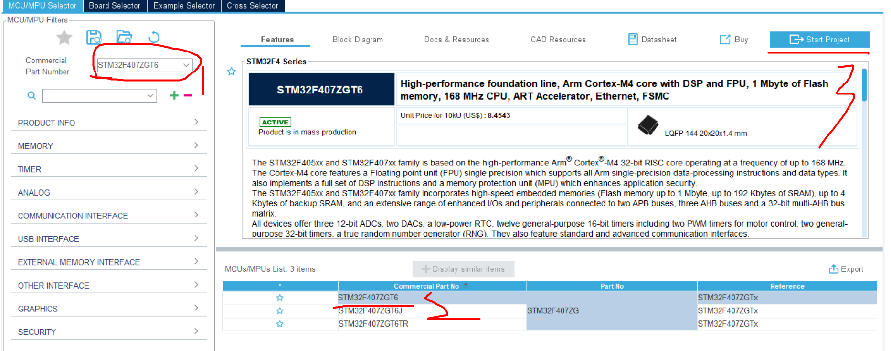

进入 MCU 配置面板，下面是面板对应的四个主要部分

- Pinout&Configuration 引脚设置
- Clock Configuration 时钟设置
- Project Manager 工程输出设置等
- Tools 保持默认，基本不需要动

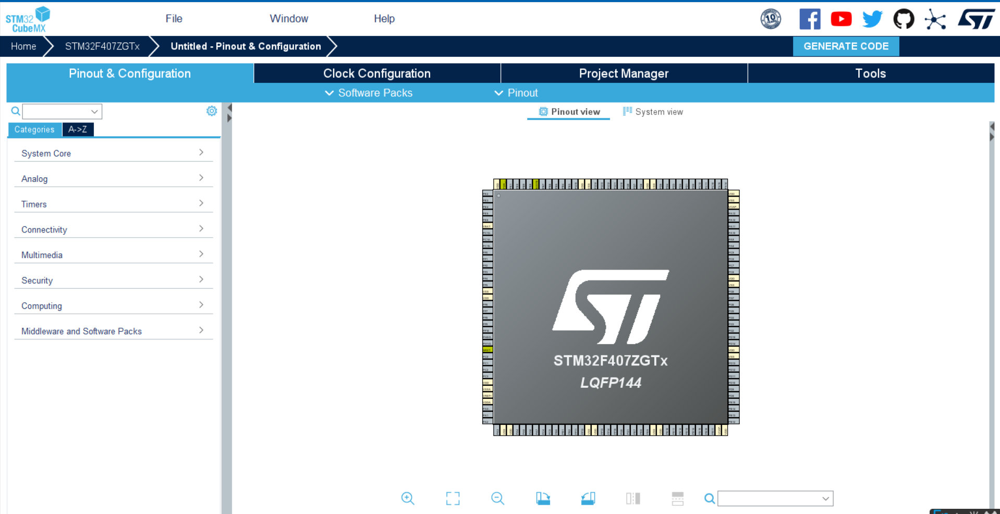

<br>

#### 引脚设置

在右侧的 MCU 引脚展示图内，找到引脚 PF9（因为该引脚默认对应探索者开发板上的板载 LED）

我们希望将其设置为输出模式，故右键点击该引脚，选择 `GPIO_Output`

在 GPIO 里面找到我们新添加的引脚 PF9，紧接着设置以下的几个参数（对应下图的第五步）

- GPIO 输出级别：设置为 LOW，表示初始低电平
- GPIO 模式：推挽输出模式
- GPIO 上拉下拉：设置为上拉模式
- 最大输出速度：设置为 HIGH
- 用户标签：可以空着或者瞎写一个，表示该 GPIO 的别名

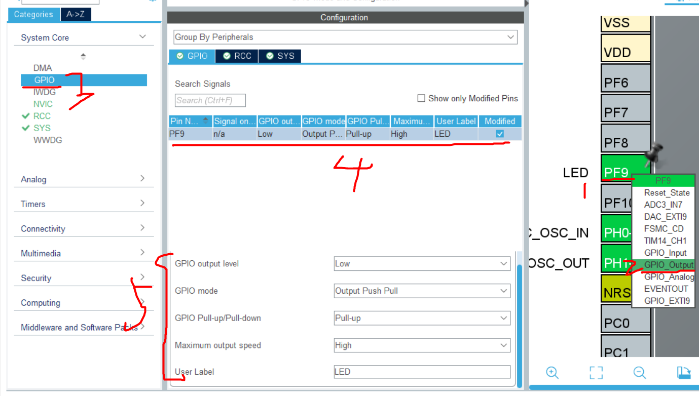

<br>

SYS 设置为总线输出的模式

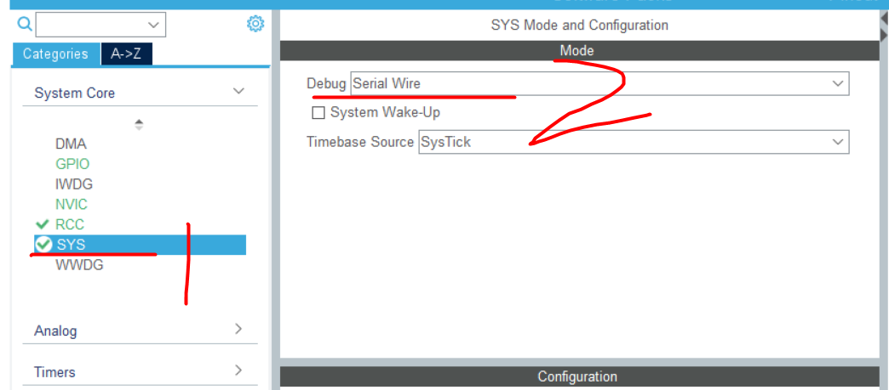

<br>

RCC 设置时钟  
高速时钟 HSE 和低速时钟 LSE 均设置为外部晶振

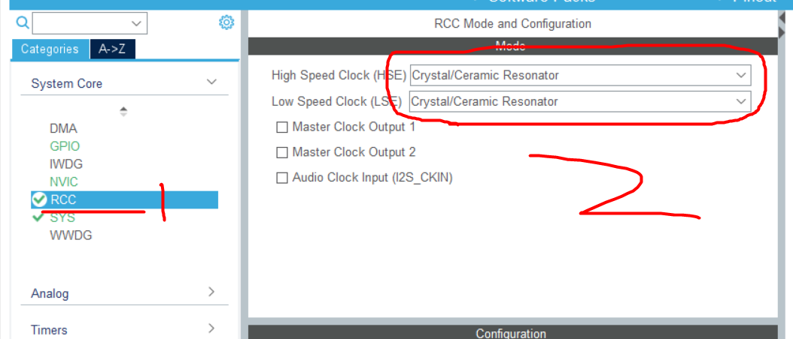

<br>

#### 时钟设置

> 这一块比较复杂，后续我将会专门出一个专题文章来介绍这个时钟配置系统各个参数的对应含义，现在大家仅需要根据我们当前的需求，简单配置以下就可以了，我们当前的目的就是让他跑起来没别的

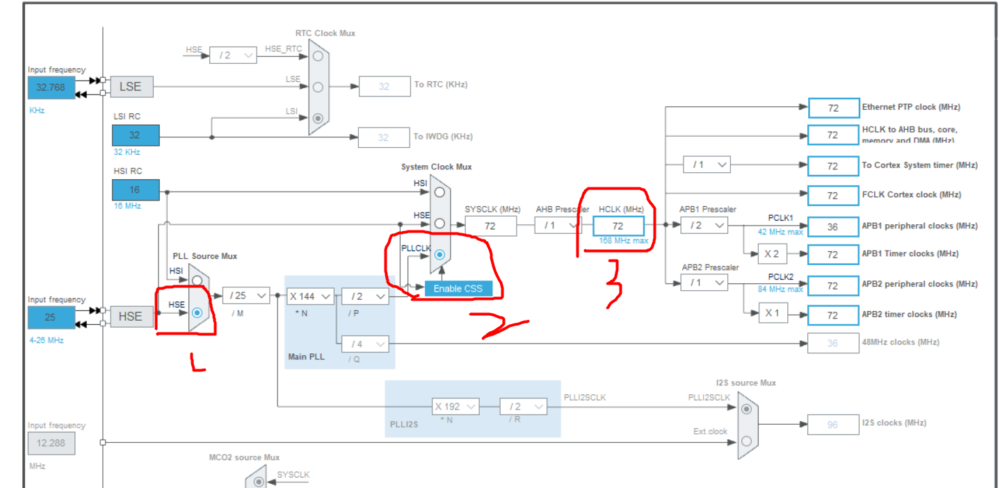

根据图上所示的步骤依次执行

1. 设置为高速时钟 `HSE`
2. 选择开启 PLL 倍频器，即 `PLLCLK`
3. 设置 CPU 时钟频率 `HCLK` 为 72

设置完毕后点击回车，CubeMX 会自己为我们计算然后得出最合适的配置并自动填充其他的空

<br>

#### 项目配置

进入 `ProjectManager` 面板

首先看项目设置

- 设置项目名称
- 项目名称和项目保存路径必须全英文且不要有奇奇怪怪的特殊符号！不然会导致编译错误
- 工具链 `toolchain` 选择 `MDK-ARM`，版本选择目前最广泛使用的 v5 版本

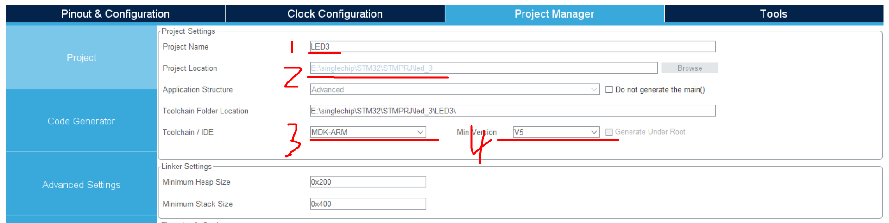

<br>

Code Generator 代码生成配置

按照下图所示步骤一和步骤二，勾选对应的内容

步骤一：勾选仅生成必须的库，可以减少编译的时间
步骤二：勾选生成外围设备是都生成.c 和.h 文件

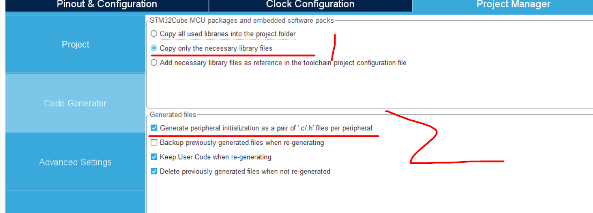

<br>

#### 生成项目

对于 tools 一栏，基本没什么好改的，直接不管

点击右上角的 GENERATOR CODE 生成 keil 代码，然后弹出的窗口中选择 open project 即可直接打开 MDK-ARM  
此时看见的就是我们实验 STM32CubeMX 生成的代码了！

该工具的最大作用就是把我们需要反复配置的时钟以及引脚等等东西都可视化了，一键式操作附带生成代码，极其方便；  
但是只能使用 HAL 库开发，目前不支持生成的项目使用库函数开发

<br>

#### 项目文件介绍

最主要的项目文件在下图红框圈出来的内容

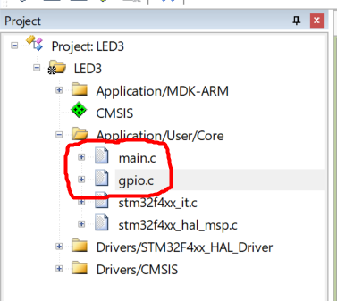

<br>

先来看看初始化 GPIO 的代码是怎么写的，下面给出了对应的中文注释

代码清单 `gpio.c`

```c
void MX_GPIO_Init(void)
{
  GPIO_InitTypeDef GPIO_InitStruct = {0};  // 定义GPIO初始化结构体

  /* GPIO Ports Clock Enable */
  __HAL_RCC_GPIOF_CLK_ENABLE();  // 使能GPIOF端口时钟
  __HAL_RCC_GPIOH_CLK_ENABLE();  // 使能GPIOH端口时钟
  __HAL_RCC_GPIOA_CLK_ENABLE();  // 使能GPIOA端口时钟

  /*Configure GPIO pin Output Level */
  HAL_GPIO_WritePin(LED_GPIO_Port, LED_Pin, GPIO_PIN_RESET); // 初始化LED引脚输出低电平

  /*Configure GPIO pin : PtPin */
  GPIO_InitStruct.Pin = LED_Pin;  // 配置LED引脚
  GPIO_InitStruct.Mode = GPIO_MODE_OUTPUT_PP;  // 设置为推挽输出
  GPIO_InitStruct.Pull = GPIO_PULLUP;  // 设置为上拉输入
  GPIO_InitStruct.Speed = GPIO_SPEED_FREQ_HIGH;  // GPIO速度频率设置为高速
  HAL_GPIO_Init(LED_GPIO_Port, &GPIO_InitStruct);  // 初始化LED引脚GPIO端口
}
```

<br>

main.c 里面有 cubemx 生成的一大堆注释，根据这些注释的提示，我们在对应部分填入对应的代码  
这里初始化了 HAL 库、系统时钟、GPIO 口

代码清单 `main.c`

```c
/* USER CODE END Header */
/* Includes ------------------------------------------------------------------*/
#include "main.h"
#include "gpio.h"

/* Private includes ----------------------------------------------------------*/
/* USER CODE BEGIN Includes */

/* USER CODE END Includes */

/* Private typedef -----------------------------------------------------------*/
/* USER CODE BEGIN PTD */

/* USER CODE END PTD */

/* Private define ------------------------------------------------------------*/
/* USER CODE BEGIN PD */

/* USER CODE END PD */

/* Private macro -------------------------------------------------------------*/
/* USER CODE BEGIN PM */

/* USER CODE END PM */

/* Private variables ---------------------------------------------------------*/

/* USER CODE BEGIN PV */

/* USER CODE END PV */

/* Private function prototypes -----------------------------------------------*/
void SystemClock_Config(void);
/* USER CODE BEGIN PFP */

/* USER CODE END PFP */

/* Private user code ---------------------------------------------------------*/
/* USER CODE BEGIN 0 */

/* USER CODE END 0 */

/**
  * @brief  The application entry point.
  * @retval int
  */
int main(void)
{
  /* USER CODE BEGIN 1 */

  /* USER CODE END 1 */

  /* MCU Configuration--------------------------------------------------------*/

  /* Reset of all peripherals, Initializes the Flash interface and the Systick. */
  HAL_Init();

  /* USER CODE BEGIN Init */

  /* USER CODE END Init */

  /* Configure the system clock */
  SystemClock_Config();

  /* USER CODE BEGIN SysInit */

  /* USER CODE END SysInit */

  /* Initialize all configured peripherals */
  MX_GPIO_Init();
  /* USER CODE BEGIN 2 */

  /* USER CODE END 2 */

  /* Infinite loop */
  /* USER CODE BEGIN WHILE */
  while (1)
  {
    /* USER CODE END WHILE */

    /* USER CODE BEGIN 3 */
  }
  /* USER CODE END 3 */
}
```

在 while 循环里面填入点灯代码，让灯泡每隔 200ms 亮灭一次  
使用 HAL_Delay 这个官方给出的延迟函数

```c
while (1)
{
/* USER CODE END WHILE */

/* USER CODE BEGIN 3 */
    HAL_GPIO_WritePin(GPIOF,GPIO_PIN_9,GPIO_PIN_RESET);
    HAL_Delay(200);
    HAL_GPIO_WritePin(GPIOF,GPIO_PIN_9,GPIO_PIN_SET);
    HAL_Delay(200);
}
/* USER CODE END 3 */
```

<br>

#### Debugger 设置

鉴于 ST-Link 默认烧录不会重置，所以大概率编译后烧录你看不到任何效果

按照下图所示，打开工程设置  
在 Debug 项打开 ST-LINK 设置  
`Flash Download` 内勾选 `Reset and Runs`

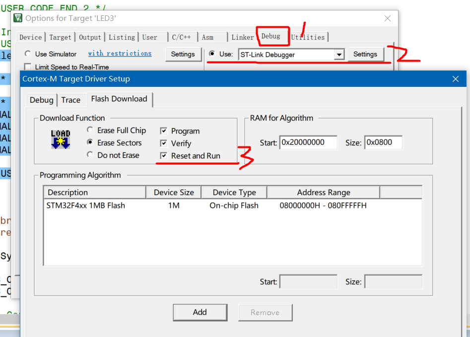

<br>

> 编译并烧录，可以看见此时的小灯就已经间隔闪烁起来啦！！！
