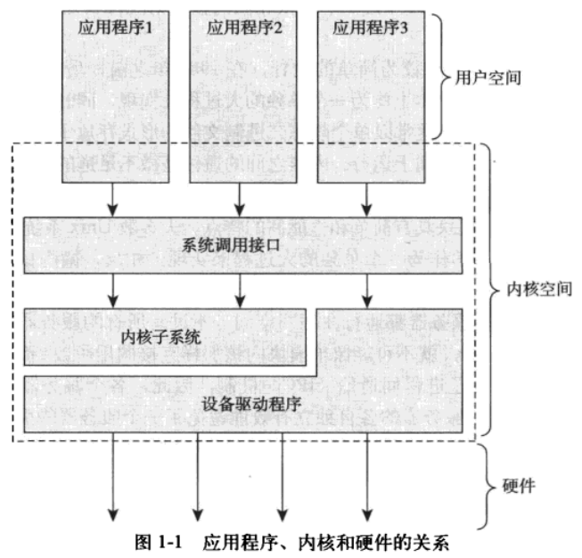
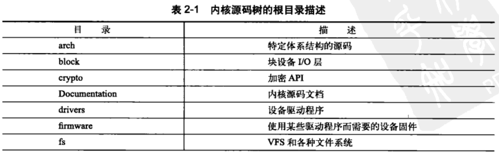
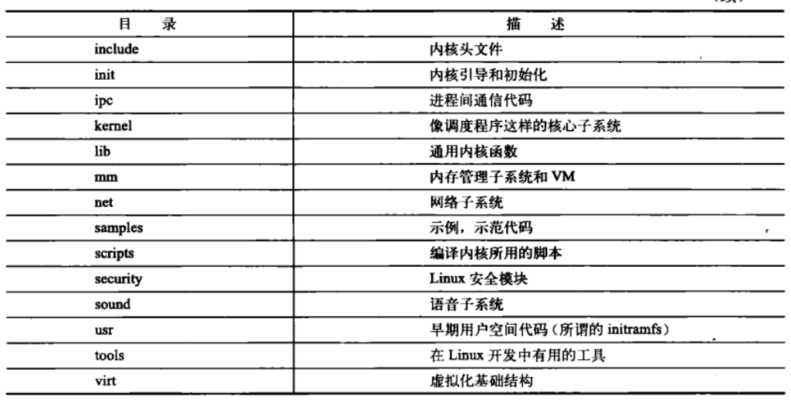
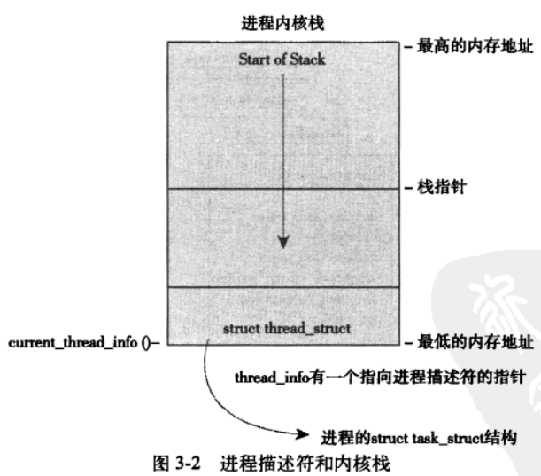
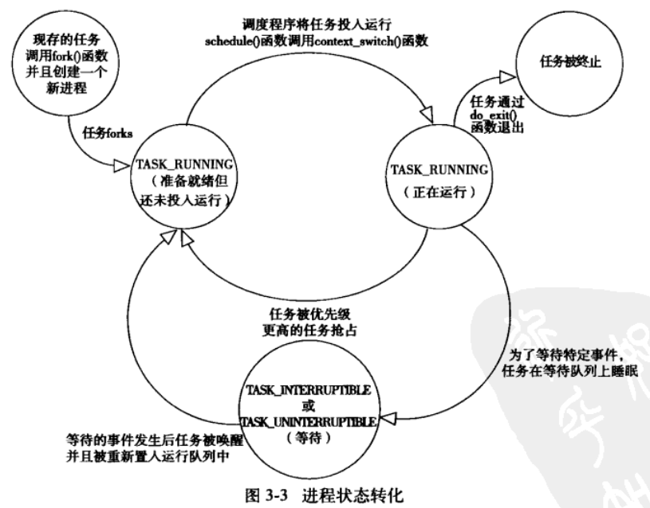

### Linux 内核简介

#### 操作系统与内核简介

任意处理器必然在任意时间段都必定处于以下三种状态

1. 运行于用户空间，执行用户线程
2. 运行于内核空间，处于程序上下文
3. 运行于内核空间，处于中断上下文

 

#### Unix&Linux 内核比较

Unix 内核常需硬件系统提供页机制（MMU）管理内存

Linux 是一个单内核，支持动态加载内核模块、支持对称多处理机制

 

### 从 Linux 内核出发

#### 内核源码树

 

#### 编译配置新内核

make 程序可以将源码编译过程拆分为多个并行作业，每个作业独立并发执行

内核编程特点

1. 不可访问 C 库或者标准 C 头文件
2. 必须使用 GUN C
3. 无内存保护机制
4. 难以执行浮点运算
5. 需要时刻注意同步与并发

 

### 进程管理

#### 进程及其描述

父进程通过调用 `fork()` 在当前基础上创建一个新的进程

内核把进程存储在被称为“任务队列”的双端循环链表中  
链表中的每一项均被称为：进程描述符，他的类型为 `task_struct`

linux 使用 slab 分配器分配 task_struct 结构

 

内核通过唯一的进程标识值或者 PID 标识每一个进程  
PID 最大值默认为 32768，隐含标识最大进程存在数目为该值

内核中访问任务需要获得指向其 `task_stuct` 的指针  
部分体系需要通过 `thread_info` 的偏移值获取 `task_struct`

 

该图展示了进程状态，所有的进程任意时刻都必须处于以下几种状态的一种

 

linux 中所有的进程均为 PID 为 1 的 init 进程的后代

系统中每一个进程都必须存在一个父进程  
所以每个进程都会包含 `parent` 以及 `children` 指针以指向其父进程或者子进程

 

#### 创建进程

Unix 创建进程的方式：使用 `fork()` 拷贝当前线程并创建一个新线程，再通过 `exec()` 读取可执行文件并载入地址空间开始运行

写时拷贝：linux 使用写时拷贝技术，即 fork 时父子进程共用同一拷贝，仅当需要写入时，数据才开始复制；

linux 通过 clone()来实现 fork()

 

#### 线程于 linux 中的实现

linux 并没有专门设计线程，所以其中所谓的“线程”都是以进程的形式呈现的，这种类型的进程也被称作为“轻量级进程”，与真正的进程“重量级进程”相对

内核有专门的内核线程，他们仅在内核运行，且无独立的地址空间；  
内核线程只能由其余内核线程创建

 

#### 进程终止

进程的终止（或者称为析构），需要调用 exit()，他也可以在 C 的 main()语句块末尾调用  
释放进程的最后一步是执行 do_exit()函数，此时与进程关联的资源均被释放

子进程终结后便会首先处于 `TASK_ZOMBIE` 状态；  
该状态依然保留进程描述符，便于父进程通过该描述符获取子进程的信息；  
仅当父进程明确指示不再用到该子进程时，子进程才会被完全删除（即移除进程描述符）

为避免父进程先于子进程被删除而导致子进程一直处于 TASK_ZOMBIE 状态而耗费内存，linux 会为其自动指定一个父进程，若还是找不到就直接指定其父进程为 init 进程

 

### 进程调度
