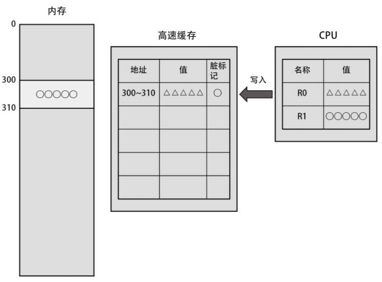

### 用户模式实现的功能

Linux 提供了绝大多数库函数；

调用系统函数需要使用汇编语言，而 `Linux 通过 OS 提供了系统调用的包装函数`，用户可以使用任意类型的高级语言并通过该包装函数转译成汇编语言来获取系统调用

 

Linux 提供了 C 标注库，而 GUN 还是默认使用 glibc 作为 C 标准库，用 C 语言编写的几乎所有程序都依赖于 glibc 库

 

### 进程管理

进程创建的方式

- 为子进程申请内存空间，并复制父进程的内存到子进程的内存空间。
- 父进程与子进程分裂成两个进程，以执行不同的代码。这一点的实现依赖于 fork() 函数分别返回不同的值给父进程与子进程。

 

内核运行程序时的流程

1. 读取可执行文件，并读取创建进程的内存映像所需的信息。
2. 用新进程的数据覆盖当前进程的内存。
3. 从最初的命令开始运行新的进程。

> 即启动另一个程序时，并非新增一个进程，而是替换了当前进程

 

### 进程调度器

进程调度的四个普适性结论

- 不管同时运行多少个进程，在任意时间点上，只能有一个进程运行在逻辑 CPU 上
- 在逻辑 CPU 上运行多个进程时，它们将按轮询调度的方式循环运行，即所有进程按顺序逐个运行，一轮过后重新从第一个进程开始轮流运行
- 每个进程被分配到的时间片的长度大体上相等
- 全部进程运行结束所消耗的时间，随着进程数量的增加而等比例地增加

 

上下文切换

每个进程都被赋予几乎等长的时间片，一旦时间片走完就立刻执行上下文切换，而不管当前进程是否还有代码执行完毕与否  
所以下方代码中，执行完 `foo()` 后可能刚好耗尽时间片，切换到另一进程，则 `bar()` 就不会立刻执行

 

进程的状态

进程具有以下四种状态，而大多数都处于睡眠态

进程之间可以执行切换

 

空闲状态

当逻辑 CPU 上无任何进程运行时，进入空闲状态，此时会执行一些无意义死循环或者开一个新进程，直到一个就绪态的子进程加入  
（系统自然不会这么傻白白耗电，他会主动休眠并等待就绪态进程出现，期间耗电量很小）

逻辑 CPU 的吞吐量随着处理线程数量的增多而升高，当且仅当 CPU 被进程填满后，无论增加多少进程吞吐量都不会变

 

多 CPU

当存在多个逻辑 CPU 时，linux 会使用“负载均衡”分配进程压力到各个 CPU 上面

> 对于多核 CPU 的计算机来说，只有同时运行多个进程才能提高吞吐量  
> 当进程数量多于逻辑 CPU 数量时，吞吐量就不会再提高

 

优先级指定

root 用户可通过 `nice()` 方法指定进程优先级，范围 `-19~20`

 

### 内存管理

Linux 通过内核中名为内存管理系统的功能来管理系统上搭载的所有内存。除了各种进程以外，内核本身也需要使用内存。

 

#### 内存不足

通过 free 指令可获得内存的不同信息，这是对于参数的分解图  

当 free 严重不足时，系统首先释放掉内核中“可释放区域”

若可释放区域释放完后，free 又不足了，此时进入 `OOM （out of memory）` 状态，OOM Killer 会随机选择一个进程直接杀掉，提供 free 内存

 

#### 虚拟内存

虚拟内存使进程无法直接访问系统上搭载的内存，但可通过虚拟地址间接访问  
访问虚拟地址上的指定地址，会自动在物理地址上进行对应转换操作

系统提供了一个页表，分别存储虚拟地址与物理地址的映射关系；  
当我们访问一个不存在的虚拟地址时，就会发生下图的“缺页中断”错误，此时该进程大概率崩溃然后被强制结束；

新建进程需要分配两大部分内存：代码段大小+数据段大小

当存在虚拟内存时，可以执行动态分配内存；

 

#### 内存分配

C 标准库的 `malloc` 方法可以获取字节内存，而其底层实现为调用 `mmap` 方法获取以页为单位的内存

内核内存存储着所有进程的虚拟内存页表，每个进程独占一段物理内存，其余进程无权访问

我们无需关系物理内存映射到那里，直接虚拟内存拿来就用即可

 

#### 高级内存操作

linux 为保证进程内存合理分配，使用以下步骤

- 进程访问入口点。
- CPU 参照页表，筛选出入口点所属的页面中哪些虚拟地址未关联物理地址。
- 在 CPU 中引发缺页中断。
- 内核中的缺页中断机构为步骤 1 中访问的页面分配物理内存，并更新其页表。
- 回到用户模式，继续运行进程。

虚拟内存不足时，无论物理内存还剩多少都无法分配；  
x86 架构的虚拟内存仅 4GB，而 x86_64 架构的虚拟内存增加到 128TB

 

写时复制：物理内存并非在发起 fork() 系统调用时进行复制，而是在尝试写入时才进行复制

子进程复制父进程并不是复制物理内存，而是复制虚拟地址页表

 

**Swap 交换区**  
当内存不足时，系统会暂时使用外部存储当做内存使用，这个外部存储区就是 Swap

换出：即将原本存储于物理内存的数据转存到 Swap 交换区；  
换入：将 Swap 交换区的数据转存到物理内存

 

标准大页机制  
linux 页表使用标准大页机制，可减免内存损耗

 

### 存储层次

#### 高速缓存

寄存器读取内存中数据的过程，如下图所示  
先从内存地址提取到高速缓存内，寄存器（CPU）再从高速缓存拿取指定地址

当寄存器需要再次获取相同值时，可以直接从高速缓存拿取对应值（如果该值存在的话），而无需再次请求内存

 

当寄存器需要修改值时，经历如下过程

- 将修改后的值存到高速缓存，并为其赋予一个脏标记
- 被赋予脏标记的高速缓存数据项在某个时间点于后台修改内存数据，修改完毕后删去脏标记
- 以此类推

 

当高速缓存空间被占满后，如果需要发起新请求，一般会删除高速缓存中的一个项目，然后复制新项目到高速缓存内；

如果所有高速缓存项都是脏的，还执意要访问内存，那么会导致系统抖动，降低运行效率

 

#### 缓冲与缓存区

CPU 上存在一个具有与高速缓存同样的访问速度的区域，名为`转译后备缓冲区（Translation Lookaside Buffer，TLB）`，又称为快表或页表缓冲，该区域用于保存虚拟地址与物理地址的转换表

页面缓存：当进程读取文件的数据时，内核并不会直接把文件数据复制到进程的内存中，而是先把数据复制到位于内核的内存上的页面缓存区域，然后再把这些数据复制到进程的内存中  
文件修改时，页面缓存区执行的动作和高速缓存一致；  
页面缓存区也有“脏”与“不脏”

强制断电将导致页面缓存中的脏页丢失

 

### 文件系统

#### 数据与容量

下图展示了文件操作的底层步骤（适用于任何操作系统）

 

数据：用户创建的文档、图片、视频和程序等数据内容  
元数据：文件的名称、文件在外部存储器中的位置和文件大小等辅助信息

为避免单文件不合理的内存使用（比如一个文件直接占满所有内容），此时就会有“磁盘配额”功能执行管理  
磁盘配额有以下三种：用户配额、目录配额、子卷配额

 

#### 日志与写时复制

日志功能在文件系统中提供了一个名为日志区域的特殊区域，他用来存储文件系统的操作

文件系统的更新步骤

1. 把更新所需的原子操作的概要暂时写入日志区域，这里的“概要”就称为日志。
2. 基于日志区域中的内容，进行文件系统的更新。

 

写时复制：即每次修改文件都是将修改后的文件保存到一个新的位置，再把指向就文件的链接改为指向新文件，此时即完成写时复制

当被强制断电后，只需删去新创建的文件，就可以恢复到原先状态

 

#### 字符设备

字符设备虽然能执行读写操作，但是无法自行确定读取数据的位置

很少有应用程序会直接操作终端的设备文件，取而代之的是操作 Linux 提供的 shell 程序或者库

 

#### 块设备

块设备除了能执行普通的读写操作以外，还能进行随机访问  
比如 HDD 与 SSD 等外部存储器

 

#### 其他文件系统

`tmpfs` 是一种创建于内存（而非外部存储器）上的文件系统  
常用于 `/tmp` 与 `/var/run` 这种“文件内容无须保存到下一次启动时”的文件上

 

`虚拟文件系统 procfs` 用于获取系统上所有进程的信息

 

### 外部存储

#### HDD

HDD 数据传输的流程

- 设备驱动程序将读写数据所需的信息传递给 HDD，其中包含扇区序列号、扇区数量以及访问类型（读取或写入）等信息。
- 通过摆动磁头摆臂并转动盘片，将磁头对准需要访问的扇区。
- 执行数据读写操作。
- 在执行读取的情况下，执行完 HDD 的读取处理就能结束数据传输。

 

HDD 上数据存储一般都是连续的，因为访问不连续的扇区会导致轨迹变长；
把针对连续区域的访问请求汇集到一次访问请求中

这就是不连续扇区访问的路径

 

#### 访问顺序

对于顺序读写

1. 不管是读取还是写入，随着单次 I/O 请求量增大，吞吐量都有所提升
2. 单次 I/O 请求量达到 1MB 后，性能就已经到达峰值了，这个值就是该 HDD 单次访问允许的数据量上限，同时也是该 HDD 设备的性能上限

 

对于随机访问  
不管是读取还是写入，随机访问的性能都比顺序访问差。特别是在 I/O 请求量较小时，差距更加明显

 

#### 调度器

linux 将 HDD 或者 SSD 均称作块设备

不同块设备都有着自己独特的文件系统，故统一使用通用块层处理这些请求

 

通用块层中的 I/O 调度器会将访问块设备的请求积攒一定时间，并在向设备驱动程序发出 I/O 请求前对这些请求进行加工（如下所示）

- 合并：将访问连续扇区的多个 I/O 请求合并为一个请求
- 排序：按照扇区的序列号对访问不连续的扇区的多个 I/O 请求进行排序

 

> 预读功能：顾名思义，磁头正在读取一个扇区时，会预先读取下一扇区内容，这样可以提高顺序访问的性能

 

#### SSD

SSD 和 HDD 不一致的方式是他直接使用电子信息交互，极大的减少了磁头读取所需的时间

但这也带来了一个问题，即 SSD 坏掉并无明确千兆，且因闪存颗粒特性，使得数据恢复极为困难；  
而 HDD 在这两方卖则和 SSD 相反

 
