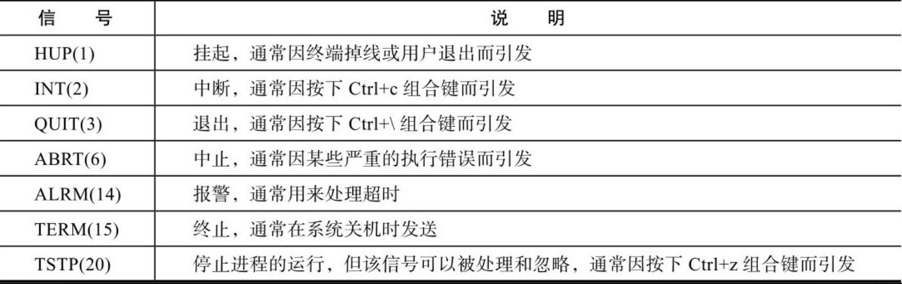

### Shell 初步入门

<br>

#### Shell 分类

对于 Unix/Linux 两种系统，shell 主要由以下两种类型

`Bourne shell` 其下还包括子分支 Bourne shell（sh）、Korn shell（ksh）、Bourne Again Shell（bash）三种类型

`C shell` 又包括 csh、tcsh 两种类型

> 目前主要留学的是 csh 以及 bash

<br>

#### 幻数

任意位置创建一个 sh 文件 `s1.sh`

写入以下代码

```sh
#! /bin/bash
echo tom
```

`#!` 叫做幻数，在其后面指出该文件使用的 shell 解释器  
（对于大多数 linux 系统，目前都会默认使用 bash，但这一行还是不可以省略）

保存该文件，同目录下，使用 bash 指令运行，发现输出了 tom  
运行代码 `bash s1.sh`

<br>

这是书中给出的常用 sh 开头写法

```sh
#! /bin/sh
#! /bin/bash
#! /usr/bin/awk
#! /bin/sed
#! /usr/bin/tcl
#! /usr/bin/expect      #＜==expect解决交互式的语言开头解释器。
#! /usr/bin/perl        #＜==perl语言解释器。
#! /usr/bin/env python  #＜==python语言解释器。
```

<br>

#### 注释

非常简单，使用一个 `#` 即可

<br>

### Shell 核心与实践

<br>

#### 变量

变量名加等号即可赋值

使用美刀符号输出变量值

```sh
#! /bin/bash

value="helloworld"

echo $value
```

<br>

终端模式下，可以使用以下三个命令获取对应作用域内的变量  
`set` 命令输出所有的变量，包括全局变量和局部变量；  
`env` 命令只显示全局变量；  
`declare` 命令输出所有的变量、函数、整数和已经导出的变量

<br>

常见的系统环境变量  
`$HOME`：用户登录时进入的目录。  
`$UID`：当前用户的 UID（用户标识），相当于 id -u。  
`$PWD`：当前工作目录的绝对路径名。  
`$SHELL`：当前 SHELL。  
`$USER`：当前用户。  
`$PATH`：环境变量

<br>

#### 引号输出

`a=123` 不加引号直接赋值，值被解析后输出

`a='123'` 单引号，不作任何解析，有什么就输出什么

`a="123"` 双引号，引号里的变量及命令会经过解析后再输出内容

<br>

#### 特殊变量

`$0` 取出当前执行脚本的文件完整名称

`$#` 取出脚本传参的个数

`$*`以及`$@` 均为输出所有传入参数的值，但是会根据变量有无单双引号而呈现不同的解释状态

<br>

#### 特殊状态变量

`$?` 获取执行上一个指令执行状态的返回值  
`$$` 获取当前 shell 脚本进程号 PID  
`$!` 获取上一个于后台工作进程的进程号  
`$_` 获取在此之前执行命令的脚本的最后一个参数

<br>

#### bash 内置变量命令

`eval` 在当前代码执行位置插入新的指令并且执行他  
如`eval "echo $0"`

`exec` 不创建新的子进程的情况下执行对应的指令，执行完毕进程终止  
如`exec data`

<br>

`read` 从标准输入读取字符串信息

`exit` 退出 shell 或者转到下一个数位

<br>

#### 变量子串


即在一个变量表达式内，使用对应的变量子串符号来达到快速操作字符串的效果

指令实例 `${#name}`

<br>

#### 特殊扩展变量


使用特殊扩展变量方法，为未初始化或者未赋值的变量在运行时显示指定内容

如下代码，由于 res 变量未定义，我们通过 `:-` 设置了当变量未初始化时输出的内容

```sh
echo $test # 没有定义的变量直接调用就是0
res=${test:-UNDEFINED} # 定义未定义的变量的方法
echo $res # UNDEFINED
```

<br>

### Shell 变量数值计算实践

#### 基本算术运算符


<br>

#### 双小括号


双小括号可以作为一个简单的表达式使用，进行赋值或者回显操作时务必带上￥符号，否则将会出错  
`echo $((100+200))`

表达式在命令行执行时不需要加$符号，直接使用((6%2))形式即可，但是如果需要输出，就要加$符

`“(())”`里的所有字符之间没有空格、有一个或多个空格都不会影响结果

<br>

#### let

let 相当于双小括号，你可以这么写

`let i=i+1`

<br>

#### expr

可用于求职或者表达式运算

乘法运算要加上反斜杠进行转义

```sh
expr 2 + 2 # 4
expr 2 \* 2 # 4
```

使用反引号包裹 expr，使其以一个表达式的形式出现

```sh
i=5
i=`expr $i + 6`
echo $i # 11
```

利用 expr 做计算，将一个未知的变量和一个已知的整数相加，看返回值是否为 0，如果为 0 就认为做加法的变量为整数，否则就不是整数

可以使用 length 参数来计算对应字符串的长度

```sh
str="asd"
expr length $str # 3

```

<br>

#### bc

bc 是一款 linux 自带的计算器，我们也可将其用在命令行内

```sh
echo 3+4|bc # 7

i=10
i=`echo $i+10|bc` # 20
```

<br>

#### awk

适用于小数加减法

```sh
echo "7.7 8.2" |awk '{print ($1-$2)}' # -0.5
```

<br>

#### read

read 可以读取用户输入

```sh
# -t 10 设置等待时间为10s
# -p "please input:"输入提示词
# num输入内容被赋予的变量
read -t 10 -p "please input:" num
```

<br>

### Shell 条件测试与比较

<br>

#### 脚本条件测试

```sh
# -f判断文件是否存在，如果存在返回真，反之为假
# 一下结构类似于三元运算符，文件存在则执行true，不存在则执行false
test -f file && echo true || echo false

# 使用中括号包裹test所有参数及其对应值
# 中括号左右端都必须预留一个空格距离，否则报错
test [ -f file ] && echo 1 || echo 2
```

一般的，都建议运算符号之间没有距离（即没有很多空格阻隔）

<br>

#### 文本测试表达式


```sh
# 对单个文件变量进行测试
[ -f "$fileval" ] && echo 1 || echo 0
```

<br>

实际开发中常用的条件判断语句模板

如果条件返回 true，则执行大括号内的所有指令

```sh
[ 条件 ] &&{
    命令1
    命令2
    命令3
}
```

<br>

#### 字符串测试表达式

使用时特别注意空格间距的安排！

```sh
# -n "abs" 若字符串长度非0，返回true
[ -n "abs" ] && echo 1 || echo 0

# -z "abs" 若字符串长度为0，返回true
[ -n "" ] && echo 1 || echo 0
```

<br>

#### 整数二元比较操作符


编写时分为两种情况，按照上图针对性使用

在`[[]]`和`(())`内也可以使用文字式比较符号，但是不推荐！

```sh
[ 2 -eq 1 ] && echo 1 || echo 0
[[ 2 > 10 ]] && echo 1 || echo 0

(($num1<$num2)) && echo 1 || echo 0
```

不建议在正式工作中使用 `[[]]` ，因为它比较复杂，这会为开发带来很多麻烦

三种形式使用到的符号总结

- 整数加双引号的比较是对的。
- `[[]]`中用类似`-eq`等的写法是对的，`[[]]`中用类似`＞、＜`的写法也可能不对，有可能会只比较第一位，逻辑结果不对。
- `[]`中用类似`＞、＜`的写法在语法上虽然可能没错，但逻辑结果不对，可以使用`=、! =`正确比较。
- `(())`中不能使用类似`-eq`等的写法，可以使用类似`＞、＜`的写法。

<br>

#### 逻辑操作符

与或非运算，除了在 `[]` 内可以使用字符式表达，其余两个可以使用对应的原始符号（如&&）

```sh
[ 1 -a 1 ] # 相当于 &&
[ 1 -o 1 ] # 相当于 ||
[ 1 ! 1 ] # 相当于 ！
```

<br>

#### 区别总结


<br>

### if 语句

<br>

```sh
# 基础判断语句
# if开头，then衔接，fi结尾
if  ＜条件表达式＞
    then
    指令
fi

# 双分支结构
if  ＜条件表达式＞
    then
    指令集1
else
    指令集2
fi

# 多分支结构
if  ＜条件表达式1＞
    then
    指令1
elif ＜条件表达式2＞
    then
    指令2
else
    指令3
fi
```

除此之外，if 还可以结合 `测试表达式test、[]、[[]]、(())` 作为判断条件使用

<br>

### Shell 函数

<br>

#### 基础执行

shell 中定义函数有三种办法

```sh
# 标准格式
function demo1(){}

# 有function修饰的情况下可不写小括号
function demo2{}

# 无function修饰必须要有小括号
demo3(){}
```

> 特别注意，由于 ubuntu 中 sh 和 bash 相互冲突的关系，执行脚本时务必使用 bash 命令，否则当你使用 function 定义函数的时候会一直报错！！！

<br>

### case

<br>

#### 基本

请注意 case 使用后的闭合问题，开头 case，结尾 esac

```sh
#! /bin/bash

read -p "input your number:" ans

# 双引号内写判据
case "$ans" in
  # 对应值+右小括号
  1)
  echo "1";; # 末尾两个引号可视为break
  2)
  echo "2";;
  # *）可视为default
  *)
  echo "i dont understand what you input"
  exit; # 最后一个程序结尾直接退出
esac # 别忘了case末尾需要闭合！
```

<br>

#### case 企业级案例

此次案例展示：使用函数传参的方式来为 conf 添加用户

```sh
[root@oldboy scripts]# cat add-openvpn-user
#! /bin/bash

. /etc/init.d/functions

#config file path
FILE_PATH=/etc/openvpn_authfile.conf           #＜==这是openvpn的登录授权文件路径。
[ ! -f $FILE_PATH ] && touch $FILE_PATH        #＜==如果变量对应的文件不存在，则创建文件。
usage(){                                       #＜==帮助函数。
    cat ＜＜EOF                                #＜==这是一个可以替代echo的输出菜单等内
                                                        容的方法。
    USAGE: `basename $0` {-add|-del|-search} username
EOF
}

#judge run user
if [ $UID -ne 0 ] ; then    #＜==必须是root用户，才能执行本脚本。
    echo "Youare not supper user, please call root! "
    exit 1;
fi

#judge arg numbers.
if [ $# -ne 2 ] ; then      #＜==传入的参数必须为两个。
    usage
    exit 2
fi
#满足条件后进入case语句判断。
case "$1" in                #＜==获取命令行第一个参数的值。
    -a|-add)                #＜==如果匹配-a或-add，则执行下面的命令语句。
        shift               #＜==将$1清除，将$2替换为$1，位置参数左移。
        if grep "^$1$" ${FILE_PATH} ＞/dev/null 2＞&1     #＜==过滤命令行第一个参
                                                                数的值，如果有
            then              #＜==则执行下面的指令。
            action $"vpnuser, $1 is exist" /bin/false
            exit
            else              #＜==如果文件中不存在命令行传参的一个值，则执行下面的指令。
            chattr -i ${FILE_PATH}             #＜==解锁文件。
            /bin/cp ${FILE_PATH} ${FILE_PATH}.$(date +%F%T)
#＜==备份文件（尾部加时间）。
            echo "$1" ＞＞ ${FILE_PATH}        #＜==将第一个参数（即用户名）加入到文件。
            [ $? -eq 0 ] && action $"Add $1" /bin/true      #＜==如果返回值为0，提
                                                                示成功。
            chattr +i ${FILE_PATH}             #＜==给文件加锁。
        fi
        ;;
    -d|-del)       #＜==如果命令行的第一个参数匹配-d或-del，则执行下面的命令语句。
        shift
        if [ `grep "\b$1\b" ${FILE_PATH}|wc -l` -lt 1 ]   #＜==过滤第一个参数值，
                                                                并看文件中是否存在。

            then     #＜==如果不存在，则执行下面的指令。
            action $"vpnuser, $1 is not exist." /bin/false
            exit
        else       #＜==否则执行下面的指令，存在才删除，不存在就提示不存在，不需要删除。
            chattr -i ${FILE_PATH}                #＜==给文件解锁，准备处理文件的内容。
            /bin/cp ${FILE_PATH} ${FILE_PATH}.$(date +%F%T)
#＜==备份文件（尾部加时间）。
            sed -i "/^${1}$/d" ${FILE_PATH}       #＜==删除文件中包含命令行传参的用户。
            [ $? -eq 0 ] && action $"Del $1" /bin/true
#＜==如果返回值为0，提示成功。
            chattr +i ${FILE_PATH}                #＜==给文件加锁。
            exit
        fi
        ;;
    -s|-search)    #＜==如果命令行的第一个参数匹配-s或-search，就执行下面的命令语句。
        shift
        if [ `grep -w "$1" ${FILE_PATH}|wc -l` -lt 1 ]
#＜==过滤第一个参数值，并看文件中是否存在。
            then
            echo $"vpnuser, $1 is not exist."; exit
        else
            echo $"vpnuser, $1 is exist."; exit
        fi
        ;;
    ＊)
        usage
        exit
        ;;
esac
```

<br>

### while 循环

<br>

#### 当型与直到

当型即 while，当条件成立时才继续执行

```sh
while ＜条件表达式＞
do
    指令...
done
```

直到即 until，当条件成立后就停止循环

```sh
until ＜条件表达式＞
do
    指令...
done
```

<br>

每隔两秒输出一次负载值的程序

```sh
#! /bin/bash

while [ 1 ]
do
  uptime
  sleep 2
done
```

<br>

#### 后台运行


比如这样子可以让程序后台执行 `sh demo1.sh &`

<br>

#### while 实战

每个十秒检测一个网站是否正常

```sh
#! /bin/sh
if [ $# -ne 1 ]; then               #＜==判断，若传参的个数不为1，
    echo $"usage $0 url"            #＜==则打印正确使用提示。
    exit 1                          #＜==以返回值1退出脚本。
fi

while true                          #＜==永远为真，进入while循环。
do
    if [ `curl -o /dev/null --connect-timeout 5 -s -w "%{http_code}"   $1|
egrep -w "200|301|302"|wc -l` -ne 1 ]
    #＜==对传入的URL参数获取状态码，过滤200、301、302任意之一转为数字，如果不等于1，
则表示状态信息不对。
        then
        echo "$1 is error."         #＜==提示URL访问错误。
        #echo "$1 is error."|mail -s "$1 is error." 31333741--@qq.com
                                    #＜==发送邮件报警。
    else
        echo "$1 is ok"             #＜==否则，提示URL访问OK。
    fi
    sleep 10   #＜==休息10秒继续执行while循环，注意，当while后面有true等永远为真的条件时，一般在循环里要有退出循环的条件或类似sleep休息的命令，否则会大量消耗系统资源。
done
```

> 日常开发时，推荐吧常用的函数放置到函数库 function 里面，类似于前端封装的工具类，便于后期调用

<br>

每一个小时检测某个 IP 是否访问量超过了 500 次，如果是，则判定其为恶意的，直接自动封禁

```sh
file=$1          #＜==定义一个变量接收命令行传参，参数为日志文件类型。

while true
do
    awk '{print $1}' $1|grep -v "^$"|sort|uniq -c ＞/tmp/tmp.log
    #＜==分析传入的日志文件，并在排序去重后追加到一个临时文件里。
    exec ＜/tmp/tmp.log     #＜==读取上述临时文件。
    while read line         #＜==进入while循环处理。
    do
        ip=`echo $line|awk '{print $2}'`          #＜==获取文件中的每一行的第二列。
        count=`echo $line|awk '{print $1}'`       #＜==获取文件中的每一行的第一列。
        if [ $count -gt 500 ] && [ `iptables -L -n|grep "$ip"|wc -l` -lt 1 ]
        #＜==如果PV数大于500，并且防火墙里没有封过此IP。
            then
            iptables -I INPUT -s $ip -j DROP      #＜==则封掉PV数大于500的IP。
            echo "$line is dropped" ＞＞/tmp/droplist_$(date +%F).log
                                                    #＜==记录处理日志。
        fi
    done
    sleep 3600  #＜==读者可以按分钟进行分析，不过日志的分割或过滤也得按分钟才行。
done
```

<br>

### for & select

<br>

#### for 循环方法

由两种典型的定义 for 循环的方法

```sh
# shell中foreach风格的for
# 下面展示的被迭代的数据为一个数组，数字之间使用空格隔开
for num in 1 2 3 4 5
do
  echo $num
done

# C风格的for
for ((i=1; i<=3; i++))
do
  echo $i
done
```

<br>

配合其他语法可以实现特殊的效果

```sh
# 花括号列表形式
for n in {5..1}        #＜==实质上也相当于列表。
do
    echo $n
done

# seq步长，反引号实际上规定了一个执行linux命令的区域
for n in `seq 5 -1 1` #＜==5是起始数字，-1是步长，即每次减一，1是结束数字。
do
    echo $n
done
```

<br>

#### linux 生成随机数

```sh
# $RANDOM 系统变量，生成随机数
# 后面的参数表示使用md5进行加密
echo "oldboy$RANDOM"|md5sum|cut -c 8-15

# 借助openssl生成安全稳定的随机数
openssl rand -base64 8

# 通过date获取随机数
date +%s%N

# 借助UUID生成随机数
cat /proc/sys/kernel/random/uuid

# 使用expect的子库mkpassowrd快速生成随机数
# -l长度 -d数字个数 -c小写字母个数 -C大写字母个数 -s特殊字符个数
mkpasswd -l 9 -d 2 -c 3 -C 3 -s 1
```

<br>

#### select

select 的作用和 foreach 对应功能差不多一样，可以借鉴

他可以根据给定数组或者列表，输出对应列表项（即 select 过后，echo 输出的结果将以列表的形式呈现）

```sh
arr=(hey shit pig)
select s in "${arr[@]}"
do
  echo $s
done
```

<br>

### 循环控制

<br>


<br>

### Shell 数组

<br>

三种常见的定义数组的方法

```sh
# 标准数组，空格隔开
arr1=(1 2 3)

# 键值对初始化
arr2=([1]=hello [2]=world)

# 分别定义（分号表示一个语句的结束，这样可以不用换行直接在一行内写）
arr3[0]=shit; arr3[1]=damn;
```

<br>

如何打印数组中的元素呢？

```sh
echo ${array[0]}
#＜==打印单个数组元素用${数组名[下标]}，当未指定数组下标时，数组的下标将从0开始。

echo ${array[＊]} #＜==使用＊或@可以得到整个数组的内容。

echo ${array[@]}  #＜==使用＊或@可以得到整个数组的内容。

```

其他数组操作

```sh
# 按照索引修改，若索引对应值未定义，会直接定义该值
arr[1]=one

# 删除数组元素
unset arr[1]
# 或者直接删除整个数组
unset arr

# 截取数组下标1-3的数组元素（不包括下标3）
echo ${arr[@]:1:3}

# 将数组中的1全部替换为b
echo ${arr[@]/1/b}
```

<br>

#### 数组开发实践

使用循环批量输出数组元素

```sh
#! /bin/bash
array=(1 2 3 4 5)
for((i=0; i＜${#array[＊]}; i++))  #＜==从数组的第一个下标0开始，循环数组的所有下标。
do
    echo ${array[i]}               #＜==打印数组元素。
done
```

<br>

#### shell 数组相关面试题

例题：利用 bash for 循环打印下面这句话中字母数不大于 6 的单词

```sh
# 数组的方式实现
arr=(I am oldboy teacher welcome to oldboy training class)
for ((i=0; i＜${#arr[＊]}; i++))
do
    if [ ${#arr[$i]} -lt 6 ]
        then
        echo "${arr[$i]}"
    fi
done
echo -----------------------
for word in ${arr[＊]}
do
    if [ `expr length $word` -lt 6 ]; then
        echo $word
    fi
done
```

<br>

批量检查多个网址是否正常（能否 ping 通）

```sh
#! /bin/bash
# this script is created by oldboy.
# e_mail:31333741@qq.com
# function:case example
# version:1.3
. /etc/init.d/functions

check_count=0
url_list=(                           #＜==定义检测的URL数组，包含多个URL地址。
http://blog.oldboyedu.com
http://blog.etiantian.org
http://oldboy.blog.51cto.com
http://10.0.0.7
)

function wait()                      #＜==定义3,2,1倒计时函数。
{
    echo -n '3秒后，执行检查URL操作．';
    for ((i=0; i＜3; i++))
    do
        echo -n "."; sleep 1
    done
    echo
}
function check_url()                 #＜==定义检测URL的函数。
{
    wait                             #＜==执行倒计时函数。
    for ((i=0; i＜`echo ${#url_list[＊]}`; i++)) #＜==循环数组元素。
    do
        wget -o /dev/null -T 3 --tries=1 --spider ${url_list[$i]} ＞/dev/null 2＞&1
                                        #＜==检测是否可以访问数组元素的地址。
        if [ $? -eq 0 ]              #＜==如果返回值为0，则表示访问成功。
            then
            action "${url_list[$i]}" /bin/true #＜==优雅地显示成功结果。
        else
            action "${url_list[$i]}" /bin/false #＜==优雅地显示失败结果。
        fi
    done
    ((check_count++))                                  #＜==检测次数加1。
}
main(){                                                #＜==定义主函数。
    while true                                         #＜==开启一个持续循环。
    do
        check_url                                      #＜==加载检测url的函数。
        echo "-------check count:${check_count}---------"
        sleep 10                                       #＜==间歇10秒。
    done
}
main                                                   #＜==调用主函数运行程序。
```

<br>

### Shell 脚本开发规范

<br>

顶部最好添加以下规范性信息

```sh
#Date:    16:29 2012-3-30
#Author: Created by oldboy
#Mail:       31333741@qq.com
#Function:This scripts function is.....
#Version: 1.1
```

Shell 脚本中尽量不要用中文注释，应用英文注释

Shell 脚本命名应以“.sh”为扩展名。例如：`script-name.sh`

Shell 脚本应存放在固定的路径下，例如：`/server/scripts`。

字符串赋值给变量时应加双引号，并且等号前后不能有空格

<br>

全局变量也称环境变量，它的定义应全部大写，多个单词间可用`“_”`号连接，并且最好采用 `export` 来定义  
如 `export DEMO="demo"`

局部变量可以使用大驼峰或者小驼峰

引用变量时，若变量前后都有字符，则需要使用 `${APACHE_ERR}`（加大括号的方式）引用变量  
变量内容为字符串时，需要使用 `"${APACHE_ERR}"`（外面加双引号的方式）引用变量  
变量内容为整数时，则最好直接使用 `$APACHE_ERR` 来引用变量

<br>

shell 脚本高级命名规范
1）常规 Shell 脚本使用统一的后缀：`.sh`，例如`oldboy.sh`  
2）模块的启动和停止脚本统一命名为`start_`模块名`．sh`和`stop_`模块名`．sh  `  
3）监控脚本通常以`*_mon.sh`为后缀  
4）控制脚本一般以`*_ctl.sh`为后缀。

<br>

Shell 的通用变量以配置文件的形式单独存放，以`“功能．cfg”`来命名

通用的公共函数可以存放于`/etc/init.d/functions`

<br>

### Shell 脚本调试

当在 windows 下编写的 shell 脚本移植到 linux 后，发现执行后一直报错，此时可以使用 `dos2unix` 格式化一下  
注：dos2unix 需要额外安装  
`dos2unix demo.sh`

<br>

使用 bash 自带参数进行调试  
`sh [-nvx] scripts.sh`  
`-n`：不会执行该脚本，仅查询脚本语法是否有问题，并给出错误提示。  
`-v`：在执行脚本时，先将脚本的内容输出到屏幕上，然后执行脚本，如果有错误，也会给出错误提示。  
`-x`：将执行的脚本内容及输出显示到屏幕上，这是对调试很有用的参数。

<br>

### Shell 脚本开发环境配置

<br>

#### vimrc 配置

在使用 vim 是，我们通常需要提前配置 vim 配置文件 vimrc  
他一般位于 `/etc/vimrc`

下面展示的是书中作者给出的 vimrc 配置文件主要配置

```sh
" ～/.vimrc
" vim config file
" date 2008-09-05
" Created by oldboy
" blog:http://oldboy.blog.51cto.com
"""""""""""""""""""""
" =＞ 全局配置
"""""""""""""""""""""
"关闭兼容模式
set nocompatible

"设置历史记录步数
set history=100

"开启相关插件
filetype on
filetype plugin on
filetype indent on

"当文件在外部被修改时，自动更新该文件
set autoread

"激活鼠标的使用
set mouse=a

"""""""""""""""""""""
" =＞ 字体和颜色
"""""""""""""""""""""
"开启语法
syntax enable

"设置字体
"set guifont=dejaVu\ Sans\ MONO\ 10
"
""设置配色
"colorscheme desert

"高亮显示当前行
set cursorline
hi cursorline guibg=#00ff00
hi CursorColumn guibg=#00ff00

"""""""""""""""""""""
" =＞ 代码折叠功能 by oldboy
"""""""""""""""""""""
"激活折叠功能
set foldenable

"设置按照语法方式折叠（可简写set fdm=XX）
"有6种折叠方法：
"manual 手工定义折叠
"indent 更多的缩进表示更高级别的折叠
"expr    用表达式来定义折叠
"syntax 用语法高亮来定义折叠
"diff    对没有更改的文本进行折叠
"marker 对文中的标志进行折叠
set foldmethod=manual

"设置折叠区域的宽度
"如果不为0，则在屏幕左侧显示一个折叠标识列
"分别用“-”和“+”来表示打开和关闭的折叠。
set foldcolumn=0

"设置折叠层数为3
setlocal foldlevel=3

"设置为自动关闭折叠
set foldclose=all

"用空格键来代替zo和zc快捷键实现开关折叠
"zo  O-pen a fold    (打开折叠)
"zc  C-lose a fold  (关闭折叠)
"zf  F-old creation (创建折叠)
nnoremap ＜space＞ @=((foldclosed(line('.')) ＜ 0) ? 'zc' : 'zo')＜CR＞
"""""""""""""""""""""
" =＞ 文字处理 by oldboy
"""""""""""""""""""""
"使用空格来替换Tab
set expandtab

"设置所有的Tab和缩进为4个空格
set tabstop=4

"设定 ＜＜ 和 ＞＞ 命令移动时的宽度为4
set shiftwidth=4

"使得按退格键时可以一次删掉4个空格
set softtabstop=4

set smarttab

"缩进，自动缩进(继承前一行的缩进)
"set autoindent命令关闭自动缩进，是下面配置的缩写。
"可使用autoindent命令的简写，即“:set ai”和“:set noai”。
"还可以使用“ :set ai sw=4”在一个命令中打开缩进并设置缩进级别。
set ai

"智能缩进
set si

"自动换行
set wrap

"设置软宽度
set sw=4
"""""""""""""""""""""
" =＞ Vim 界面 by oldboy
"""""""""""""""""""""
"Turn on WiLd menu
set wildmenu

"显示标尺
set ruler

"设置命令行的高度
set cmdheight=1

"显示行数
"set nu

"Do not redraw, when running macros.. lazyredraw
set lz

"设置退格
set backspace=eol, start, indent

"Bbackspace and cursor keys wrap to
set whichwrap+=＜, ＞, h, l

"Set magic on（设置魔术）
set magic

"关闭遇到错误时的声音提示
"关闭错误信息响铃
set noerrorbells

"关闭使用可视响铃代替呼叫
set novisualbell

"显示匹配的括号([{和}])
set showmatch

"How many tenths of a second to blink
set mat=2

"搜索时高亮显示搜索到的内容
set hlsearch

"搜索时不区分大小写
"还可以使用简写（“:set ic”和“:set noic”）
set ignorecase

"""""""""""""""""""""
" =＞ 编码设置
"""""""""""""""""""""
"设置编码
set encoding=utf-8
"设置文件编码
set fileencodings=utf-8

"设置终端编码
set termencoding=utf-8
"""""""""""""""""""""
" =＞ 其他设置 by oldboy 2010
"""""""""""""""""""""
"开启新行时使用智能自动缩进
set smartindent
set cin
set showmatch

"隐藏工具栏
set guioptions-=T

"隐藏菜单栏
set guioptions-=m

"置空错误铃声的终端代码
set vb t_vb=

"显示状态栏 (默认值为 1, 表示无法显示状态栏)
set laststatus=2
"粘贴不换行问题的解决方法

set pastetoggle=＜F9＞

"设置背景色
set background=dark

"设置高亮相关
highlight Search ctermbg=black   ctermfg=white guifg=white guibg=black
```

> 将 vim 的配置文件．vimrc 上传到 Linux 系统的“～”目录下，然后退出 SSH 客户端重新登录，即可应用

<br>

#### vim 常用指令速查


<br>

### Linux 信号与 trap 命令

<br>

使用 `kill -l` 或者 `trap -l` 查看当前系统的所有信号

下图展示了 linux 最重要的几个信号及其对应含义


<br>

这是 trap 命令于命令行中的具体使用方式（具有同时处理多个信号以及处理单个信号两个模式）

```sh
# 仅处理单个信号
[root@oldboy ～]# trap 'echo oldboy' 2   #＜==当执行此命令时，按Ctrl+c键，就会执行echo命令，这里结尾的2就是Ctrl+c键对应的数字信号。

[root@oldboy ～]# trap "echo oldgirl" INT  #＜==当执行此命令时，按Ctrl+c键，就会执行echo命令，这里结尾的INT就是Ctrl+c键对应的信号名称。

# 同时处理多个信号
[root@oldboy ～]# trap "" 1 2 3 20 15  #＜==执行这些数字信号，什么都不做。
[root@oldboy ～]# trap ":" 1 2 3 20 15 #＜==执行这些数字信号，恢复对应功能。
[root@oldboy ～]# ^C
[root@oldboy ～]# trap "" HUP INT QUIT TSTP TERM #＜==执行这些名称信号，什么都不做。
[root@oldboy ～]# trap ":" HUP INT QUIT TSTP TERM #＜==执行这些名称信号，恢复对应功能。
[root@oldboy ～]# trap "" `echo {1..64}`        #＜==屏蔽1-64的所有数字信号。
```

`stty -a`可以列出中断信号与键盘的对应信息

<br>

### expect 自动化交互程序

<br>

> expect 是一款自动化交互工作流程库，能大幅度简化运维时的重复操作

Expect 的自动交互工作流程简单说明，依次执行如下操作

spawn 启动指定进程 →expect 获取期待的关键字 →send 向指定进程发送指定字符 → 进程执行完毕，退出结束

<br>

#### 安装与基础使用

安装 expect

```sh
[root@oldboy ～]# rpm -qa expect           #＜==检查是否安装。
[root@oldboy ～]# yum install expect -y    #＜==执行安装命令。
[root@oldboy ～]# rpm -qa expect           #＜==再次检查是否安装。
```

<br>

随意编写一个可以 ssh 链接云主机并且自动填写用户名和密码以便快速登入的 expect 脚本 `demo.exp`

```sh
#! /usr/bin/expect       #＜==脚本开头解析器，和Shell类似，表示程序使用Expect解析。
spawn ssh root@192.168.33.130 uptime #＜==执行ssh命令（注意开头必须要有spawn，
                                            否则无法实现交互）。
expect "＊password"      #＜==利用Expect获取执行上述ssh命令输出的字符串是否为期待的
                                字符串＊password，这里的＊是通配符。
send "123456\n" #＜==当获取到期待的字符串＊password时，则发送123456密码给系统，\n为换行
expect eof      #＜==处理完毕后结束Expect。
```

然后执行他

```sh
expect demo.exp
```

<br>

#### 快速了解 expect 文件基本结构

在 Expect 自动交互程序执行的过程中，spawn 命令是一开始就需要使用的命令  
如果没有 spawn 命令，Expect 程序将会无法实现自动交互

`spawn [选项] [需要自动交互的命令或程序]`

<br>

expect 命令的作用就是获取 spawn 命令执行后的信息，看看是否和其事先指定的相匹配，一旦匹配上指定的内容就执行 expect 后面的动作

`expect  表达式  [动作]`

```sh
spawn ssh root@192.168.33.130 uptime
expect "＊password" {send   "123456\r"}
```

expect 命令还有一种高级用法，即它可以在一个 expect 匹配中多次匹配不同的字符串，并给出不同的处理动作，此时只需要将匹配的所有字符串放在一个{}（大括号）中就可以了

```sh
#! /usr/bin/expect
spawn ssh root@192.168.33.130 uptime
expect {     #＜==起始大括号前要有空格。
    "yes/no"     {exp_send "yes\r"; exp_continue} #＜==exp_send和send类似。
    "＊password" {exp_send "123456\r"}
}
expect eof
```

<br>

`exp_send` 和 `send` 命令是 `Expect` 中的动作命令，用法类似，即在 expect 命令匹配指定的字符串后，发送指定的字符串给系统，这些命令可以支持一些特殊转义符号

如果需要一次匹配多个字符串，那么不同的匹配之间就要加上 `exp_continue` 否则 `expect` 将不会自动输入指定的字符串

`exit` 命令的功能类似于 Shell 中的 exit，即直接退出 Expect 脚本

下图是对上方工程的一个总结表


<br>

设置变量以及变量的打印

```sh
# 设置变量
set value1 "123456"

# 打印指定变量
puts $value1
```

相比于 shell，在 expect 中的条件语句就显得很亲切了

```sh
if {条件表达式} {
    指令
} else {
    指令
}
```

<br>

`timeout` 是 Expect 中的一个控制时间的关键字变量，它是一个全局性的时间控制开关

这是 timeout 的使用方法，表示 `expect` 只要执行超过了 3s，就必定执行结尾的 timeout 动作

```sh
[root@oldboy ～]# cat 18_11_2.exp
#! /usr/bin/expect
spawn ssh root@192.168.33.130 uptime
expect {
    -timeout 3
    "yes/no" {exp_send "yes\r"; exp_continue}
    timeout   {puts "Request timeout by oldboy."; return}
}
```

<br>

### 企业 shell 面试题

<br>

#### 面试题 1：批量生成随机字符文件名

使用 for 循环在/oldboy 目录下批量创建 10 个 html 文件，其中每个文件需要包含 10 个随机小写字母加固定字符串 oldboy

```sh
#! /bin/bash
Path=/oldboy                                #＜==定义生成文件的路径。
[ -d "$Path" ]||mkdir -p $Path              #＜==如果定义的路径不存在则创建。
for n in `seq 10`                           #＜==for循环10次，即创建10个文件。
do
    random=$(openssl rand -base64 40|sed 's#[^a-z]##g'|cut -c 2-11)
                                            #＜==将10位随机字符赋值给变量。
    touch $Path/${random}_oldboy.html       #＜==根据题意生成所需要的文件。
done
```

<br>

#### 面试题 2：批量改名

文件名中的 oldboy 字符串全部改成 oldgirl（最好用 for 循环实现），并且将扩展名 html 全部改成大写

```sh
#! /bin/sh
Filename=_oldgirl.HTML    #＜==定义替换后的目标字符串。
Dirname="/oldboy"         #＜==定义操作目录。
cd $Dirname||exit 1       #＜==切换到指定目录下，如果不成功则退出。
for n in `ls`             #＜==遍历当前目录获取文件名列表，并循环处理。
do
    name=$(echo ${n}|awk -F '_' '{print $1}')      #＜==定义替换后的目标。
    mv $n ${name}${Filename}                       #＜==实际mv改名操作命令。
done
```

<br>

#### 面试题 3：批量创建特殊要求用户

批量创建 10 个系统账号 oldboy01-oldboy10 并设置密码（密码为随机数，要求是字符和数字等的混合）

<br>

#### 面试题 4：扫描网络内存活主机

写一个 Shell 脚本，判断 10.0.0.0/24 网络里，当前在线的 IP 有哪些？

```sh
#! /bin/sh
CMD="ping -W 2 -c 2"                  #＜==定义ping命令及参数。
Ip="10.0.0."                          #＜==IP前半部分。
for n in $(seq 254)                   #＜==IP后半部分，1-254。
do
    {
    $CMD $Ip$n &＞ /dev/null          #＜==对指定IP实行ping政策。
    if [ $? -eq 0 ]; then             #＜==如果返回值为0，则证明该IP对应的主机存在。
        echo "$Ip$n is ok"            #＜==打印提示。
    fi
    }&                                #＜==Shell的并发检测功能，批量ping，快速返回结果。
done
```

> 此题可以使用 nmap 直接解决

<br>

### 子 shell 与 shell 嵌套模式

<br>

#### 概念及使用方式

子 Shell 的本质可以理解为 Shell 的子进程（系统运行的应用程序几乎都是从 init（Pid 为 1 的进程）进程派生而来的，所有这些应用程序都可以视为 init 进程的子进程，而 init 则为它们的父进程）

`pstree -a` 命令可以看到 init 及系统中其他进程的进程树信息

通常情况下，当 Shell 脚本执行时，会向系统内核请求启动一个新的进程，以便在该进程中执行脚本的命令及子 Shell 脚本

<br>

子 shell 产生的场景

1. 通过 Shell 脚本来实现一个由“&”产生的子 Shell
2. 使用管道功能生成子 shell
3. 实现由“()”产生的子 Shell
4. 通过调用外部 Shell 脚本产生子 Shell

<br>

while 产生的子 shell 问题  
当使用 while 时会创建一个子 shell，其中的变量对于父 shell 均不可见，故当 while 循环完毕后，父 shell 对应变量依旧没变，只是子 shell 变了而已，二者相互隔离互不影响，此时就会导致输出错误

<br>

#### 调用脚本模式

`fork` 模式是最普通的脚本调用方式，即直接在父脚本里面用“/bin/sh /directory/script.sh”来调用脚本  
（SubShell 可以从 ParentShell 继承环境变量，但是默认情况下 SubShell 中的环境变量不能带回 ParentShell）

`exec` 模式不需要新开一个 Subshell 来执行被调用的脚本。被调用的脚本与父脚本在同一个 Shell 内执行，使用 exec 调用一个新脚本以后，父脚本中 exec 执行之后的脚本内容就不会再执行了

`source` 模式与 fork 模式的区别是不会新开一个 Subshell 来执行被调用的脚本，而是在同一个 Shell 中执行

<br>

#### 现场脚本调用方式

特殊的 parentshell 脚本实现以及调用全流程

这是父 shell 对应的脚本

```sh
#! /bin/bash
#Author:oldboy training
#Blog:http://oldboy.blog.51cto.com
. /etc/init.d/functions
function usage(){                              #＜==定义帮助函数。
    echo "Usage:$0 {exec|source|fork}"
    exit 1
}
function ParentFun(){                          #＜==定义父脚本主要信息的输出。
    plus_color "ParentShell start." red        #＜==打印父脚本开始提示。
    export ParentVar="Parent"                  #＜==在父脚本中定义环境变量。
    echo "PID for ParentShell.sh before "$1":`plus_color "$$" "green"`"
                                                #＜==打印父脚本PID。
    echo "ParentShell.sh: \$ParentVar is `plus_color "$ParentVar" "green"`"
                                                #＜==输出父脚本环境变量信息。
    case "$1" in                               #＜==利用$1接收不同的模式。
        exec)                                  #＜==如果匹配exec，
            echo "using exec…"
            exec ./SubShell.sh ; ;             #＜==则通过exec调用子Shell脚本。
        source)                                #＜==如果匹配source，
            echo "using source…"
            source ./SubShell.sh ; ;           #＜==则通过source调用子Shell脚本。
        fork)                                  #＜==如果匹配fork，
            echo "using source…"
            /bin/sh ./SubShell.sh ; ;          #＜==则通过sh（fork模式）调用子Shell脚本。
        ＊)                                    #＜==如果匹配其他，
            usage                              #＜==则给出正确使用方法。
    esac
    echo "PID for ParentShell.sh after "$1":`plus_color "$$" "green"`"
                                                #＜==打印父脚本PID。
    echo "ParentShell.sh: Get: \$SUB_VAR=`plus_color "$SUB_VAR" "blue"`"
                                                #＜==打印子脚本变量信息。
    plus_color "ParentShell stop." red         #＜==父脚本结束提示。
}
function main(){ #＜==主函数
    if [ $# -ne 1 ]; then
        usage
    fi
    ParentFun $＊ #＜==$＊接收函数外传参（调用脚本模式字符串），传给函数内的$1。
}
main $＊            #＜==$＊接受脚本传参，转到函数里的$＊或$1，注意此处的$＊不要用引号。
```

这是子 shell 对应的脚本

```sh
#! /bin/bash
#Author:oldboy training
#Blog:http://oldboy.blog.51cto.com
. /etc/init.d/functions      #＜==加载函数库，主要是下文使用的plus_color函数。
plus_color "SubShell start." yellow     #＜==打印子Shell开始提示。
echo "PID for SubShell.sh: `plus_color "$$" "blue"`" #＜==打印子Shell的PID信息。
echo -e "SubShell.sh get \$ParentVar=`plus_color "$ParentVar" "blue"`"
                                        #＜==打印父Shell变量。
export SUB_VAR="Sub"                  #＜==定义子Shell变量。
echo "SubShell.sh: \$SUB_VAR=`plus_color "$SUB_VAR" "blue"`"
                                        #＜==输出子Shell变量。
plus_color "SubShell stop." yellow #＜==打印子Shell结束信息。
```

<br>

exec 与 fork 与 source 区别分异

<br>
