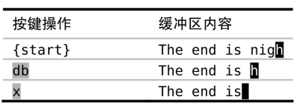
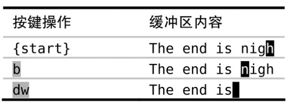
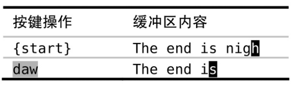
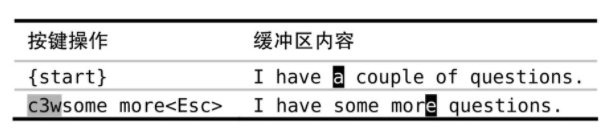
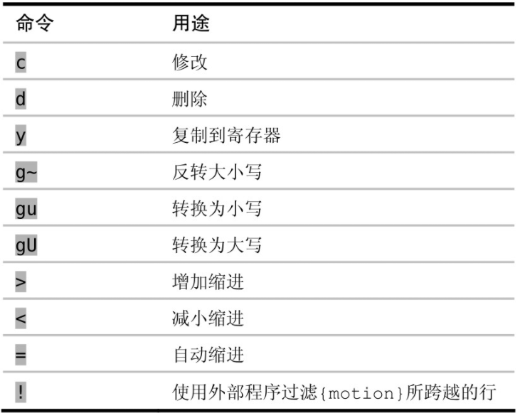
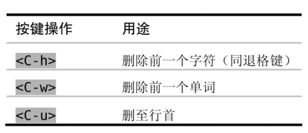
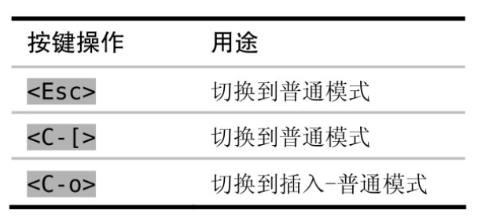

### 普通模式

> Vim 指令是区分大小写的

撤销命令会回退从进入插入模式到退出此模式期间输入（或删除）的全部字符

如果在插入模式中使用了 `<Up> 、<Down> 、<Left>或 <Right>` 这些光标键，将会产生一个新的撤销块

 

> VimGolf 一种评价 vim 按键次数的指标（譬如你完成一个删除操作时，输入了 3 次指令，那么该值等于 3）

下面三幅图提供了删除一个单词的三种方式：从后往前、从前往后、直接删除整个单词

 

**可以重复就不要使用多余次数**

比如想要删除光标后面两个单词可以有如下三种写法  
`2dw` 删除一个单词，执行两次  
`d2w` 一次删除两个单词  
`dw.` 删除一个单词，然后再执行删除一个单词操作（运行结果为删除两个单词）

修改光标后数三个单词为指定内容  

 

`操作符 + 动作命令 = 操作`

比如，daw，即为 `删除操作d + 一个单词aw = 删除一个单词daw`

当一个操作符命令被连续调用两次时，它会作用于当前行，比如 `删除当前行dd`

> 快速全文档自动缩进：gg=G（gg 调到文档开头，=G 自动缩进光标处到文档结尾处所有内容）

 

vim 还有一个相当短命的模式：`操作符待决模式`  
只有操作符才会激活操作符待决模式

当我们键入 d 后欲键入 w 的一段短瞬间就处于该模式，系统等待用户输入对应的动作以执行完整的指令

 

### 插入模式

在插入模式下，依然可以使用快捷键进行有限的单词删除操作

下图中的 `<C-h>` 表示 `ctrl+h` 键

 

插入模式切换到普通模式有三种快捷键，不一定非得用 esc

其中下图第三种方式可以暂时切换到普通模式，当我们执行一次命令后就切换回插入模式

 

运算寄存器

插入模式下键入如下指令，运算寄存器将计算 6*100 的值然后返回给你（CR 表示回车）  
`<C-r>=6*100<CR>`

 

字符编码插入非常用字符 `<C-v>{code}`

如果字符编码超过 3 位，那么可以使用该格式 ` <C-v>u{code}`

 

### 可视模式

学习可视模式的第一件事当然就是激活可视模式啦
