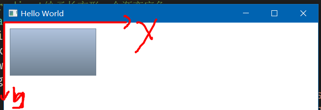
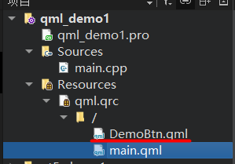
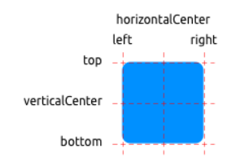
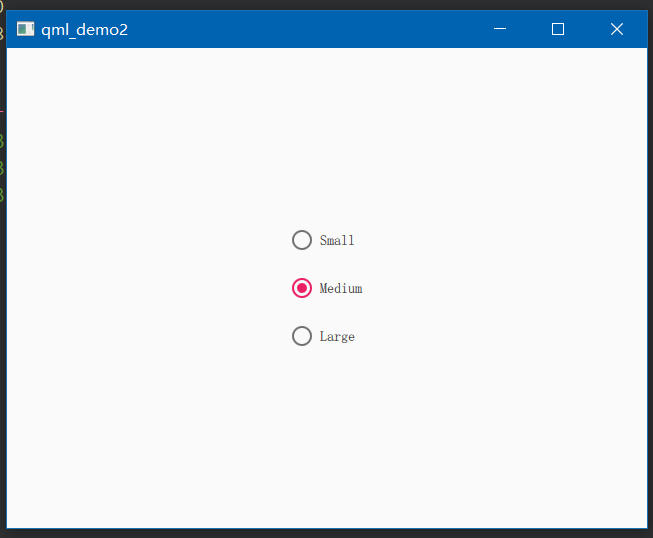
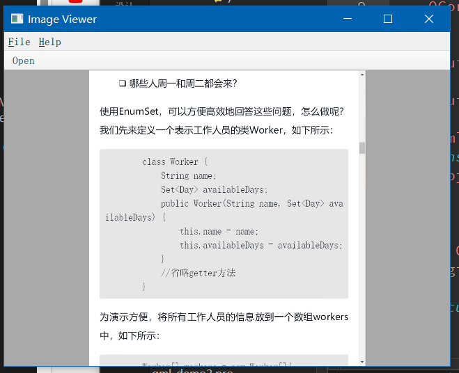
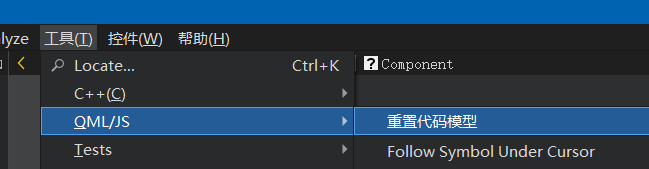

### 前言

基于如下环境

- Qt Quick 2.12
- Qt 5.12

参考文献

- [qmlbook](https://qmlbook.github.io/)

<br>

### Quick 预备知识

<br>

#### 二维坐标系

新建一个 quick 工程文件

`main.qml` 代码清单

```c
import QtQuick 2.12
import QtQuick.Window 2.12

// 主window
Window {
    width: 640
    height: 480
    visible: true
    title: qsTr("Hello World")

    // 构建一个长方形
    // 左上角绘制点为[0,0]
    // 绘制长宽为176 96
    // Gradient给予长方形一个渐变底色
    Rectangle {
        id: rect1
        x: 12; y: 12
        width: 176; height: 96
        gradient: Gradient {
            GradientStop { position: 0.0; color: "lightsteelblue" }
            GradientStop { position: 1.0; color: "slategray" }
        }
        border.color: "slategray"
    }
}

```

quick 中的坐标系如下图所示

- y 轴向下为正
- x 轴向右为正

所有的组件绘制起点都是左上角点，所以代码中我们设置 Rectangle 的坐标为 `[12,12]` 即为绘制起点坐标



<br>

#### text

很简单，学过类似的声明式页面开发都知道这些英文代表什么，就不多废话了

仅就不易辨别或者 QT 自带特有的属性进行分析讲解

```c
Text {
    width: 40; height: 120
    text: 'A very long text'

    // elide 表示文本省略的位置，省略位置会以三个英文原点代替
    // 这里表示中间省略，故文本最终展示为："A...t"
    elide: Text.ElideMiddle

    style: Text.Sunken
    styleColor: '#FF4444'

    verticalAlignment: Text.AlignTop
}
```

<br>

#### image

```c
Image {
    x: 12+64+12; y: 12
    // width: 72
    height: 72/2
    source: "assets/triangle_red.png"
    fillMode: Image.PreserveAspectCrop
    clip: true
}
```

<br>

#### mousearea

鼠标可点击位置

下方代码实现：点击左侧方形，改变右侧方形的显示与隐藏

```c
Rectangle {
    id: rect1
    x: 12; y: 12
    width: 76; height: 96
    color: "lightsteelblue"

    // 设置一个点击区域
    // onClicked 点击后触发的方法
    MouseArea {
        id: area
        width: parent.width
        height: parent.height
        onClicked: rect2.visible = !rect2.visible
    }
}

Rectangle{
    id: rect2
    x: rect1.width+24; y:12
    width: 76; height: 96
    color: "deepskyblue"
}
```

<br>

#### 组件

在 main.qml 同级目录下新建一个自定义组件文件 `DemoBtn.qml`  
下方展示最终文件结构



<br>

> 以下简单案例实现：自定义一个按钮 DemoBtn，并给予其两个插槽，可更改按钮显示文本以及按钮点击事件；在主界面 main.qml 调用自定义按钮，实现组件复用

下方为 DemoBtn.qml 代码清单

```c
import QtQuick 2.12

// 定义根元素
// 需要在根元素内定义接收的参数，让根元素下所有子元素调度
Rectangle {
    id: root

    // 既然这是一个自定义组件，就必须给予可传递的参数位置来改变组件内容
    // 导出属性使用 property alias
    property alias text: label.text
    // 导出信号或者其他触发方法使用 signal
    signal clicked

    width: 116; height: 26
    color: "lightsteelblue"
    border.color: "slategrey"

    Text {
        id: label
        anchors.centerIn: parent
        text: "Start"
    }
    MouseArea {
        anchors.fill: parent
        onClicked: {
            // 点击事件直接采用根元素接收来的参数clicked
            root.clicked()
        }
    }
}
```

回到咱们的 main.qml

由于处于同级目录，不需要 import 导入，直接使用自定义组件即可！

`自定义组件名==文件名`

```c
// 由于我们编写的自定义组件文件名为DemoBtn.qml，所以使用该组件时依旧使用此名称
DemoBtn {
    id: button
    x: 12; y: 12

    // 传递text参数
    text: "innerText"
    // 传递点击事件参数
    onClicked: {
        status.text="Button click!!!"
    }
}

// 被控制的text组件
Text {
    id: status
    x: 12; y: 76
    width: 116; height: 26
    text: "waiting ..."
    horizontalAlignment: Text.AlignHCenter
}
```

<br>

组件复用还可以使用另外一种方法 `Item`

在开发大型项目时，几乎都采用此方法

修改自定义组件 `DemoBtn.qml` 代码为

```c
import QtQuick 2.12

Item {
    id: root
    width: 116; height: 26

    property alias text: label.text
    signal clicked

    Rectangle {
        anchors.fill: parent
        color: "lightsteelblue"
        border.color: "slategrey"

        Text {
            id: label
            anchors.centerIn: parent
            text: "Start"
        }
        MouseArea {
            anchors.fill: parent
            onClicked: {
                root.clicked()
            }
        }
    }
}
```

<br>

#### 定位元件

`Column` 列定位
在其中添加的组件都会按照列的方向竖直排列

```c
Column{
    id: row
    x: 12; y:12

    // 每个组件之间垂直方向间隔
    spacing: 8

    // 所有组件（这里使用了我自己写的可复用组件，实际上就是一个带背景颜色的正方形）
    SimpleRect{}
    SimpleRect{color: "deepskyblue"}
    SimpleRect{color: "lightgreen"}
}
```

<br>

`Row` 行定位  
水平方向，不做过多解释

```c
Row{
    id: row
    x: 12; y:12
    spacing: 8
    SimpleRect{}
    SimpleRect{color: "deepskyblue"}
    SimpleRect{color: "lightgreen"}
}
```

<br>

Grid 栅格排列

```c
Grid{
    id: row
    x: 12; y:12
    rows: 2
    columns: 2
    spacing: 8
    anchors.centerIn: parent
    SimpleRect{}
    SimpleRect{color: "deepskyblue"}
    SimpleRect{color: "lightgreen"}
    SimpleRect{color: "orange"}
}
```

Grid 搭配 Repeater 可以实现循环渲染元素的效果

```c
Grid{
    id: row
    x: 12; y:12
    rows: 4
    columns: 4
    spacing: 8
    anchors.centerIn: parent

    // 将会渲染16个，4x4排列的，由正方形组成的矩阵
    Repeater{
        model: 16
        SimpleRect{}
    }
}
```

<br>

#### 布局项

子组件通过对其父组件的各个锚点，实现精确定位  
（这类似于 android 的约束布局，欠约束的子组件将会可以被改变位置）

使用 `anchors` 锚点作为定位手段



<br>

水平居中与垂直居中，并附带水平和垂直方向上的偏移

```c
Rectangle{
    id: rect1
    anchors.fill: parent

    Rectangle{
        id: rect2
        width: 100; height: 100
        color: "deepskyblue"
        anchors.horizontalCenter: parent.horizontalCenter
        anchors.verticalCenter: parent.verticalCenter
        anchors.verticalCenterOffset: 10
        anchors.horizontalCenterOffset: -10
    }
}
```

指定方向锚点约束，并附加 margin

```c
Rectangle{
    id: rect1
    anchors.fill: parent

    Rectangle{
        id: rect2
        width: 100; height: 100
        color: "deepskyblue"
        anchors.top: parent.top
        anchors.topMargin: 10
        anchors.left: parent.left
        anchors.leftMargin: 50
    }
}
```

<br>

#### 输入元素

输入元素即文本输入框 `TextInput`

首先看一下焦点定位与键盘切换焦点示例

```c
import QtQuick 2.5

Rectangle {
    width: 200
    height: 80
    color: "linen"

    TextInput {
        id: input1
        x: 8; y: 8
        width: 96; height: 20

        // 是否获取焦点
        focus: true
        text: "Text Input 1"

        // 点击键盘上的tab键后，焦点移动到哪一个组件上去
        KeyNavigation.tab: input2
    }

    TextInput {
        id: input2
        x: 8; y: 36
        width: 96; height: 20
        text: "Text Input 2"
        KeyNavigation.tab: input1
    }
}
```

<br>

使用 keys 进行按键检测，是不是想到实现一个角色控制游戏了？

```c
import QtQuick 2.5

DarkSquare {
    width: 400; height: 200

    GreenSquare {
        id: square
        x: 8; y: 8
    }
    focus: true
    Keys.onLeftPressed: square.x -= 8
    Keys.onRightPressed: square.x += 8
    Keys.onUpPressed: square.y -= 8
    Keys.onDownPressed: square.y += 8
    Keys.onPressed: {
        switch(event.key) {
            case Qt.Key_Plus:
                square.scale += 0.2
                break;
            case Qt.Key_Minus:
                square.scale -= 0.2
                break;
        }

    }
}
```

<br>

####

### 流元素

<br>

#### 动画

在使用任何动画之前，必须要在 `main.qml` 内导入以下头文件  
或者在任何需要调用动画的 qml 文件添加该头，否则会一直报错！

- 若使用 QT5 的 QML，使用：`import QtQuick.Controls 1.4`
- 若使用 QT6 的 QML，使用：`import QtQuick.Controls 2.0`

添加完毕后，必须要重新构建整个项目！

<br>

> `rect` 点击后在固定时间内持续自旋后停止案例

代码清单：`AnimationComp.qml`

```c
import QtQuick 2.0

Item {
    id: root
    width: 100; height: 100

    // 控制是否播放动画的属性
    property bool isRunning: false

    Rectangle{
        id: rect
        anchors.fill: parent
        anchors.margins: 20
        color: "deepskyblue"

        // RotationAnimation控制旋转类型的动画
        RotationAnimation on rotation{
            to: 360 // 从当前位置到360
            duration: 300 // 持续时间300ms
            running: root.isRunning // 当前动画状态
        }
    }

    // 设立一个按钮点击区域以便启动动画
    MouseArea{
        id: mouse
        anchors.fill: parent
        onClicked: root.isRunning = true
    }
}
```

在 main.qml 里面是这样的：

```c
import QtQuick 2.12
import QtQuick.Window 2.12

// 一定一定一定要记住导入这个头文件！！！
import QtQuick.Controls 1.4


Window {
    width: 640
    height: 480
    visible: true
    title: qsTr("Hello World")

    // 调用自己编写的带动画的rect组件
    AnimationComp{}
}
```

<br>

Rectangle 竖直方向移动动画  
我们可以使用两种方式实现

方法一：`Behavior` 监听位置变换

```c
Rectangle{
    id:rect
    width: 200; height: 200
    color: "deepskyblue"

    // 使用Behavior监听组件y轴位置
    // 一旦y值变化，则启动动画过渡效果
    Behavior on y{
        // NumberAnimation数值动画过渡效果
        NumberAnimation{
            duration: 1000
            easing.type: Easing.InOutQuad
        }
    }

    MouseArea{
        id:mouse
        anchors.fill: parent

        // 点击后修改y轴位置，触发对应Behavior
        onClicked: rect.y = 200
    }
}
```

方法二：`NumberAnimation` 触发

```c
Rectangle{
    id:rect
    width: 200; height: 200
    color: "deepskyblue"

    // NumberAnimation数值类型动画过渡
    NumberAnimation {
        id:anim         // 设置动画id
        target: rect    // 那个组件执行动画
        property: "y"   // 欲监听变动的属性
        to: 200         // 属性变化到哪个数值
        duration: 1000  // 动画持续时间
        easing.type: Easing.InOutQuad   // 过渡曲线
    }

    MouseArea{
        id:mouse
        anchors.fill: parent

        // 使用start显式触发对应id的动画！
        onClicked: anim.start()
    }
}
```

<br>

#### 分组动画

`ParallelAnimation` 非顺序分组动画  
由该组件包裹的所有动画全部都同时进行，不按顺序

```c
Rectangle{
    id:rect
    width: 100; height: 100
    color: "deepskyblue"

    MouseArea{
        id:mouse
        anchors.fill: parent
        onClicked: para.start() // 开启分组动画
    }

    ParallelAnimation{
        id:para
        NumberAnimation{
            target: rect
            properties: "y"
            to: 100
            duration: 1000
            easing.type: Easing.Bezier
        }
        NumberAnimation{
            target: rect
            properties: "x"
            to: 200
            duration: 1000
            easing.type: Easing.Bezier
        }
    }
}
```

`SequentialAnimation` 按顺序分组动画  
所有添加进去的动画都按照顺序依次执行

代码不做演示，直接把上方代码中的 ParallelAnimation 改为 SequentialAnimation 即可

<br>

#### 状态与转换

使用 states 进行状态管理，实现不同状态的切换

```c
import QtQuick 2.0

Item {
    id:root
    width: 100; height: 100

    // 起始状态
    state: "open"

    // 所有可能的状态
    states: [
        // open状态，颜色为灰色
        State {
            name: "open"
            PropertyChanges {
                target: rect
                color:"lightgray"
            }
        },
        // close状态，颜色为橙色
        State {
            name: "close"
            PropertyChanges {
                target: rect
                color:"orange"
            }
        }
    ]

    Rectangle{
        id:rect
        anchors.fill: parent
        color: "orange"

        MouseArea{
            id:mouse
            anchors.fill: parent
            // 鼠标点击切换状态
            onClicked: root.state = (root.state=="open" ? "close" : "open")
        }
    }
}
```

<br>

直接切换 state 显得是否僵硬，我们需要通过 transitions 添加一些过渡效果

直接把以下代码插入到上方代码中去

```c
// 设置过渡效果
transitions: [
    Transition {
        // 表示过渡效果针对所有state切换过程
        // 当然你也可以选择针对单次状态切换过程执行动画，比如from:"open"; to:"close"
        from: "*"; to:"*"
        // 一个标准的颜色切换过渡
        ColorAnimation {
            properties: "color"
            duration: 2000
            easing.type: Easing.Bezier
        }
    }
]
```

此时完整的代码应该是这样的

代码清单 `TransitionComp.qml`

```c
import QtQuick 2.0

Item {
    id:root
    width: 100; height: 100

    state: "open"
    states: [
        State {
            name: "open"
            PropertyChanges {
                target: rect
                color:"lightgray"
            }
        },
        State {
            name: "close"
            PropertyChanges {
                target: rect
                color:"orange"
            }
        }
    ]

    transitions: [
        Transition {
            from: "*"; to:"*"
            ColorAnimation {
                properties: "color"
                duration: 2000
                easing.type: Easing.Bezier
            }
        }
    ]

    Rectangle{
        id:rect
        anchors.fill: parent
        color: "orange"

        MouseArea{
            id:mouse
            anchors.fill: parent
            onClicked: root.state = (root.state=="open" ? "close" : "open")
        }
    }
}
```

<br>

### QuickControl

<br>

#### 简介

quickcontrol 用于快速构建风格化的用户界面

它包括了以下几个预制的组件风格

- Default QT 默认风格
- Universal windows 桌面风格
- Material 谷歌推出的 MaterialDesign 风格
- Fusion
- Imagine

<br>

#### 风格设置

> 官方文档对于风格设置提供了两种方式，此处就采用其中的一种，即使用 QQuickStyle

首先在 pro 文件内，添加对应库  
`QT += quick quickcontrols2`

之后来到 `main.cpp` 设置我们的整体风格  
注意，风格必须在 qml 初始化前设置，且一旦设置则全局使用此风格，不可变换！

```cpp
#include <QGuiApplication>
#include <QQmlApplicationEngine>

// 第一步，导入头文件
#include <QQuickStyle>


int main(int argc, char *argv[])
{
#if QT_VERSION < QT_VERSION_CHECK(6, 0, 0)
    QCoreApplication::setAttribute(Qt::AA_EnableHighDpiScaling);
#endif

    QGuiApplication app(argc, argv);

    // 第二步，应用风格
    // 这里使用了google的material风格
    QQuickStyle::setStyle("Material");

    ...

    return app.exec();
}
```

最后回到我们的 qml 主文件，写一段简单的代码测试一下风格

main.qml 代码清单

```c
import QtQuick 2.12
import QtQuick.Controls 2.12

// 默认此处根组件应该是Window，我这里用了ApplicationWindow，效果是一致的
ApplicationWindow {
    visible: true
    width: 640
    height: 480

    // 创建一个列表，包含三个单选按钮
    Column {
        anchors.centerIn: parent
        RadioButton { text: qsTr("Small") }
        RadioButton { text: qsTr("Medium");  checked: true }
        RadioButton { text: qsTr("Large") }
    }
}
```

如下图展示效果，风格成功应用上去了！



<br>

#### control 配置文件

对于普通项目，为便于开发，我们可以额外新建一个配置文件用于管理当前应用的整体风格

在与 `main.qml` 同级的目录下新建配置文件 `qtquickcontrols2.conf` (必须是这个名字！)

填入下方配置

```conf
; This file can be edited to change the style of the application
; Read "Qt Quick Controls 2 Configuration File" for details:
; http://doc.qt.io/qt-5/qtquickcontrols2-configuration.html

; 配置全局风格为MaterialDesign2
[Controls]
Style=Material
```

<br>

#### 图像浏览器案例

> 推荐风格选择 Fusion

功能很简单，添加菜单栏和工具栏，选择文件并打开；  
主要关注点为 FileDialog 的使用

下面是 `main.qml` 的完整代码

```c
import QtQuick 2.12
import QtQuick.Controls 2.12
import QtQuick.Dialogs 1.2

ApplicationWindow {
    visible: true
    width: 640
    height: 480
    title: qsTr("Image Viewer")

    // 顶部菜单栏
    menuBar: MenuBar {
        // 主菜单项
        Menu {
            title: qsTr("&File")
            // 子菜单项
            MenuItem {
                text: qsTr("&Open...")
                icon.name: "document-open"
                // 点击后触发对应FileDialog
                onTriggered: fileOpenDialog.open()
            }
        }

        Menu {
            title: qsTr("&Help")
            MenuItem {
                text: qsTr("&About...")
                onTriggered: aboutDialog.open()
            }
        }
    }

    // 顶部工具栏
    header: ToolBar {
        // 流式布局
        Flow {
            anchors.fill: parent
            // 工具项
            ToolButton {
                text: qsTr("Open")
                icon.name: "document-open"
                onClicked: fileOpenDialog.open()
            }
        }
    }

    // 设置背景颜色
    background: Rectangle {
        color: "darkGray"
    }

    // 图片显示组件
    Image {
        id: image
        anchors.fill: parent
        fillMode: Image.PreserveAspectFit
        asynchronous: true
    }

    // 打开文件对话框
    FileDialog {
        id: fileOpenDialog
        title: "Select an image file"
        folder: shortcuts.documents
        nameFilters: [
            "Image files (*.png *.jpeg *.jpg)",
        ]
        onAccepted: {
            image.source = fileOpenDialog.fileUrl
        }
    }

    // About对话框
    Dialog {
        id: aboutDialog
        title: qsTr("About")
        Label {
            anchors.fill: parent
            text: qsTr("QML Image Viewer\nA part of the QmlBook\nhttp://qmlbook.org")
            horizontalAlignment: Text.AlignHCenter
        }

        standardButtons: StandardButton.Ok
    }
}
```

运行结果



<br>

#### component 组件报错问题

当我们在需要使用 Component 定义一个组件时，通常会发现编辑器报错 `Unknown component (M300)`

解决方法很简单，点击编辑器菜单栏的 `工具->QML/JS->重置代码模型` 即可解决



<br>

#### StackView

> StackView 可以实现多页面的堆栈管理，类似于 android 中的 view

<br>

> 下方代码实现效果：点击界面实现 push 和 pop 效果，并附带自定义界面切换效果

由于要使用动画过渡属性，故导入头文件时，control 需要使用 1.4 版本的 `import QtQuick.Controls 1.4`

简要介绍下方代码展示的主要内容及其对应含义：

- `initialItem` 设置初始展示页面/组件
- `delegate` 设置当新页面 push 或者被 pop 后的过渡动画
- `Component` 组件，根据 id 被 stackview 使用

代码清单 `main.qml`

```c
import QtQuick 2.12

// 请使用1.4版本
import QtQuick.Controls 1.4

ApplicationWindow {
    visible: true
    width: 640
    height: 480
    title: qsTr("Image Viewer")

    StackView {
        id:sv
        anchors.fill: parent
        initialItem: mainView   // 设置初始页面

        // 设置页面push或pop后过渡动画
        // 动画设置中有两个可用变量：exitItem正在退出的元素；enterItem正在加入的元素；
        delegate: StackViewDelegate {
            // 当动画结束后，执行的对应方法
            function transitionFinished(properties)
            {
                properties.exitItem.x = 0
                properties.exitItem.rotation = 0
            }

            // push插入动画
            // 动画内容是：让当前组件从界面左侧移动走，然后自身再旋转360度
            pushTransition: StackViewTransition {
                // 顺序动画
                SequentialAnimation {
                    ScriptAction {
                        script: enterItem.rotation = 90
                    }
                    PropertyAnimation {
                        target: enterItem
                        property: "x"
                        from: enterItem.width
                        to: 0
                    }
                    PropertyAnimation {
                        target: enterItem
                        property: "rotation"
                        from: 90
                        to: 0
                    }
                }
                PropertyAnimation {
                    target: exitItem
                    property: "x"
                    from: 0
                    to: -exitItem.width
                }
            }

            // pop弹出动画
            // 动画内容：组件颜色渐变（非常实用，建议copy）
            popTransition: StackViewTransition {
                PropertyAnimation {
                    target: enterItem
                    property: "opacity"
                    from: 0
                    to: 1
                }
                PropertyAnimation {
                    target: exitItem
                    property: "opacity"
                    from: 1
                    to: 0
                }
            }
        }

        // 在stackview内部定义组件
        Component{
            id: mainView
            MouseArea{
                Rectangle{
                    id:mvRect
                    width: 100; height: 100
                    anchors.centerIn: parent
                    color: "orange"
                }
                onClicked: sv.push(sideView) // 点击后插入新页面
            }
        }

        // 定义的另一个组件
        Component{
            id: sideView
            MouseArea{
                Rectangle{
                    id:svRect
                    width: 100; height: 100
                    anchors.centerIn: parent
                    color: "deepskyblue"
                }
                onClicked: sv.pop() // 点击后弹出当前页面
            }
        }
    }
}
```

<br>

**外部界面文件调用案例**

注意，这里全部需要使用 `import QtQuick.Controls 2.2`

当然了，我们不可能把所有组件或者页面都以 Component 的形式写到 stackview 里面去，我们需要对其进行充分的解构

首先来看看主文件 `main.qml`

```c
import QtQuick 2.12
import QtQuick.Controls 2.2

ApplicationWindow {
    visible: true
    width: 640
    height: 480
    title: qsTr("Image Viewer")

    StackView {
        id:sv
        anchors.fill: parent
        // 加载外部组件HomeView
        initialItem: HomeView{}
    }
}
```

主页面代码清单 `HomeView.qml`

```c
import QtQuick 2.0
import QtQuick.Controls 2.2

// Page表示页面
Page{
    title: qsTr("Home")

    MouseArea{
        anchors.fill: parent
        Label {

            text: qsTr("Home Screen")
        }
        // sv就是我们在主页面定义的stackview组件
        // push内部直接写同级目录下的qml文件，就可以插入了
        onClicked: sv.push("SideView.qml")
    }
}
```

副页面代码清单 `SideView.qml`

```c
import QtQuick 2.0
import QtQuick.Controls 2.2

Page{
    title: qsTr("Home")

    Button{
        id:btn
        width: 120; height: 40
        anchors.centerIn: parent
        text: qsTr("点击返回home")
        onClicked: sv.pop() // 弹出
    }
}
```

> 这里就实现了调用外部 qml 文件来执行 push 和 pop 操作

<br>

#### SwipeView

> 类似前端中的轮播图

同样的，需要注意导入 `import QtQuick.Controls 2.2`

```c
import QtQuick 2.9
import QtQuick.Controls 2.2

ApplicationWindow {

    // ...

    visible: true
    width: 640
    height: 480

    title: qsTr("Side-by-side")

    // 滑动视图
    SwipeView {
        id: swipeView
        anchors.fill: parent

        // 这是三个外部Page组件，用于组成视图
        Current {
        }

        UserStats {
        }

        TotalStats {
        }

        // ...

    }

    // 导航指示点
    PageIndicator {
        anchors.bottom: parent.bottom
        anchors.horizontalCenter: parent.horizontalCenter

        currentIndex: swipeView.currentIndex
        count: swipeView.count
    }

    // ...

}
```

我们随机找一个 swipeview 用到的外部组件，该组件很简单，根部是 Page，点击按钮返回第一个轮播项

代码清单 `TotalStats.qml`

```c
import QtQuick 2.9
import QtQuick.Controls 2.2

// 和stackview一样，这里的外部组件依然需要使用page定义
Page {
    header: Label {
        text: qsTr("Community Stats")
        font.pixelSize: Qt.application.font.pixelSize * 2
        padding: 10
    }

    Column {
        anchors.centerIn: parent
        spacing: 10
        Label {
            anchors.horizontalCenter: parent.horizontalCenter
            text: qsTr("Community statistics")
        }
        Button {
            anchors.horizontalCenter: parent.horizontalCenter
            text: qsTr("Back")
            onClicked: swipeView.setCurrentIndex(0); // 点按钮回到第一个轮播项
        }
    }
}
```

> 由于内容比较简单，其余的两个轮播项就不一一展示代码了，反正也就是对应的使用 Page 组件即可！

<br>

### Model-View-Delegate 模型

> 使用此方法来进行快捷方便的数据存储与渲染

<br>

#### Model & Delegate

`ListModel` 构建列表 Model，用于存储多条数据

同一 `Repeater` 下的任何一个子组件，都可以直接根据 `ListElement` 中定义的属性名获取对应参数值！！！

```c
Column {
    anchors.fill: parent
    spacing: 2

    Repeater {
        model: ListModel {
            ListElement { name: "Mercury"; surfaceColor: "gray" }
            ListElement { name: "Venus"; surfaceColor: "yellow" }
            ListElement { name: "Earth"; surfaceColor: "blue" }
            ListElement { name: "Mars"; surfaceColor: "orange" }
            ListElement { name: "Jupiter"; surfaceColor: "orange" }
            ListElement { name: "Saturn"; surfaceColor: "yellow" }
            ListElement { name: "Uranus"; surfaceColor: "lightBlue" }
            ListElement { name: "Neptune"; surfaceColor: "lightBlue" }
        }

        Rectangle{
            width: 120;height: 50
            color: surfaceColor
            Text {
                id: name
                text: qsTr(name)
            }
        }
    }
}
```

<br>

`ListModel` 里面还可以添加函数，后续通过 onclicked 进行调用

```c
ListModel {
    id: actionModel

    ListElement {
        name: "Copenhagen"
        // 定义一个函数方法
        hello: function(value) { console.log(value + ": You clicked Copenhagen!"); }
    }
    ...
}

ListView {
    ...
}

Component {
    id: actionDelegate

    Rectangle {
        ...

        MouseArea {
            anchors.fill: parent
            onClicked: hello(index); // 点击触发ListModel中属性对应的函数方法
        }
    }
}
```

<br>

使用委托也很方便，借助 model 可以实现渲染指定数量的组件

```c
import QtQuick 2.12
import QtQuick.Window 2.12

Window {
    width: 640
    height: 480
    visible: true
    title: qsTr("Hello World")

    ListView{
        anchors.fill: parent
        anchors.margins: 20
        clip: true
        spacing: 5

        // orientation: ListView.Horizontal 这样可以吧默认竖直状态改为水平状态

        model: 10 // 渲染100个子组件
        delegate: card // 欲被渲染的子组件
    }

    // 在这里定义欲被渲染的子组件
    Component{
        id: card
        Rectangle{
            width: parent.width ;height: 100
            color: "deepskyblue"
        }
    }
}
```

<br>

#### 焦点切换动画

自定义高亮动画，实现点击 `小键盘上的上下箭头` 切换列表项焦点时的过渡效果

highlight 属性可以定义高亮组件，高亮组件位于列表项组件的底层，我们可以通过设置高亮组件的动画来呈现切换的效果

```c
import QtQuick 2.12
import QtQuick.Window 2.12

Window {
    width: 640
    height: 480
    visible: true
    title: qsTr("Hello World")

    ListView {
        id: view
        anchors.fill: parent
        anchors.margins: 20
        spacing: 4
        clip: true

        currentIndex: 0 // 初始焦点为第一个列表项

        model: 100
        delegate: numberDelegate

        // 设置高亮组件
        highlight: highlightComponent
        // 关闭ListView自带的高亮切换动画，以便我们使用自定义的动画过渡效果
        highlightFollowsCurrentItem: false
        // 默认初始为焦点聚集状态
        focus: true
    }

    // 高亮组件，位于列表组件的底层
    Component {
        id: highlightComponent

        Item {
            width: ListView.view.width
            height: ListView.view.currentItem.height

            y: ListView.view.currentItem.y

            // 由于我们的列表是垂直状态，故检测y轴动作
            // 先把上一个失焦高亮组件透明度变成0，然后把当前高亮组件变成1
            Behavior on y {
                SequentialAnimation {
                    PropertyAnimation { target: highlightRectangle; property: "opacity"; to: 0; duration: 200 }
                    NumberAnimation { duration: 1 }
                    PropertyAnimation { target: highlightRectangle; property: "opacity"; to: 1; duration: 200 }
                }
            }

            // 高亮组件底色使用一个长方形
            Rectangle{
                id:highlightRectangle
                color: "deepskyblue"
                anchors.fill: parent
            }
        }
    }

    // 列表组件，位于最上层
    Component {
        id: numberDelegate

        Item {
            width: 40
            height: 40

            Text {
                anchors.centerIn: parent
                font.pixelSize: 14
                text: index
            }
        }
    }
}
```

<br>

#### 网格视图

```c
GridView {
    id: view
    anchors.fill: parent
    anchors.margins: 20

    clip: true

    model: 100

    cellWidth: 45
    cellHeight: 45

    delegate: numberDelegate
}

Component {
    id: numberDelegate

    GreenBox {
        width: 40
        height: 40
        text: index
    }
}
```

<br>

#### 高级委托

增删项目的动画处理

代码实现内容：提供一个数据源 ListModel，网格视图选择该 model 进行渲染，提供增删列表项按钮，并添加增删的动画

对应原理已经写到下面的代码里面去了，直接解释不太方便~

```c
import QtQuick 2.12
import QtQuick.Window 2.12

Window {
    width: 640
    height: 480
    visible: true
    title: qsTr("Hello World")

    // 定义初始列表
    // 渲染的列表项都从这里来
    ListModel {
        id: theModel
        ListElement { number: 0 }
        ListElement { number: 1 }
        ListElement { number: 2 }
        ListElement { number: 3 }
        ListElement { number: 4 }
        ListElement { number: 5 }
        ListElement { number: 6 }
        ListElement { number: 7 }
        ListElement { number: 8 }
        ListElement { number: 9 }
    }

    // 增加列表项的按钮
    Rectangle {
        anchors.left: parent.left
        anchors.right: parent.right
        anchors.bottom: parent.bottom
        anchors.margins: 20

        height: 40

        color: "#53d769"
        border.color: Qt.lighter(color, 1.1)

        Text {
            anchors.centerIn: parent
            text: "Add item!"
        }

        MouseArea {
            anchors.fill: parent
            onClicked: {
                // 点击按钮后给列表theModel添加新项
                theModel.append({"number": ++parent.count});
            }
        }

        property int count: 9
    }

    // 网格视图
    GridView {
        anchors.fill: parent
        anchors.margins: 20
        anchors.bottomMargin: 80

        clip: true

        model: theModel // 渲染的model

        cellWidth: 45
        cellHeight: 45

        delegate: numberDelegate // 委托
    }

    Component {
        id: numberDelegate

        Rectangle {
            id: wrapper

            width: 40
            height: 40

            gradient: Gradient {
                GradientStop { position: 0.0; color: "#f8306a" }
                GradientStop { position: 1.0; color: "#fb5b40" }
            }

            Text {
                anchors.centerIn: parent
                font.pixelSize: 10
                text: number
            }

            MouseArea {
                anchors.fill: parent
                onClicked: {
                    // 点击列表项后移除自身
                    theModel.remove(index);
                }
            }

            // 移除列表项动画
            GridView.onRemove: SequentialAnimation {
                PropertyAction { target: wrapper; property: "GridView.delayRemove"; value: true }
                NumberAnimation { target: wrapper; property: "scale"; to: 0; duration: 250; easing.type: Easing.InOutQuad }
                PropertyAction { target: wrapper; property: "GridView.delayRemove"; value: false }
            }

            // 新增列表项动画
            GridView.onAdd: SequentialAnimation {
                NumberAnimation { target: wrapper; property: "scale"; from: 0; to: 1; duration: 250; easing.type: Easing.InOutQuad }
            }
        }
    }
}
```

<br>

#### ObjectModel

`ObjectModel` 可管理多个组件，可直接使用 `listview` 进行渲染

```c
ObjectModel {
    id: itemModel

    Rectangle { height: 60; width: 80; color: "#157efb" }
    Rectangle { height: 20; width: 300; color: "#53d769"
        Text { anchors.centerIn: parent; color: "black"; text: "Hello QML" }
    }
    Rectangle { height: 40; width: 40; radius: 10; color: "#fc1a1c" }
}

ListView {
    anchors.fill: parent
    anchors.margins: 10
    spacing: 5

    model: itemModel
}
```

<br>

### 音视频操作

> 特别注意！再进行音视频开发前，最好先安装一个万能解码器，对于部分电脑（比如我的），未安装解码器时，即便代码无误且可完美运行，但是依旧无法播放音视频

安装 `LAV Filters` 解码器  
[下载地址](http://www.downza.cn/soft/253007.html)

解码器安装位置任选，安装时关联所有的音视频格式（也就是安装默认安装即可）

不需要做特殊处理，之后在 QT 中调用视频时就会自动执行解码了

<br>

#### MediaPlayer

> 2023/06/17 更新：目前仍未解决 QML 无法识别相对路径问题，所以下方仍然只能提供绝对路径的写法，大家将就着用。。。

创建新的项目，随便准备一个 mp4 文件，丢到项目根目录下，这里视频文件为 `demo.mp4`

直接在 main.qml 写入以下代码

```c
import QtQuick 2.12
import QtQuick.Window 2.12
import QtMultimedia 5.0

Window {
    width: 640
    height: 480
    visible: true
    title: qsTr("Hello World")

    // 媒体播放器对象
    MediaPlayer{
        id:player
        // 绝对路径，格式： file:/[绝对路径名]
        // 路径全部使用正斜杠
        source:"file:/E:/qml_camera/demo.mp4"
        // 自动播放视频
        autoPlay: true
    }

    // 视频输出对象
    // 这个组件才是真正输出给我们看的
    VideoOutput{
        anchors.fill: parent
        source: player // 设置视频源为对应的mediaplayer
    }
}
```

> 点击运行，即可看到视频已经自动播放出来啦

<br>

####
