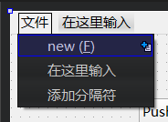
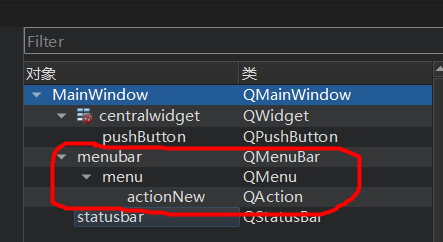
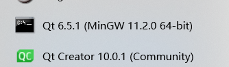
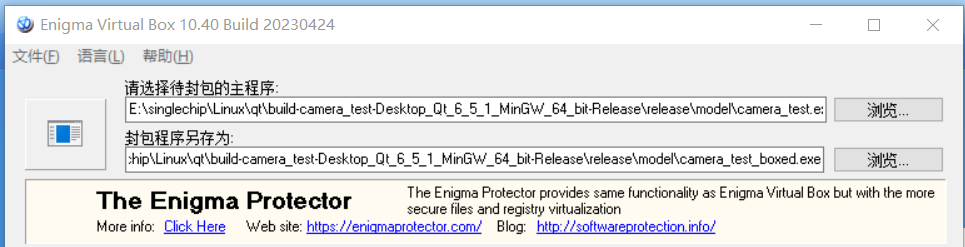
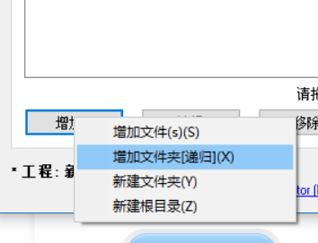

### 标准文件结构

<br>

#### widget.h

widget 对象的头文件

一般会直接在头文件导入所有后续在 cpp 文件内用到的类，所以 `include` 基本都会写在这里

```cpp
// 头文件标志起始
#ifndef WIDGET_H
#define WIDGET_H

// 头文件导入
#include <QWidget>

// 这一块不要动，你也动不了现在
QT_BEGIN_NAMESPACE
namespace Ui { class Widget; }
QT_END_NAMESPACE

class Widget : public QWidget
{
    Q_OBJECT

// 初始化定义区域，定义非信号和槽方法
public:
    Widget(QWidget *parent = nullptr);
    ~Widget();

// 定义信号的区域
signals:

// 定义槽的区域
private slots:
    void on_pushButton_clicked();

// 定义全局私有变量
private:
    Ui::Widget *ui;
};
#endif // WIDGET_H
```

<br>

#### widget.cpp

```cpp
// 头文件导入区
#include "Widget.h"
#include "ui_Widget.h"

// 主构造函数，可以自定义构造函数的参数以及继承规则
Widget::Widget(QWidget *parent)
    : QWidget(parent)
    , ui(new Ui::Widget)
{
    ui->setupUi(this);

    // 定义Widget被实例化后立刻执行的代码
    // 比如TCP链接或者调试输出啥的
}

// 析构函数，用于Widget被销毁前需执行的代码
Widget::~Widget()
{
    delete ui;
}

// 在这里定义信号以及槽的具体实现方法
// ...
```

<br>

#### main.cpp

主入口文件

```cpp
#include "Widget.h"

#include <QApplication>

// 主入口，代码从这里执行
int main(int argc, char *argv[])
{
    QApplication a(argc, argv);

    // 实例化widget后使用show显示他
    Widget w;
    w.show();

    // 程序结束，使用exec
    return a.exec();
}
```

<br>

#### pro 文件

该文件比较复杂，具体使用方式请查看帮助文档，这里没办法告诉你具体的使用方式

最常用的就是当你使用 TCP 链接或者任意网络请求时，必须要在第一行的末尾添加一个 network，就在下方代码第一行末尾注释区那边

```py
QT       += core gui #network

greaterThan(QT_MAJOR_VERSION, 4): QT += widgets

CONFIG += c++11

# You can make your code fail to compile if it uses deprecated APIs.
# In order to do so, uncomment the following line.
#DEFINES += QT_DISABLE_DEPRECATED_BEFORE=0x060000    # disables all the APIs deprecated before Qt 6.0.0

SOURCES += \
    main.cpp \
    Widget.cpp

HEADERS += \
    Widget.h

FORMS += \
    Widget.ui

# Default rules for deployment.
qnx: target.path = /tmp/$${TARGET}/bin
else: unix:!android: target.path = /opt/$${TARGET}/bin
!isEmpty(target.path): INSTALLS += target
```

<br>

### 信号与槽

<br>

#### 自定义信号

> 实现功能：点击按钮发射一个信号，widget 获取信号后执行对应槽函数输出一段信息（此过程含有信息的传递）

新建一个 `Widget` 文件，UI 设计图添加一个 pushbutton，重命名为 firstBtn，并且为其添加一个空的 clicked() 槽

此时的 `Widget.h` 文件应该是这样的

```cpp
#ifndef WIDGET_H
#define WIDGET_H

#include <QWidget>
#include <QDebug>

QT_BEGIN_NAMESPACE
namespace Ui { class Widget; }
QT_END_NAMESPACE

class Widget : public QWidget
{
    Q_OBJECT

public:
    Widget(QWidget *parent = nullptr);
    ~Widget();

// 自定义一个新的信号，其接收一个字符串参数
signals:
    void firstSignal(QString msg);

// firstEmit为自定义槽函数，用于响应自定义信号firstSignal
// on_firstBtn_clicked为按钮点击相应槽函数
private slots:
    void firstEmit(QString msg);
    void on_firstBtn_clicked();

private:
    Ui::Widget *ui;
};
#endif // WIDGET_H
```

代码清单 `Widget.cpp`

注意，如果信号定义 N 个形参，那么对应接收的槽也必须有等于或少于 N 个的形参（绝对不能大于 N）！因为发射的信号的所有参数值都会一一传递给槽函数，所有参数都是对应关系！

```cpp
#include "Widget.h"
#include "ui_Widget.h"

Widget::Widget(QWidget *parent)
    : QWidget(parent)
    , ui(new Ui::Widget)
{
    ui->setupUi(this);

    // 第一步，connect链接信号和槽
    // 参数一：信号发出者，这里选择当前widget
    // 参数二：欲发出的信号
    // 参数三：信号接收者，这里也是当前widget
    // 参数四：欲处理对应信号的槽函数
    connect(this,&Widget::firstSignal,this,&Widget::firstEmit);
}

Widget::~Widget()
{
    delete ui;
}

// 第二步：定义处理信号的槽函数
// 函数有一个形参，用于接收信号传递过来的参数
void Widget::firstEmit(QString msg)
{
    // 调试输出信号发射过来的参数msg
    qDebug() << msg;
}

// 第三步：定义发射信号的按钮响应槽函数
void Widget::on_firstBtn_clicked()
{
    // 使用emit发射对应名称的信号，注意我们这里传入了一个字符串作为参数
    emit firstSignal("shit");
}
```

此时保存文件，编译运行，可见点击按钮后就会在 console 里面看见我们输出的调试信息了！

<br>

#### connect 的两种方式

> 特别注意，只要选择了一种方式，那么信号和槽都必须使用同种方式添加，不能说我信号使用 SIGNAL 然后槽使用引用，这是不对的！

链接信号和槽时可以使用引用的方式，或者实例化对象的方式：

- 实例化时，信号和槽末尾要添加小括号
- 引用时，不能保留小括号

```cpp
#include "MainWindow.h"
#include "ui_MainWindow.h"

MainWindow::MainWindow(QWidget *parent)
    : QMainWindow(parent)
    , ui(new Ui::MainWindow)
{
    ui->setupUi(this);

    // 方法一：使用SIGNAL以及SLOT传入信号和槽
    connect(this,SIGNAL(customSignal()),this,SLOT(on_pushButton_clicked()));

    // 方法二：直接使用引用传入信号和槽
    connect(this,&MainWindow::customSignal,this,&MainWindow::on_pushButton_clicked);

    emit customSignal();
}

MainWindow::~MainWindow()
{
    delete ui;
}

void MainWindow::on_pushButton_clicked()
{
    qDebug() << "this is a sentence";
}
```

<br>

### 对话框

目前的对话框主要有以下几大类

- 文件对话框( QFile Dialog)
- 消息对话框( QMessageBox)
- 输入对话框( QInputDialog)
- 颜色对话框( QColorDialog)
- 字体对话框( QFontDialog)

<br>

这是七大对话框及其基本用法的实例参考，所有代码都写在槽函数里面了

```cpp
#include "Widget.h"
#include "ui_Widget.h"

Widget::Widget(QWidget *parent)
    : QWidget(parent)
    , ui(new Ui::Widget)
{
    ui->setupUi(this);

    te = ui->textEdit;
}

Widget::~Widget()
{
    delete ui;
}


// 打开文件对话框
void Widget::on_fileBtn_clicked()
{
    // 打开多个文件并获取文件完整路径
    // 如果你想打开单个文件，请使用getOpenFileName方法
    QStringList filenames = QFileDialog::getOpenFileNames(
                this,
                "打开图片", ".", "Images (*.png *.jpg)");
            for(int i=0; i<filenames.length(); i++)
                te->append(filenames[i]);
}


// 颜色选择对话框
void Widget::on_colorBtn_clicked()
{
    QColor color = QColorDialog::getColor();
            te->setTextColor(color);
}


// 字体选择对话框
void Widget::on_fontBtn_clicked()
{
    bool ok;
            QFont font = QFontDialog::getFont(&ok);

            if(ok)  //用户选择了字体
                te->setCurrentFont(font);
}


void Widget::on_inputBtn_clicked()
{
    QString str = QInputDialog::getText(this, "xxxx", "yyyy");
            te->setText(str);
}


void Widget::on_errorBtn_clicked()
{
    QErrorMessage *x;
            x->showMessage("error message show");
}


void Widget::on_messageBtn_clicked()
{
    QMessageBox::warning(this, "xxxx", "yyyyyyy", QMessageBox::Open, QMessageBox::Apply);
}


void Widget::on_processBtn_clicked()
{
    QProgressDialog x;
            x.setValue(88);
            x.exec();
}
```

<br>

### MainWindow

<br>

#### 菜单

使用代码的方式添加（不推荐，不方便管理）

```cpp
#include "MainWindow.h"
#include "ui_MainWindow.h"

MainWindow::MainWindow(QWidget *parent)
    : QMainWindow(parent)
    , ui(new Ui::MainWindow)
{
    ui->setupUi(this);

    // 创建菜单项，名称为“打开文件”
    QAction *a1 = new QAction("打开文件");
    a1->setIcon(QIcon("xxx.png")); // 设置菜单项图标
    a1->setShortcut(QKeySequence("Ctrl+O")); // 设置菜单项右侧简介

    // 创建主菜单，名称为“文件”
    QMenu *menu = menuBar()->addMenu("文件");
    menu->addAction(a1); // 把菜单项插入到主菜单里面
}

MainWindow::~MainWindow()
{
    delete ui;
}
```

使用 Designer 直接设计

进入 UI 编辑界面，双击顶部即可创建新的主菜单；  
进入主菜单后，继续双击即可创建菜单项；

下图创建一个使用快捷键 ctrl+f 触发的菜单项，我们在创建时应该输出： `new (&F)`

其中 `&F` 表示以&后面的第一个字母作为 ctrl 的辅助键，例如 `&X` 就表示 `ctrl+x`



<br>

如何触发菜单项点击事件？

新建一个主菜单以及对应菜单项后，我们会在设计页面的右侧预览中找到对应的组件

如下图

- menuBar 表示默认的菜单组件
- menu 表示新添加的主菜单“文件”
- actionFile 表示先添加的菜单项“new”



之后直接回到 MainWindow.cpp，添加对应 connect 即可！

```cpp
MainWindow::MainWindow(QWidget *parent)
    : QMainWindow(parent)
    , ui(new Ui::MainWindow)
{
    ui->setupUi(this);

    connect(ui->actionNew,&QAction::triggered,this,&MainWindow::newFile);
}
```

<br>

#### 工具栏

在 designer 界面，右键点击 mainwindow，弹出窗口选择添加工具栏即可！

由于无法直接在 designer 里面添加工具栏项，我们只能借用菜单栏内的菜单项（即 action）  
下方代码我们先使用变量获取 toolbar 以及对应的 actionnew，然后使用 addAction 把对应的菜单项添加到工具栏即可！

```cpp
MainWindow::MainWindow(QWidget *parent)
    : QMainWindow(parent)
    , ui(new Ui::MainWindow)
{
    ui->setupUi(this);

    toolBar = ui->toolBar;      // 获取工具栏实例
    actionNew = ui->actionNew;  // 获取欲添加的菜单项实例

    // 先绑定菜单项action对应的信号和槽
    connect(actionNew,&QAction::triggered,this,&MainWindow::newFile);

    // 然后把菜单项插入到工具栏
    toolBar->addAction(actionNew);

}
```

<br>

### 事件处理

#### 覆写指定事件实现检测

QObject 为我们提供了丰富的关于鼠标、键盘等事件的检测，我们仅需要对其覆写即可实现检测效果

代码清单：`widget.h`

```cpp
protected:
    // 覆写按键点击事件
    void keyPressEvent(QKeyEvent *event);
```

之后来到主文件 `widget.cpp`，直接覆写对应的时间即可

```cpp
// 覆写按键点击事件
void Widget::keyPressEvent(QKeyEvent *event)
{
    // 检测按下alt和x键
    if(event->modifiers()==Qt::AltModifier && event->key()==Qt::Key_X){
        qDebug() << "press key alt m";
    }else{
        // 检测不到，就一直检测
        QWidget::keyPressEvent(event);
    }
}
```

<br>

#### eventFilter 按键检测

eventFilter 可以实现让一个对象监听另一个对象的所有事件，我们只需要在对应的函数中对截取到的事件进行过滤后处理对应事件即可

我们接下来实现这样的效果：在 widget 主窗口点击 ctrl+m，然后调试输出一段文本

首先在头文件 `Widget.h` 定义一下虚函数 eventFilter

```cpp
...

class Widget : public QWidget
{
    Q_OBJECT

protected:
    // 添加虚函数，注意尾部的override对其进行覆写，否则无法使用！
    bool eventFilter(QObject *watched, QEvent *event) override;

...
};
#endif // WIDGET_H
```

紧接着进入主文件 `Widget.cpp`

由于我们需要监听整个 widget，所以在主构造函数里面使用 `installEventFilter` 装载监听器，监听对象就是自己 this

```cpp
Widget::Widget(QWidget *parent)
    : QWidget(parent)
    , ui(new Ui::Widget)
{
    ui->setupUi(this);

    // 装载监听器，监听对象就是自己
    installEventFilter(this);
}
```

之后就是对应的事件过滤函数，我们需要对其进行覆写

```cpp
bool Widget::eventFilter(QObject *obj, QEvent *event)
{
    // 如果事件类型为键盘点击事件
    if (event->type() == QEvent::KeyPress) {
        // 强制转换事件类型为键盘点击事件
        QKeyEvent *keyEvent = static_cast<QKeyEvent *>(event);
        // 如果同时按下ctrl与m键
        if (keyEvent->modifiers()==Qt::ControlModifier && keyEvent->key() == Qt::Key_M) {
            // 输出一段调试文本
            qDebug() << "M key pressed";
        }
    }
    // 最后返回事件作为结尾
    return QWidget::eventFilter(obj, event);
}
```

完整代码 `Widget.cpp`

```cpp
#include "Widget.h"
#include "ui_Widget.h"
#include "QKeyEvent"

Widget::Widget(QWidget *parent)
    : QWidget(parent)
    , ui(new Ui::Widget)
{
    ui->setupUi(this);

    installEventFilter(this);
}

Widget::~Widget()
{
    delete ui;
}

bool Widget::eventFilter(QObject *obj, QEvent *event)
{
    if (event->type() == QEvent::KeyPress) {
        QKeyEvent *keyEvent = static_cast<QKeyEvent *>(event);
        if (keyEvent->modifiers()==Qt::ControlModifier && keyEvent->key() == Qt::Key_M) {
           qDebug() << "M key pressed";
        }
    }
    return QWidget::eventFilter(obj, event);
}
```

<br>

### 调试

<br>

#### qDebug

一个简单的输出调试信息的 debug 方法

```cpp
// 导入头文件
#include <QDebug>

...

// 按钮点击事件槽
void Widget::on_pushButton_clicked()
{
    // 使用此格式输出调试信息
    qDebug() << "这是一条测试信息";
}
```

<br>

### 打包发布

#### release 单文件打包

> 参考文献：https://blog.csdn.net/sasafa/article/details/126538432

首先准备我们欲打包发布的项目

默认情况下运行时发布的是 debug 类型的（包含冗余调试信息，文件大），我们需要切换到 release 类型！！！

切换完毕后点击绿色运行按钮，此时即编译完成 release 文件

按照下图步骤 1，切换至 release  
构建文件生成位置根据下图 234 步即可查看


打开构建完毕的文件夹，找到构建完毕的 exe 文件  
之后任意新建一个 model 文件夹，把该 exe 文件拷贝进去

<br>

之后在开始菜单里面搜索，找到 Qt 命令行，注意我这里使用的编译器是 MinGW，如果你用的是 MSVC 就要切换到对应的命令行！



使用 cd 指令，进入到 model 文件夹下，使用下方指令对其进行打包

```sh
windeployqt xxx.exe
```

打包完毕后双击对应的 exe 文件，发现可以正常运行，那么我们就进入下一步

<br>

这里我们需要使用到一个打包软件，叫做`Enigma Virtual Box`，它是免费的
点击这里前往官网下载：https://enigmaprotector.com/en/downloads.html

打开 `Enigma Virtual Box`  
待封包的主程序，选择 model 文件夹下的 exe 文件  
封包程序另存为，自己找一个顺眼的文件夹保存打包好的单文件



之后点击“文件选项”，勾选“压缩文件”，然后点击确定

点击“添加”，务必选择“递归添加文件夹”，弹出窗口选择我们的 model 文件夹即可



最后点击右下角的 `执行封包` 稍稍等待一分钟，就可以生成我们打包好的单文件应用了

该应用封装了所有 dll，移植到任何一台 windows 电脑都可以正常使用！

<br>

#### anaconda 冲突错误解决

有些情况下，我们使用 windeployqt 打包时，会出现`unable find xxx`

这是由于我们之前安装了 anaconda 环境，并配置了环境变量，命令行错误的寻址到了 anaconda 下并查找模块 windeployqt，自然是找不到的，所以必定报错

目前没有很好的解决办法，只能修改环境变量

打开环境变量，打开 path，找到我们设置的 anaconda 变量的位置，在该变量之前加上一个 0（目的就是为了使该变量失效，从而使命令行不要寻址到此位置！）  
然后连点三个确定，才可正式应用变动

重新打开 qt 命令行，cd 到 model 文件夹，此时再执行 windeployqt 就不会有问题了！

<br>
