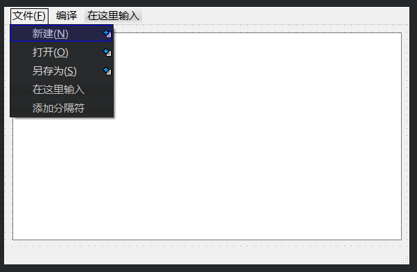

### 定时器

<br>

#### 定时器图片流水灯案例

> 实现效果：构建一个界面，点击开始按钮轮流播放文件夹下图片，点击停止按钮停止播放


构建页面，上部是一个没有内容的 label  
下面是开始和暂停按钮，各自的名称分别为 startBtn 和 stopBtn

<br>

先保持在 UI 设计界面别走  
右键点击开始和停止按钮，选择添加槽，各自添加一个 clicked 槽！

此时不需要为槽添加响应内容，我们打开 `Widget.h`

下图注释部分即为我们需要添加的部分

```cpp
#ifndef WIDGET_H
#define WIDGET_H

#include <QWidget>

// 第一步：定义轮播间隔时间
#define TIMEOUT 1*1000

QT_BEGIN_NAMESPACE
namespace Ui { class Widget; }
QT_END_NAMESPACE

class Widget : public QWidget
{
    Q_OBJECT

public:
    Widget(QWidget *parent = nullptr);

    // 第二步：定义虚函数timerEvent，表示定时器事件，他接受一个QTimerEvent类型的参数
    virtual void timerEvent(QTimerEvent *evt);
    ~Widget();

private slots:

    // 第三步：我们为两个按钮添加槽后，这边自动生成的代码
    void on_startBtn_clicked();
    void on_stopBtn_clicked();

private:
    Ui::Widget *ui;

    // 第四步：定义定时器ID（保证定时器的唯一性），以及当前图片轮播ID
    int myTimerId;
    int pixId;
};
#endif // WIDGET_H
```

<br>

头文件已经处理完毕，打开 `Widget.cpp`

首先在 widget 初始化时，我们就需要为 label 指定显示一张图片

```cpp
#include "Widget.h"
#include "ui_Widget.h"

Widget::Widget(QWidget *parent)
    : QWidget(parent)
    , ui(new Ui::Widget)
{
    ui->setupUi(this);

    // 下一张图片ID
    pixId = 2;
    // 默认显示的图片，即第一张图片1.png
    QPixmap pix("E:\\singlechip\\Linux\\qt\\qt_demo2\\image\\1.png");
    // 将图片绑定到界面内部的label里去
    ui->label->setPixmap(pix);
}
```

<br>

为两个信号槽定义代码

```cpp
// 开始按钮
void Widget::on_startBtn_clicked()
{
    // 开启定时器，并且返回定时器编号
    myTimerId = this->startTimer(TIMEOUT);
}

// 停止按钮
void Widget::on_stopBtn_clicked()
{
    // 杀死指定ID的定时器
    this->killTimer(myTimerId);
}
```

<br>

还记得我们之前在头文件中注册的虚函数 `timerEvent` 吗？  
我们需要在这边实现它，定义事件处理函数

```cpp
void Widget::timerEvent(QTimerEvent *evt)
{
    // 如果取得的定时器ID不对应，那么不执行后续代码
    if(evt->timerId()!=myTimerId) return;

    // 字符串拼接获得图片路径
    QString path("E:\\singlechip\\Linux\\qt\\qt_demo2\\image\\");
    path+=QString::number(pixId);
    path+=".png";

    // 将图片路径绑定到label上，以便显示图片
    QPixmap pix(path);
    ui->label->setPixmap(pix);

    // 每次显示完毕后ID都自增一次，直到递增超过文件夹下最大图片数量，就重置为1，从头开始显示
    pixId++;
    if(pixId==3) pixId=1;
}
```

<br>

这是完整的 Widget.cpp 代码：

```cpp
#include "Widget.h"
#include "ui_Widget.h"

Widget::Widget(QWidget *parent)
    : QWidget(parent)
    , ui(new Ui::Widget)
{
    ui->setupUi(this);

    pixId = 2;
    QPixmap pix("E:\\singlechip\\Linux\\qt\\qt_demo2\\image\\1.png");
    ui->label->setPixmap(pix);
}

Widget::~Widget()
{
    delete ui;
}


void Widget::on_startBtn_clicked()
{
    // 开启定时器，并且返回定时器编号
    myTimerId = this->startTimer(TIMEOUT);
}

void Widget::timerEvent(QTimerEvent *evt)
{
    if(evt->timerId()!=myTimerId) return;

    QString path("E:\\singlechip\\Linux\\qt\\qt_demo2\\image\\");
    path+=QString::number(pixId);
    path+=".png";

    QPixmap pix(path);
    ui->label->setPixmap(pix);

    pixId++;
    if(pixId==3) pixId=1;
}


void Widget::on_stopBtn_clicked()
{
    this->killTimer(myTimerId);
}
```

> 大功告成，你现在可以点击左下角的绿色按钮执行测试了

<br>

#### QTimer

> QTimer 的使用方式和上面那个差不多，只是稍微流程有些变动

打开 `widget.h`

```cpp
#ifndef WIDGET_H
#define WIDGET_H

#include <QWidget>

// 导入QTimer
#include <QTimer>
// 设置好间隔时间
#define TIMEOUT 1*1000

QT_BEGIN_NAMESPACE
namespace Ui { class Widget; }
QT_END_NAMESPACE

class Widget : public QWidget
{
    Q_OBJECT

public:
    Widget(QWidget *parent = nullptr);
    ~Widget();

private slots:
    // 需要手动在此注册超时函数的槽
    void timeout_slot();

    // 定义开始和停止按钮的点击槽
    void on_startBtn_clicked();
    void on_stopBtn_clicked();

private:
    Ui::Widget *ui;

    // 定义QTimer全局变量
    QTimer *timer;
    // 定义计数器，指示当前数字
    int currentNumber;
};
#endif // WIDGET_H
```

这是对应的 widget.cpp 代码清单

```cpp
#include "Widget.h"
#include "ui_Widget.h"

Widget::Widget(QWidget *parent)
    : QWidget(parent)
    , ui(new Ui::Widget)
{
    ui->setupUi(this);

    // 实例化计时器
    timer = new QTimer;

    // 初始值为0，显示在label内部，注意数值和文本之间的类型转换
    currentNumber=0;
    ui->label->setText(QString::number(currentNumber));

    // 使用connect链接信号和槽！
    connect(timer,&QTimer::timeout,this,&Widget::timeout_slot);
}

Widget::~Widget()
{
    delete ui;
}


void Widget::on_startBtn_clicked()
{
    // 开启计时器
    timer->start(TIMEOUT);
}

// 超时函数，每经过一次计时周期（TIMEOUT的长度），就会执行一次如下槽内的代码
void Widget::timeout_slot()
{
    currentNumber++;
    ui->label->setText(QString::number(currentNumber));
}


void Widget::on_stopBtn_clicked()
{
    // 停止计时器
    timer->stop();
}
```

<br>

### 文件操作

<br>

#### 最简记事本

> 记事本实现功能：新建、打开、保存文件，操作结果实时显示在 mainwindow 下方的 statusbar 里面

新建一个 `MainWindow` 类型项目（之前建立的都是 Widget 类型，别搞错了）

稍微设计一下界面，顶部导航新增三个按钮：新建、打开、保存  
整个页面中间是一个 text edit



打开 `MainWindow.h`

```cpp
#ifndef MAINWINDOW_H
#define MAINWINDOW_H

#include <QMainWindow>

// 添加这两个header，后面会用到
#include <QFileDialog>
#include <QMessageBox>

QT_BEGIN_NAMESPACE
namespace Ui { class MainWindow; }
QT_END_NAMESPACE

class MainWindow : public QMainWindow
{
    Q_OBJECT

public:
    MainWindow(QWidget *parent = nullptr);
    ~MainWindow();

private slots:

    // 这三个槽对应新建、文件、另存为
    void newActionSlot();
    void openActionSlot();
    void saveActionSlot();

private:
    Ui::MainWindow *ui;
};
#endif // MAINWINDOW_H
```

<br>

打开 `MainWindow.cpp`

首先使用 `connect` 函数链接对应的槽

```cpp
MainWindow::MainWindow(QWidget *parent)
    : QMainWindow(parent)
    , ui(new Ui::MainWindow)
{
    ui->setupUi(this);

    // 将三个按钮连接到对应的槽里面
    connect(ui->newAction,&QAction::triggered,this,&MainWindow::newActionSlot);
    connect(ui->openAction,&QAction::triggered,this,&MainWindow::openActionSlot);
    connect(ui->saveAction,&QAction::triggered,this,&MainWindow::saveActionSlot);
}
```

之后就是三个按钮对应的操作功能，大体都一样，就是简单的文件操作而已，具体分析请看里面的注释！

```cpp
// 新建文件
void MainWindow::newActionSlot()
{
    // 新建文件之前需要清空编辑框内容
    ui->textEdit->clear();
    this->setWindowTitle("未命名.txt");
}

// 打开文件
void MainWindow::openActionSlot()
{
    // QFileDialog为专门显示打开文件的对话框
    // getOpenFileName该函数返回被打开文件的完整路径，如果点击了取消或者直接关闭窗口，此时返回空
    // 参数一：父窗口
    // 参数二：对话框标题
    // 参数三：默认起始路径
    // 参数四：文件过滤器
    QString fileName = QFileDialog::getOpenFileName(
                this,
                "请选择一个文件",
                QCoreApplication::applicationFilePath(),
                "*.txt"
                );

    // 如果没有选择任何文件（即点击取消按钮），设置窗口底部状态栏的文本
    if(fileName.isEmpty()){
        ui->MainWindow::statusbar->showMessage("您取消选择了文件！");
    }else{
        ui->MainWindow::statusbar->showMessage("打开文件："+fileName);
        this->setWindowTitle(fileName);

        // 通过路径实例化QFile对象
        QFile f(fileName);
        // 设置文件为只读
        f.open(QIODevice::ReadOnly);
        // 使用字节流的形式读取文本内容，并写入到编辑框内
        QByteArray str = f.readAll();
        ui->textEdit->setText(QString(str));
        // 打开文件完毕后要记住关掉它！
        f.close();
    }
}

// 保存文件
void MainWindow::saveActionSlot()
{
    // 如法炮制
    QString saveFileName = QFileDialog::getSaveFileName(
                this,
                "请选择保存位置与文件名",
                QCoreApplication::applicationFilePath(),
                tr("文本文件(*.txt)")
                );

    if(saveFileName.isEmpty()){
        ui->MainWindow::statusbar->showMessage("您取消了文件保存！");
    }else{
        ui->MainWindow::statusbar->showMessage("文件成功保存到："+saveFileName);
        this->setWindowTitle(saveFileName);

        // 保存文件，需要设置为只写模式
        QFile f(saveFileName);
        f.open(QIODevice::WriteOnly);
        QByteArray byteArr;
        // 先把编辑框内容添加到字节流里面，然后才使用文件写操作保存文件
        byteArr.append(ui->textEdit->toPlainText().toStdString());
        f.write(byteArr);
        f.close();
    }
}
```

<br>

#### ctrl+s 保存

此处需要使用事件处理，保持上一节写的记事本代码不变

打开 MainWindow.h

```cpp
#define MAINWINDOW_H

#include <QMainWindow>
#include <QFileDialog>
#include <QMessageBox>
#include <QKeyEvent>

QT_BEGIN_NAMESPACE
namespace Ui { class MainWindow; }
QT_END_NAMESPACE

class MainWindow : public QMainWindow
{
    Q_OBJECT

public:
    MainWindow(QWidget *parent = nullptr);
    ~MainWindow();

    // 在此处注册按键点击事件
    void keyPressEvent(QKeyEvent *k);
```

注册完毕后，回到 MainWindow.cpp

添加对应的监听事件内容

```cpp
// 响应键盘按键点击事件
void MainWindow::keyPressEvent(QKeyEvent *k)
{
    // ControlModifier表示修饰按键，此修饰按键即为ctrl
    // Qt::Key_S表示主要按键，此按键为S
    if(k->modifiers()==Qt::ControlModifier && k->key()==Qt::Key_S){
        // 同时按下ctrl+s，就会调用保存文件的方法！
        saveActionSlot();
    }
}
```

<br>

### Socket

<br>

#### 简易 TcpSocket 链接

注意，无论是客户端还是服务端，只要使用了 socket 服务，就必须在每个项目的 pro 文件内添加 network 字段，否则直接无法使用！

```cpp
// 在首行末尾添加network，注意与前一个单词有一个空格的距离
QT       += core gui network

greaterThan(QT_MAJOR_VERSION, 4): QT += widgets

CONFIG += c++11

...
```

代码清单 `Widget.h`

```cpp
#ifndef WIDGET_H
#define WIDGET_H

#include <QWidget>
#include <QTcpSocket>
#include <QHostAddress>
#include <QMessageBox>

QT_BEGIN_NAMESPACE
namespace Ui { class Widget; }
QT_END_NAMESPACE

class Widget : public QWidget
{
    Q_OBJECT

public:
    Widget(QWidget *parent = nullptr);
    ~Widget();

private slots:

    // 对应链接服务端和取消链接两个按钮槽
    void on_cancelBtn_clicked();
    void on_connectBtn_clicked();

private:
    Ui::Widget *ui;

    // 定义QTcpSocket客户端
    QTcpSocket *socket;
};
#endif // WIDGET_H
```

<br>

代码清单 `Widget.cpp`

```cpp
#include "Widget.h"
#include "ui_Widget.h"

Widget::Widget(QWidget *parent)
    : QWidget(parent)
    , ui(new Ui::Widget)
{
    ui->setupUi(this);

    socket = new QTcpSocket;    // 创建scoket对象
}

Widget::~Widget()
{
    delete ui;
}


void Widget::on_cancelBtn_clicked()
{
    this->close();
}

// 链接服务器
void Widget::on_connectBtn_clicked()
{
    // 获取IP地址以及对应的端口号
    QString ip = ui->ipLineEdit->text();
    QString port  = ui->portLineEdit->text();

    // 连接到服务器
    socket->connectToHost(QHostAddress(ip),port.toShort());

    connect(socket,&QTcpSocket::connected,[this](){
        QMessageBox::information(this,"连接提示","成功连接到服务器！");
    });

    connect(socket,&QTcpSocket::disconnected,[this](){
        QMessageBox::warning(this,"连接提示","服务器链接已经断开！");
    });
}
```

<br>

同理，如法炮制一个服务端，具体代码如下

代码清单 Widget.h

```cpp
#ifndef WIDGET_H
#define WIDGET_H

#include <QWidget>

// 记得导入这两个头文件
#include <QTcpServer>
#include <QTcpSocket>

// 默认的服务端端口，需要客户端指定为此端口才可以连接到服务端上
#define DEFAULT_PORT 10086

QT_BEGIN_NAMESPACE
namespace Ui { class Widget; }
QT_END_NAMESPACE

class Widget : public QWidget
{
    Q_OBJECT

public:
    Widget(QWidget *parent = nullptr);
    ~Widget();

private slots:
    // 建立新链接槽
    void newClientHandler();

private:
    Ui::Widget *ui;

    // 定义服务端QTcpServer
    QTcpServer *server;
};
#endif // WIDGET_H
```

<br>

代码清单 Widget.cpp

```cpp
#include "Widget.h"
#include "ui_Widget.h"

Widget::Widget(QWidget *parent)
    : QWidget(parent)
    , ui(new Ui::Widget)
{
    ui->setupUi(this);

    // 实例化服务端
    server = new QTcpServer;
    // 开始侦听指定IP和端口
    // QHostAddress::AnyIPv4表示监听任意IPV4地址，DEFAULT_PORT为之前定义的常量，值为10086
    server->listen(QHostAddress::AnyIPv4,DEFAULT_PORT);

    // 定义当服务端建立新链接的信号
    connect(server,&QTcpServer::newConnection,this,&Widget::newClientHandler);
}

Widget::~Widget()
{
    delete ui;
}

// 建立新链接的方法
void Widget::newClientHandler()
{
    // 为服务端和客户端之间创建一个持久性链接（基于TCP）
    QTcpSocket *socket = server->nextPendingConnection();

    // 获取客户端IP和端口，显示到页面的label上面
    ui->ipLabel->setText(socket->peerAddress().toString());
    ui->portLabel->setText(QString::number(socket->peerPort()));
}
```

<br>
