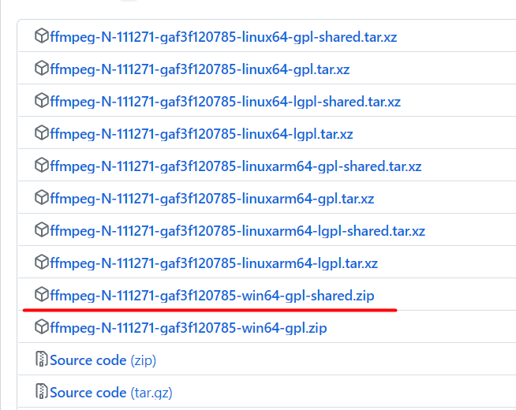

## FFmpeg

<br>

### 环境配置

> 文章更新时间：2023/06/24

#### ffmpeg 下载

由于大部分的关于配置 `ffmpeg+qt` 环境的文章都停留在 2021 年，且许多方法均已过时，现在介绍一个最新的方法，并分析槽点供大家参考

前往 FFmpeg 官网下载对应库包：[官网地址](http://www.ffmpeg.org/download.html)  
按照下图，选择 window 版本的，推荐下载源选择图中指示的第二个


进入 github，下载带 shared 后缀的那个包即可



<br>

#### qt 配套环境配置

把下载好的压缩包解压到任意一个文件夹内，我们发现这里有 4 个文件夹

在项目根目录下新建一个文件夹 ffmpeglib  
然后我们需要把 include 和 lib 这两个文件夹全部复制到该 ffmpeglib 目录下  
最终看起来是这样的：（上方路径中，qt_ffmpeg 是我的项目根目录！）


<br>

这还没完，回到 qtcreator，打开咱们的项目，直接点击运行  
此时会自动构建

回到 ffmpeg 根目录下，打开 bin 目录，复制所有的 dll 文件，然后粘贴到构建文件夹的 debug 文件夹下


<br>

#### 代码测试

在项目的 pro 文件内添加以下内容，导入项目根目录下的 ffmpeg 库

```
INCLUDEPATH +=$$PWD/ffmpeglib/include

LIBS += $$PWD/ffmpeglib/lib/avcodec.lib \
        $$PWD/ffmpeglib/lib/avfilter.lib \
        $$PWD/ffmpeglib/lib/avformat.lib \
        $$PWD/ffmpeglib/lib/avutil.lib \
        $$PWD/ffmpeglib/lib/postproc.lib \
        $$PWD/ffmpeglib/lib/swresample.lib \
        $$PWD/ffmpeglib/lib/swscale.lib
```

在 main.cpp 里面调用对应库，并使用一个简单的代码进行验证

```c
#include "Widget.h"

#include <QApplication>
#include <QDebug>

// 需要使用C来对C++进行支持
// 注意注意注意，这里的C是大写的！不是小写的！小写会报错！
extern "C"
{
//avcodec:编解码(最重要的库)
#include <libavcodec/avcodec.h>
    //avformat:封装格式处理
#include <libavformat/avformat.h>
    //swscale:视频像素数据格式转换
#include <libswscale/swscale.h>
    //avdevice:各种设备的输入输出
#include <libavdevice/avdevice.h>
    //avutil:工具库（大部分库都需要这个库的支持）
#include <libavutil/avutil.h>
}


int main(int argc, char *argv[])
{
    QApplication a(argc, argv);
    Widget w;
    w.show();

    // 测试avcodec版本
    qDebug() << avcodec_version();

    return a.exec();
}
```

> 如果运行完全没有问题，你将会在应用程序输出里面看见一串数字

<br>
